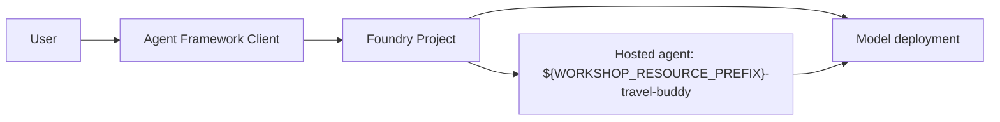

# Step 1 — Your first hosted agent: TravelBuddy

> **Goal:** stand up a hosted Foundry agent that can hold a basic travel conversation.

## What you'll learn

- What a Foundry **hosted agent** is and how the Agent Framework talks to it
- How `DefaultAzureCredential` flows from `az login` to the agent client
- The minimum agent.yaml / agent.manifest.yaml needed to ship an agent

## What's already in the repo

- `travel_assistant/requirements.txt` — the Python packages for the Step 1 agent.
- `travel_assistant/agent.yaml` — the hosted-agent runtime definition. It's ready to run; you'll read it to understand each part.
- `travel_assistant/agent.manifest.yaml` — the deployment/template manifest. It's provided complete; you'll read it to see what it declares.
- `travel_assistant/main.py` — the Python entry point. You'll write TravelBuddy's instructions.
- `travel_assistant/Dockerfile` — how your agent is packaged into the container image Foundry runs. Provided complete; you'll read it.
- `travel_assistant/.dockerignore` — keeps build junk and local secrets (`.env`) out of that image.
- `travel_assistant/.azdignore` — tells `azd` which files *not* to upload when it packages the deployment.

In this step you **complete** the one small edit called out below (TravelBuddy's instructions in `main.py`) — you don't create the files from scratch, and the two YAML files are ready to use as-is. The workshop is **incremental**: when you advance, the next step's files are laid on top of your `travel_assistant/` folder. Files from earlier steps that the next step doesn't touch stay exactly as they are — nothing is deleted. Files the next step ships (for example an updated `main.py`) are refreshed to that step's version, and your current work is backed up under `.workshop_instance/workshop_backups/step-<N>/` first, so you can always recover your own wording.

> **Before you start:** make sure you completed the setup in Step 0 — [Install the tools you'll need](.workshop/docs/steps/00-intro.md#install-the-tools-youll-need) and [Set up your local environment](.workshop/docs/steps/00-intro.md#set-up-your-local-environment-one-time). If `python .workshop/scripts/preflight.py --step 1` is green, you're ready.

## Concept (5-min read)

**Azure AI Foundry** (the Learn docs now call the new experience **Microsoft Foundry**) is the Azure platform for building, deploying, and managing AI apps and agents. It gives you a portal, SDKs, model catalog, model deployments, agent tooling, tracing, evaluation, and access controls in one place, instead of making every app assemble those pieces by hand.

A **Foundry project** is the workspace boundary for one app, prototype, or team. It holds the things your code needs at runtime: model deployments, connections, files, evaluations, and hosted agents. The `AZURE_AI_PROJECT_ENDPOINT` value in your `.env` points to exactly one project, usually in this shape:

```text
https://<foundry-resource>.services.ai.azure.com/api/projects/<project-name>
```

In this workshop, TravelBuddy uses that endpoint plus `AZURE_AI_MODEL_DEPLOYMENT_NAME` to find the model deployment inside your project.

A **raw model call** sends a prompt directly to a model deployment and gets one response back. That is useful, but the caller must know all of the app wiring: which model to use, what instructions to send, how to manage conversation state, where tools live, and how to deploy the code.

A **Foundry hosted agent** is different: it is an agent application packaged as a **container image** and deployed **into your Foundry project**, where Foundry runs it for you as a managed service. The package tells Foundry how to start the agent, which protocol it serves, which environment variables it needs, and what resources it should get. In Step 1 the agent only chats; in later steps the same hosted boundary becomes the place where TravelBuddy gains tools, retrieval, workflows, and memory.

The **Microsoft Agent Framework** is the Python/.NET SDK we use to build the agent in code. Here, `FoundryChatClient` connects to your Foundry project and model deployment, `Agent` defines TravelBuddy's name and instructions, and `ResponsesHostServer` exposes the agent through the Responses protocol. `DefaultAzureCredential` reuses the Azure sign-in you created with `az login`.

The YAML files are the smallest hosted-agent package:

- `agent.yaml` describes the local hosted runtime that `azd ai agent run` and the Foundry Toolkit can start.
- `agent.manifest.yaml` describes the template metadata that `azd ai agent init` (and the Foundry Toolkit) reads to scaffold the Azure deployment artifacts (`azure.yaml` and `infra/`).
- `main.py` is ordinary Python code, so you can run the same agent locally before deploying it.
- `Dockerfile` and `.dockerignore` package `main.py` and its dependencies into the container image Foundry runs.
- `.azdignore` keeps scaffolding-only files (`agent.manifest.yaml`, `agent.yaml`, `.env.example`) out of that deployment upload.



Helpful references:

- [What is Microsoft Foundry?](https://learn.microsoft.com/azure/ai-foundry/what-is-azure-ai-foundry)
- [Create a project for Microsoft Foundry](https://learn.microsoft.com/azure/ai-foundry/how-to/create-projects)
- [What are hosted agents?](https://learn.microsoft.com/azure/foundry/agents/concepts/hosted-agents)
- [agent.yaml / agent.manifest.yaml schema reference](https://learn.microsoft.com/azure/foundry/agents/concepts/agent-yaml-reference)
- [Microsoft Agent Framework](https://learn.microsoft.com/agent-framework/overview/agent-framework-overview)
- [Upstream `01-basic` hosted-agent sample](https://github.com/microsoft-foundry/foundry-samples/tree/main/samples/python/hosted-agents/agent-framework/responses/01-basic)

## Steps

### 1. Review `travel_assistant/agent.yaml`

**Why this file exists:** `agent.yaml` is the **AgentDefinition** — the concrete hosted-agent runtime. It gives the agent a name, declares that it serves the `responses` protocol, sets a small CPU/memory shape, and lists the environment variables the runtime needs. It's a [ContainerAgent](https://learn.microsoft.com/azure/foundry/agents/concepts/agent-yaml-reference#template-containeragent) (an AgentDefinition with `kind: hosted`).

**What you do:** nothing to edit — this file is ready to run. Read it so you recognize each block. The name uses `${WORKSHOP_RESOURCE_PREFIX}` so your agent stays unique when many people deploy into the same project; the `${...}` values are resolved from your `.env` at run/deploy time.

**What happens at run/deploy time:** `azd ai agent run` and the Foundry Toolkit read this file to start the local Responses host. Deployment tooling uses the same contract so the hosted runtime in Foundry receives the right environment values.

Open `travel_assistant/agent.yaml` in your editor and skim it — the file is annotated with inline comments that explain each block.

### 2. Review `travel_assistant/agent.manifest.yaml`

**Why this file exists:** the manifest is the **AgentManifest** — a parameterized template that deployment tooling reads to *scaffold* your hosted agent (**scaffold** = automatically generate the starter project files so you don't write them by hand). It carries top-level metadata (name, description, tags), a `template` block (the hosted-agent definition), and a `resources` list of what deployment tooling should provision. The `name` fields are plain literals (`travel-buddy`). See the [schema reference](https://learn.microsoft.com/azure/foundry/agents/concepts/agent-yaml-reference) for every field.

> **Note — Why the names here are literals, and how values get filled in.** `azd ai agent init` validates the agent name *before* any substitution, so a `${...}` or `{{...}}` value in the `name` fields would fail; you attach your per-user prefix at init time with `--agent-name` (see the deploy step below). The `environment_variables` values use `${VAR}` references that resolve from your `.env` at run/deploy time — the same way `agent.yaml` does. (`{{ param }}` placeholders are only for values you declare in a `parameters:` block and get prompted for during `azd ai agent init`; this workshop doesn't use them.)

**What you do:** nothing to edit — this file is ready to use. Read it so you understand what it declares. Notice that `resources` is **empty (`[]`)**: you already deployed a model in Step 0, and the agent picks it up at runtime through the `AZURE_AI_MODEL_DEPLOYMENT_NAME` environment variable (see [Model resource](https://learn.microsoft.com/azure/foundry/agents/concepts/agent-yaml-reference#model-resource)). Because the model already exists, there's nothing for `azd` to provision, so you don't declare a `kind: model` resource here.

**What happens at run/deploy time:** `azd ai agent init -m travel_assistant/agent.manifest.yaml` reads this file to generate the root deployment artifacts (`azure.yaml` and `infra/`). With no model resource declared, it wires up only the container-hosting infrastructure and leaves your existing model deployment alone. The Foundry Toolkit also uses manifest metadata when walking you through hosted-agent setup.

Open `travel_assistant/agent.manifest.yaml` and read through it — the inline comments call out what each block declares and why `resources` is empty.

### 3. Write TravelBuddy's instructions in `travel_assistant/main.py`

**Why this file exists:** `main.py` is the Python process that hosts TravelBuddy. It creates the Foundry model client, defines the agent instructions, and starts the Responses server.

**What you edit:** the scaffold already wires up `FoundryChatClient`, `Agent`, and `ResponsesHostServer` — you complete the single `TODO` inside `main()`, replacing the placeholder `instructions=` string with TravelBuddy's system prompt: a friendly travel assistant that gives practical, concise trip-planning advice with local context, budget awareness, and safety-minded tips.

**What happens at run/deploy time:** locally, this process serves an OpenAI-compatible Responses endpoint on `http://localhost:8088`. After deployment, Foundry starts the same code as the hosted container entry point.

Open `travel_assistant/main.py` and complete the `TODO`. If you get stuck, the finished file is in [`.workshop/solutions/01-basic/`](.workshop/solutions/01-basic/).

`ResponsesHostServer` is the hosted-agent contract: when started locally it serves an OpenAI-compatible Responses endpoint on `http://localhost:8088`; when packaged and deployed to Foundry it becomes the container entry point. The same code runs in both places.

> **Note — Three different "names" show up in this step — they live at different layers and don't have to match.**
>
> - **Manifest name** — `name` / `template.name` in `agent.manifest.yaml` (`travel-buddy`) is the template's declared identity, the value `azd ai agent init` reads to scaffold your agent. It **must be a plain literal**: `init` validates it *before* any variable substitution, so `${WORKSHOP_RESOURCE_PREFIX}-…` would be rejected. You attach your per-user prefix separately, at init time, with `--agent-name` (see the deploy step below). Reference: [agent.yaml / manifest schema](https://learn.microsoft.com/azure/foundry/agents/concepts/agent-yaml-reference).
> - **Deployed agent name** — the `name` in `agent.yaml` (`${WORKSHOP_RESOURCE_PREFIX}-travel-buddy`), resolved with your prefix via `--agent-name`, is the **hosted agent's identity in your Foundry project** — what the portal shows and what `.workshop/scripts/cleanup.py` matches on to tear things down. Reference: [Manage hosted agents (azd)](https://learn.microsoft.com/azure/foundry/agents/how-to/manage-hosted-agent).
> - **Runtime name** — `Agent(name="travel-buddy")` in `main.py` is the **Agent Framework's in-process name**. It's a code-level string (not an Azure resource name, so it isn't bound by azd's naming rules). It appears in tracing/observability, identifies the responder in the Responses output, and — most importantly — becomes the **reference key when you compose agents later**: with `as_tool()` (agent-as-a-tool) or handoffs, an agent's `name` is the tool/route name the coordinator calls. That's why Step 7 gives each specialist its own name. Reference: [Agent Framework agents](https://learn.microsoft.com/agent-framework/agents/).
>
> The template and in-code names are both `travel-buddy`; only the **deployed** agent differs, carrying your prefix as `${WORKSHOP_RESOURCE_PREFIX}-travel-buddy`. They live at different layers, so they don't have to match — but using one stable base name keeps the agent easy to follow as it grows across steps.

### 4. Review the container and deploy files

Three more files ship with Step 1. You don't edit them, but reading them shows how TravelBuddy goes from local Python to a container Foundry runs.

**`Dockerfile` — how the agent is packaged.** Foundry runs your hosted agent as a container, and this is the recipe. It starts from `python:3.12-slim`, copies your `travel_assistant/` code into the image, installs `requirements.txt`, exposes port **8088**, and launches `python main.py`. That `EXPOSE 8088` matches the port `ResponsesHostServer` listens on, so the same entry point you run locally is what serves traffic once deployed.

**`.dockerignore` — what stays out of the image.** It excludes local-only cruft (`.venv`, `__pycache__`, `*.pyc`, …) so the build context stays small, and — importantly — it excludes **`.env`** so your local secrets are never baked into the container image. A deployed runtime gets its configuration from the azd/Foundry environment, not from a file in the image.

**`.azdignore` — what `azd` doesn't upload.** When `azd` packages your agent for deployment, it skips everything listed here. Step 1 ignores three files, because none of them belong in the deployed container:

- **`agent.manifest.yaml`** — a **scaffolding-time** template. `azd ai agent init` reads it once to generate `azure.yaml` and `infra/`; the running container never needs it.
- **`agent.yaml`** — its contents are **folded into the generated `azure.yaml`** during scaffolding, so the deployment already carries this information and shipping `agent.yaml` again would be redundant.
- **`.env.example`** — only a placeholder template. Real configuration comes from your azd environment (`.env`), so the sample doesn't belong in the upload.

Open the three files and skim them so you recognize what each one controls.

### 5. Confirm env

Make sure your `.env` contains values for `AZURE_AI_PROJECT_ENDPOINT` and `AZURE_AI_MODEL_DEPLOYMENT_NAME`. If you're unsure, rerun:

<!-- terminal -->
```bash
# If you activated .venv
python .workshop/scripts/preflight.py --step 1

# If you're using uv without activation
uv run python .workshop/scripts/preflight.py --step 1
```

## Run and deploy TravelBuddy

You can run and deploy TravelBuddy two ways: with the [**Azure Developer CLI** (`azd`)](#option-1--azure-developer-cli-azd) or with the [**VS Code Foundry Toolkit**](#option-2--vs-code-foundry-toolkit) extension. Both wrap the same hosted-agent contract — pick one. The workshop's later steps default to `azd` snippets because they script cleanly, but the Toolkit gives you the same flow in a UI.

> **One-time generated files:** these are created once and reused by later steps — don't regenerate them per step. [Option 1 — Azure Developer CLI (`azd`)](#option-1--azure-developer-cli-azd) generates a **project folder named after your agent** (`${WORKSHOP_RESOURCE_PREFIX}-travel-buddy/`) containing `azure.yaml` and `infra/`; [Option 2 — VS Code Foundry Toolkit](#option-2--vs-code-foundry-toolkit) generates `.vscode/tasks.json` and `.vscode/launch.json`. Don't just keep these files — **commit them when the step is complete**. Pushing them to `main` is what loads the next step.

### Option 1 — Azure Developer CLI (`azd`)

1. **Scaffold `azure.yaml` and `infra/`** from the manifest (one-time per workshop):

   Load your `.env` into the shell first (the repo `.env` isn't auto-loaded — only Python's `load_dotenv()` and azd's YAML templating read it), then pass the expanded prefix to `--agent-name`:

   <!-- terminal -->
   ```bash
   # bash / zsh
   set -a; source .env; set +a
   azd ai agent init -m travel_assistant/agent.manifest.yaml \
     --agent-name "${WORKSHOP_RESOURCE_PREFIX}-travel-buddy"
   ```

   <!-- terminal -->
   ```powershell
   # PowerShell
   Get-Content .env | Where-Object { $_ -match '^\s*[^#].*=' } | ForEach-Object {
     $name, $value = $_ -split '=', 2
     Set-Item "Env:$($name.Trim())" $value.Trim()
   }
   azd ai agent init -m travel_assistant/agent.manifest.yaml `
     --agent-name "$($env:WORKSHOP_RESOURCE_PREFIX)-travel-buddy"
   ```

   This reads your manifest, asks any setup questions it needs, and creates a **new project folder named after your agent** (`${WORKSHOP_RESOURCE_PREFIX}-travel-buddy/`) containing the `azure.yaml` and `infra/` that `azd provision` and `azd deploy` use. If that folder already exists from an earlier run, don't delete it just because you moved to a new step.

   > **Why `--agent-name`?** The manifest's `name`/`template.name` must be a plain literal (`travel-buddy`) — `azd ai agent init` validates the agent name *before* any substitution, so a `${WORKSHOP_RESOURCE_PREFIX}-…` or `{{…}}` value there would fail with `invalid agent name`. But the **deployed** Foundry agent identity should still carry your prefix so it stays unique in shared projects and so `.workshop/scripts/cleanup.py` (which deletes only resources whose names start with `WORKSHOP_RESOURCE_PREFIX`) can find it. Passing `--agent-name` sets that deployed identity explicitly, matching the name `agent.yaml` already uses locally (`${WORKSHOP_RESOURCE_PREFIX}-travel-buddy`).

   > **Why load `.env` instead of putting `${WORKSHOP_RESOURCE_PREFIX}` directly on the flag, like in `agent.yaml`?** Those are two different substitution engines. Inside `agent.yaml`/`agent.manifest.yaml`, `${WORKSHOP_RESOURCE_PREFIX}` is *azd's* template placeholder, which azd resolves from `.env` when it reads those files. `--agent-name` is a **command-line argument** that azd validates *before* any templating, so azd's `${…}` syntax isn't interpreted there. Instead, **your shell** expands the variable — but the repo `.env` isn't auto-loaded into your shell, which is why you load it first with the one-liner above before passing the already-expanded value.

   After init, azd creates the **project folder named after your agent** (`${WORKSHOP_RESOURCE_PREFIX}-travel-buddy/`). `cd` into it and set the variables that `azure.yaml` references in the **azd env** — keep your `.env` loaded in the shell (same one-liner as above) so you can pass the values through:

   <!-- terminal -->
   ```bash
   # bash / zsh — after: set -a; source .env; set +a
   cd "${WORKSHOP_RESOURCE_PREFIX}-travel-buddy"
   azd env set AZURE_AI_PROJECT_ENDPOINT "$AZURE_AI_PROJECT_ENDPOINT"
   azd env set AZURE_AI_MODEL_DEPLOYMENT_NAME "$AZURE_AI_MODEL_DEPLOYMENT_NAME"
   azd env set WORKSHOP_RESOURCE_PREFIX "$WORKSHOP_RESOURCE_PREFIX"
   ```

   <!-- terminal -->
   ```powershell
   # PowerShell — after loading .env into the shell
   cd "$($env:WORKSHOP_RESOURCE_PREFIX)-travel-buddy"
   azd env set AZURE_AI_PROJECT_ENDPOINT "$env:AZURE_AI_PROJECT_ENDPOINT"
   azd env set AZURE_AI_MODEL_DEPLOYMENT_NAME "$env:AZURE_AI_MODEL_DEPLOYMENT_NAME"
   azd env set WORKSHOP_RESOURCE_PREFIX "$env:WORKSHOP_RESOURCE_PREFIX"
   ```

   > **Why azd asks for these when they're already in `.env`.** azd keeps its **own** environment store at `.azure/<env-name>/.env` inside the new project folder, which is **separate from the repo-root `.env`** you've been editing. The generated `azure.yaml` reads from the *azd* env, so azd doesn't see the values in your repo `.env` and asks you to set them once. `cd` into the project folder, then run the `azd env set` commands azd printed.

2. **Provision** the hosted-agent infrastructure (first deploy only):

   <!-- terminal -->
   ```bash
   azd provision
   ```

   This signs into Azure through `azd`, asks you to choose a subscription/location if needed, and creates the container-hosting infrastructure (resource group, container registry, and supporting resources) wired to the Foundry project from your `.env`. It does **not** create a model deployment — you already deployed one in Step 0, and the agent uses it at runtime via `AZURE_AI_MODEL_DEPLOYMENT_NAME`. Wait for a successful summary before continuing.

3. **Run TravelBuddy locally** in the hosted Responses runtime:

   <!-- terminal -->
   ```bash
   azd ai agent run
   ```

   `azd` reads `agent.yaml`, substitutes values from your environment, and starts the server on `http://localhost:8088`. Leave this terminal running; it is your local hosted-agent process.

4. **Invoke the local agent from a new terminal.** The `azd ai agent run` process from the previous step is still running and holding its terminal, so open a **second terminal** for this command (in the same project folder):

   <!-- terminal -->
   ```bash
   azd ai agent invoke --local "I'm planning a trip to Lisbon — give me three things you'd want me to know."
   ```

   Expected: TravelBuddy streams a travel-focused answer back to your terminal.

   Prefer a UI? With the local agent still running, open the **Agent Inspector** from the Foundry Toolkit (Command Palette → **Foundry Toolkit: Open Agent Inspector**, or the **Agent Inspector** entry under **Developer Tools**). It connects to `http://localhost:8088` and lets you chat with TravelBuddy and watch the streamed Responses events.

   

5. **Deploy to Foundry**. Subsequent workshop steps only need `azd deploy`:

   <!-- terminal -->
   ```bash
   azd deploy
   ```

   The first deploy builds the container, pushes it to your Azure Container Registry, and starts the hosted agent runtime in Foundry. Expect ~5–10 minutes.

6. **Invoke the deployed agent**:

   <!-- terminal -->
   ```bash
   azd ai agent invoke "I'm planning a trip to Lisbon — give me three things you'd want me to know."
   ```

   Prefer a UI? Open the **Hosted Agent Playground** from the Foundry Toolkit (under **Developer Tools** → **Build** → **Hosted Agent Playground**). Pick your deployed agent and version, then chat with TravelBuddy and inspect session details, logs, and traces directly in VS Code.

   

   When you select **Hosted Agent Playground** in the Foundry Toolkit's **Developer Tools**, you'll be prompted to sign in. If the interactive sign-in doesn't complete, cancel it and choose the **device code** flow instead. Once signed in, select the Foundry project that hosts your deployed agent.

### Option 2 — VS Code Foundry Toolkit

The [Foundry Toolkit](https://marketplace.visualstudio.com/items?itemName=ms-windows-ai-studio.windows-ai-studio) is pre-installed in Codespaces by the devcontainer. If you're using local VS Code, the repo's `.vscode/extensions.json` recommends it; accept the install prompt or install it from the Marketplace.

1. Open the Command Palette (`Ctrl+Shift+P`) → **Foundry Toolkit: Create Hosted Agent** (or open the existing `travel_assistant/` hosted-agent folder if you've already completed the scaffold). The extension creates `.vscode/tasks.json` and `.vscode/launch.json`, then walks you through **Foundry Project Setup** to choose a subscription and existing Foundry project, or create one.
2. Press **F5** to start TravelBuddy locally in debug mode. VS Code should run the generated task, start `travel_assistant/main.py`, and show that the Responses host is listening on `http://localhost:8088`.
3. Command Palette → **Foundry Toolkit: Open Agent Inspector**. The Inspector connects to the running local agent so you can send messages and watch streamed responses.
4. Command Palette → **Foundry Toolkit: Deploy Hosted Agent**. The wizard reads `agent.yaml` and opens **Deploy Hosted Agent**:
   - Confirm subscription/project under **Basics**.
   - Pick deployment method (**Code** or **Container**), then confirm the agent name is **`${WORKSHOP_RESOURCE_PREFIX}-travel-buddy`** — the same prefixed identity the `azd` path sets with `--agent-name`. The wizard prefills it from `agent.yaml`'s `name`; if it shows the unresolved `${WORKSHOP_RESOURCE_PREFIX}` placeholder or a bare `travel-buddy`, set it to your prefixed value so the deployed agent stays unique in shared projects and `.workshop/scripts/cleanup.py` can find it later.
   - On **Review + Deploy**, pick CPU/memory and click **Deploy**.
5. After deployment, open the agent in the **Agent Playground** and stream live logs from the **Logs** tab in the Toolkit sidebar. You should see the deployed TravelBuddy respond the same way your local debug run did.

## Try it

Whichever option you picked, try a few prompts:

- "I'm planning a trip to Lisbon — give me three things you'd want me to know."
- "What's a budget-friendly weekend in Reykjavik like?"
- "Compare Tokyo and Seoul for a first-time visitor."

## Troubleshooting

- **`DefaultAzureCredential failed`**: run `az login`, confirm `az account show` returns your tenant.
- **`Model deployment not found`**: confirm `AZURE_AI_MODEL_DEPLOYMENT_NAME` matches the deployment name in your Foundry project (case-sensitive).
- **`401 Unauthorized`**: your Entra ID needs the `Cognitive Services User` (and ideally `Azure AI Developer`) role on the Foundry project resource.

## Solution

> If you get stuck: [`.workshop/solutions/01-basic/`](.workshop/solutions/01-basic/)

## Upstream sample

> This step is based on the upstream [`01-basic`](https://github.com/microsoft-foundry/foundry-samples/tree/main/samples/python/hosted-agents/agent-framework/responses/01-basic) sample.
