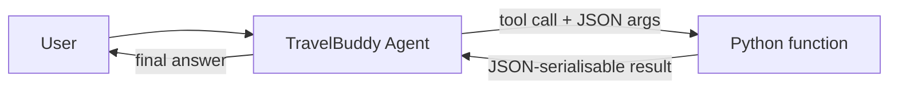

# Step 2 — Give TravelBuddy real-time tools

> **Goal:** wire three function tools — weather, local time, currency conversion — into the agent so it can answer time-sensitive questions.

## What you'll learn

- How the Agent Framework turns a plain Python function into a tool the model can call
- How the tool's JSON schema is inferred from your type hints + docstring
- The full request → tool-call → result → final-answer loop, and who decides when a tool runs
- Why adding local tools changes your code but **not** your deployment shape

## What's already in the repo

- `travel_assistant/main.py`, `agent.yaml`, `agent.manifest.yaml` — carried over from Step 1 (your TravelBuddy chat agent). Nothing was deleted when you advanced; your Step 1 work is preserved.
- `travel_assistant/tools.py` — a **stub** laid down for this step with a single `TODO`. You'll implement the three tool functions here.

In this step you **implement** `tools.py`, then make two small edits to `main.py` (one import + one argument) and one edit to the manifest's description. You do **not** rewrite `main.py` from scratch — you add to the file you finished in Step 1.

## Concept (5-min read)

TravelBuddy can already hold a conversation, but a chat model only knows what it was trained on. It cannot know **today's** weather in Tokyo, the **current** time in Lisbon, or a **fresh** currency estimate. To answer those questions it needs a way to ask running code for live information — that's what **function tools** are for.

A **function tool** is just an ordinary Python function you hand to the agent. In the Agent Framework you register one by passing it in the `tools=[...]` list when you create the `Agent`. The framework then reads the function's **type hints** and **docstring** and builds a JSON schema describing the tool's name, parameters, and purpose. That schema — not your Python source — is what the model sees.

In OpenAI-Responses-style tool calling, the model never runs your Python directly. Instead the loop looks like this:

1. The model reads the user's message and the tool schemas.
2. If it decides a tool would help, it emits a structured **tool call** with JSON arguments (for example `get_weather(city="Tokyo")`).
3. The Agent Framework matches that call to your Python function, runs it, and captures the return value.
4. The result is fed back to the model, which then writes the final natural-language answer for the user.

The framework hides all of that plumbing — the request/response threading, argument parsing, and result formatting. Your job is to write clear functions. Because the **model** decides when to call a tool, good function names, complete type hints, and descriptive docstrings matter: the docstring is effectively the model's instruction manual for the tool.

Each tool in this step is decorated with `@tool(approval_mode="never_require")`. The `@tool` decorator marks the function as a callable tool and lets you configure its behavior; `approval_mode="never_require"` tells the runtime to run it automatically without pausing for human approval — appropriate here because the tools are read-only and return mock data. (Later steps and the [tool-approval docs](https://learn.microsoft.com/agent-framework/agents/tools/tool-approval) cover tools that *should* require a confirmation step.)

For the workshop these tools return **mock** data, but the registration pattern is the real lesson: later you can swap the mock bodies for real weather, time-zone, or exchange-rate APIs without changing how the agent registers them. Note also that local tools run **in-process** inside the same hosted-agent container — they add no new Azure resources, so your `agent.manifest.yaml` and deployment shape barely change from Step 1.



Helpful references:

- [Using function tools with an agent](https://learn.microsoft.com/agent-framework/agents/tools/function-tools) — how the Agent Framework turns a Python function into a tool and infers its schema.
- [Create the agent with function tools](https://learn.microsoft.com/agent-framework/agents/tools/function-tools#create-the-agent-with-function-tools) — passing functions via `tools=[...]`.
- [Tool approval](https://learn.microsoft.com/agent-framework/agents/tools/tool-approval) — what `approval_mode` controls and when to require confirmation.
- [Function calling in Microsoft Foundry Agents](https://learn.microsoft.com/azure/foundry/agents/how-to/tools/function-calling) — the tool-calling loop from the Foundry side.
- [What are hosted agents?](https://learn.microsoft.com/azure/foundry/agents/concepts/hosted-agents) — the hosted boundary your tools run inside.
- [Upstream `02-tools` hosted-agent sample](https://github.com/microsoft-foundry/foundry-samples/tree/main/samples/python/hosted-agents/agent-framework/responses/02-tools) — the sample this step is based on.

## Steps

### 1. Implement the tools in `travel_assistant/tools.py`

Open the stub `travel_assistant/tools.py` and replace its `TODO` with the three mock functions below. Each is a normal Python function with type hints and a docstring written for the model as much as for a human reader.

The three tools you're adding:

- **`get_weather(city, date=None)`** — returns mock current-or-planned-date weather for a destination. The optional `date` argument shows how the model can pass extra context when the traveler asks about a specific day; a `None` default makes it optional in the generated schema.
- **`get_local_time(city)`** — maps a known city to a time zone (via the small `CITY_TIME_ZONES` table) and returns the current local time, falling back to UTC for unknown cities. This is why time-zone answers stay correct without the model guessing.
- **`convert_currency(amount, from_currency, to_currency)`** — converts a price between USD, EUR, JPY, and GBP using static mock rates, and returns a structured result (with a `note`) when a currency isn't supported instead of raising.

```python
# travel_assistant/tools.py
from datetime import datetime
from zoneinfo import ZoneInfo

from agent_framework import tool


CITY_TIME_ZONES = {
    "lisbon": "Europe/Lisbon",
    "london": "Europe/London",
    "new york": "America/New_York",
    "reykjavik": "Atlantic/Reykjavik",
    "san francisco": "America/Los_Angeles",
    "seattle": "America/Los_Angeles",
    "tokyo": "Asia/Tokyo",
}

MOCK_RATES_TO_USD = {
    "USD": 1.0,
    "EUR": 1.09,
    "JPY": 0.0067,
    "GBP": 1.27,
}


@tool(approval_mode="never_require")
def get_weather(city: str, date: str | None = None) -> dict:
    """Return mock weather for a destination city and optional travel date.

    Use this when a traveler asks about current weather, weather for a planned
    date, packing conditions, or comparing weather across destinations. The data
    is mocked for the workshop and should be replaced with a real weather API in
    production.
    """
    requested_date = date or "today"
    return {
        "city": city,
        "date": requested_date,
        "temp_c": 22,
        "condition": "sunny",
        "note": "mock data — replace with a real API",
    }


@tool(approval_mode="never_require")
def get_local_time(city: str) -> dict:
    """Return the current local time for a city using a small city-to-time-zone map.

    Use this when a traveler asks what time it is in a destination, whether it is
    a good time to call a hotel, or how time zones compare between cities. Cities
    outside the workshop map fall back to UTC.
    """
    tz_name = CITY_TIME_ZONES.get(city.strip().lower(), "UTC")
    now = datetime.now(ZoneInfo(tz_name))
    return {
        "city": city,
        "iso_time": now.isoformat(timespec="seconds"),
        "tz": tz_name,
    }


@tool(approval_mode="never_require")
def convert_currency(amount: float, from_currency: str, to_currency: str) -> dict:
    """Convert a mock travel price between USD, EUR, JPY, and GBP.

    Use this for hotel prices, activity costs, meal budgets, or itinerary totals
    when the traveler asks for an approximate conversion. The exchange rates are
    static mock values for the workshop.
    """
    from_code = from_currency.upper()
    to_code = to_currency.upper()

    if from_code not in MOCK_RATES_TO_USD or to_code not in MOCK_RATES_TO_USD:
        return {
            "input": {"amount": amount, "currency": from_code},
            "output": None,
            "rate": None,
            "note": "mock data — supported currencies: USD, EUR, JPY, GBP",
        }

    amount_usd = amount * MOCK_RATES_TO_USD[from_code]
    converted = amount_usd / MOCK_RATES_TO_USD[to_code]
    rate = MOCK_RATES_TO_USD[from_code] / MOCK_RATES_TO_USD[to_code]

    return {
        "input": {"amount": amount, "currency": from_code},
        "output": {"amount": round(converted, 2), "currency": to_code},
        "rate": round(rate, 6),
        "note": "mock data",
    }
```

**What makes these work as tools:**

- **The `@tool` decorator** registers each function and its `approval_mode="never_require"` setting so the runtime auto-runs it in the tool-call loop instead of pausing for approval.
- **Type hints drive the schema.** `city: str`, `amount: float`, and `date: str | None = None` become the tool's parameter types; the `= None` default marks `date` as optional. Use only JSON-serialisable types (`str`, `int`, `float`, `bool`, `dict`, `list`) — the framework can't build a schema for custom classes.
- **The docstring is the model's manual.** The first line becomes the tool description and the "Use this when…" guidance nudges the model toward the right tool. Vague docstrings are the most common reason a tool never gets called.
- **Return JSON-friendly data.** Each function returns a `dict` the model can read back and turn into prose. Returning a structured result (with a `note`) for unsupported currencies is friendlier to the model than raising an exception.

### 2. Register the tools in `travel_assistant/main.py`

Your `main.py` is already complete from Step 1 — don't rewrite it. There are only **two functional additions**: import the tools, and pass them to the `Agent` via `tools=[...]`. Then extend TravelBuddy's instructions with one sentence so the model knows the tools exist.

Add the import near the top, with the other imports:

```python
# travel_assistant/main.py
from tools import convert_currency, get_local_time, get_weather
```

Then update the `Agent(...)` call. **Keep your Step 1 instructions exactly as they are** and just append the two-line tools sentence, and add the `tools=[...]` argument:

```python
    agent = Agent(
        client=client,
        name="travel-buddy",
        instructions=(
            # ... keep your Step 1 instructions here ...
            "Use your tools for weather, local time, and currency conversion "
            "when the traveler asks time-sensitive questions. Keep answers brief."
        ),
        tools=[get_weather, get_local_time, convert_currency],  # <-- add this line
        default_options={"store": False},
    )
```

That's the whole change: the `from tools import ...` line and the `tools=[...]` argument do the wiring; the appended instructions just tell the model when to reach for the tools. Everything else in `main.py` is unchanged from Step 1. If you get stuck, the finished file is in [`.workshop/solutions/02-tools/`](.workshop/solutions/02-tools/).

### 3. Update the metadata in `travel_assistant/agent.manifest.yaml`

Local Python tools run inside your hosted-agent process, so the manifest **structure doesn't change** — same `template`, same `protocols`, and `resources` stays empty (`[]`) because no new Azure resource is needed. The edits are **metadata only**: update the human-facing `description`, add a `Function Tools` tag, and declare the three tools under `metadata.tool_declarations` so anyone browsing the agent can see what it can do.

Update the `description`:

```yaml
# travel_assistant/agent.manifest.yaml
description: >
  TravelBuddy is an Agent Framework hosted agent with local Python function
  tools for destination weather, local time, and currency conversion.
```

Then extend `metadata` — add the new `Function Tools` tag and the `tool_declarations` block (`Travel Assistant` is already in the Step 1 tags):

```yaml
metadata:
  tags:
    - Agent Framework
    - AI Agent Hosting
    - Azure AI AgentServer
    - Responses Protocol
    - Travel Assistant
    - Function Tools     # <-- added
  tool_declarations:     # <-- added: describes the three tools for anyone browsing the agent
    - name: get_weather
      description: Returns mock destination weather for a city and optional date.
      parameters:
        city: string
        date: "string | null"
    - name: get_local_time
      description: Returns the current local time for a destination city.
      parameters:
        city: string
    - name: convert_currency
      description: Converts mock travel prices between USD, EUR, JPY, and GBP.
      parameters:
        amount: float
        from_currency: string
        to_currency: string
```

`tool_declarations` is **descriptive metadata** — it documents the tools for humans and tooling that browse the manifest; the tools themselves are still registered in code via `tools=[...]` in `main.py`. Leave the `template` block, the `environment_variables`, and `resources: []` exactly as they were in Step 1. No new Azure resources are declared, so you won't need to re-provision — but because `azd ai agent init` **copied** your code and manifest into the project folder in Step 1, you will re-run `azd ai agent init` in the next section to refresh that copy with these changes before deploying.

## Run and deploy TravelBuddy

**Do you need to re-init? Yes.** In Step 1, `azd ai agent init` **copied** your `travel_assistant/` code into the generated `${WORKSHOP_RESOURCE_PREFIX}-travel-buddy/` project folder — that copy is the snapshot azd actually builds and deploys. Your Step 2 edits live in `travel_assistant/` (the new `tools.py` and the `main.py` changes), so the copied snapshot is now **stale**. Re-run `azd ai agent init` to refresh it before you run or deploy; it re-copies the current `travel_assistant/` code and re-reads the updated `agent.manifest.yaml`.

You do **not** need `azd provision` again — you added no new Azure resources (`resources:` is still `[]`), so the infrastructure from Step 1 is unchanged. The re-init just refreshes the copied code + manifest, and then `azd deploy` ships the new container version.

> Prefer not to re-init? You can instead copy your edited files (`travel_assistant/tools.py` and `travel_assistant/main.py`) into the code directory inside `${WORKSHOP_RESOURCE_PREFIX}-travel-buddy/` and skip straight to `azd deploy`. Re-init is the reliable path because it also picks up the manifest changes and can't drift out of sync.

1. **Re-init from the repository root.** Load your `.env` into the shell first — the repo `.env` isn't auto-loaded, and the shell needs `WORKSHOP_RESOURCE_PREFIX` to expand `--agent-name` (and to `cd` into the folder later):

   <!-- terminal -->
   ```bash
   # bash / zsh
   set -a; source .env; set +a
   azd ai agent init -m travel_assistant/agent.manifest.yaml \
     --agent-name "${WORKSHOP_RESOURCE_PREFIX}-travel-buddy"
   ```

   <!-- terminal -->
   ```powershell
   # PowerShell
   Get-Content .env | Where-Object { $_ -match '^\s*[^#].*=' } | ForEach-Object {
     $name, $value = $_ -split '=', 2
     Set-Item "Env:$($name.Trim())" $value.Trim()
   }
   azd ai agent init -m travel_assistant/agent.manifest.yaml `
     --agent-name "$($env:WORKSHOP_RESOURCE_PREFIX)-travel-buddy"
   ```

   This refreshes the `${WORKSHOP_RESOURCE_PREFIX}-travel-buddy/` folder with your updated `main.py`, the new `tools.py`, and the updated manifest metadata.

2. **`cd` into the project folder and confirm the azd env values.** If the re-init reset the azd environment, re-set the three variables (they're idempotent, so it's safe to run them again). Keep `.env` loaded in the shell so you can pass the values through:

   <!-- terminal -->
   ```bash
   # bash / zsh — after: set -a; source .env; set +a
   cd "${WORKSHOP_RESOURCE_PREFIX}-travel-buddy"
   azd env set AZURE_AI_PROJECT_ENDPOINT "$AZURE_AI_PROJECT_ENDPOINT"
   azd env set AZURE_AI_MODEL_DEPLOYMENT_NAME "$AZURE_AI_MODEL_DEPLOYMENT_NAME"
   azd env set WORKSHOP_RESOURCE_PREFIX "$WORKSHOP_RESOURCE_PREFIX"
   ```

   <!-- terminal -->
   ```powershell
   # PowerShell — after loading .env into the shell
   cd "$($env:WORKSHOP_RESOURCE_PREFIX)-travel-buddy"
   azd env set AZURE_AI_PROJECT_ENDPOINT "$env:AZURE_AI_PROJECT_ENDPOINT"
   azd env set AZURE_AI_MODEL_DEPLOYMENT_NAME "$env:AZURE_AI_MODEL_DEPLOYMENT_NAME"
   azd env set WORKSHOP_RESOURCE_PREFIX "$env:WORKSHOP_RESOURCE_PREFIX"
   ```

3. **Run TravelBuddy locally** in the hosted Responses runtime:

   <!-- terminal -->
   ```bash
   azd ai agent run
   ```

   `azd` reads `agent.yaml`, substitutes values from your azd environment, and starts the server on `http://localhost:8088` — now with your three tools loaded. Leave this terminal running.

4. **Invoke the local agent from a second terminal.** The `azd ai agent run` process is still holding the first terminal, so open a **new** one (in the same project folder) and send a prompt that needs live information, so the model has a reason to call a tool:

   <!-- terminal -->
   ```bash
   azd ai agent invoke --local "What's the weather in Tokyo right now and what time is it there?"
   ```

   Expected: TravelBuddy calls `get_weather` and `get_local_time`, then combines both results into one natural-language answer.

   Prefer a UI? With the local agent still running, open the **Agent Inspector** from the Foundry Toolkit (Command Palette → **Foundry Toolkit: Open Agent Inspector**). It connects to `http://localhost:8088` and shows each streamed tool call and result.

5. **Deploy to Foundry**:

   <!-- terminal -->
   ```bash
   azd deploy
   ```

   This builds the container image from the **refreshed** project-folder snapshot — now including `tools.py` and your updated `main.py` — pushes it to your Azure Container Registry, and rolls out a new hosted agent version. No `azd provision` is needed because the infrastructure is unchanged.

6. **Invoke the deployed agent**:

   <!-- terminal -->
   ```bash
   azd ai agent invoke "What's the weather in Tokyo right now and what time is it there?"
   ```

   Prefer a UI? Open the **Hosted Agent Playground** from the Foundry Toolkit (**Developer Tools** → **Build** → **Hosted Agent Playground**), pick your deployed agent and version, and watch the tool calls in the session details.

## Try it

- "What's the weather in Tokyo right now and what time is it there?"
- "If a hotel costs 28,000 JPY, how much is that in EUR?"
- "Compare current weather in Lisbon, Reykjavik, and Tokyo."

For the comparison prompt, the model may call `get_weather` once per city.

## Troubleshooting

- **Tools never get called**: the model decides whether to call them. Make sure your docstring is descriptive (the model reads it). Try a prompt that explicitly needs real-time info.
- **`Function signature mismatch`**: the Agent Framework needs JSON-serialisable types. Use `str`, `int`, `float`, `bool`, `dict`, `list` — not custom classes.
- **`Schema generation failed`**: missing type hint on a parameter. Add `: type` for every arg.
- **`ModuleNotFoundError: tools`**: run from the repository root with `python travel_assistant/main.py`, or use `azd ai agent run` from the project folder.
- **Unknown city time zones**: add the city to `CITY_TIME_ZONES`, or let the mock fall back to UTC.
- **Currency values look approximate**: they are static mock rates. Replace `MOCK_RATES_TO_USD` with a real exchange-rate API for production.
- **Deploy didn't pick up my tools**: `azd ai agent init` **copied** your code into the `${WORKSHOP_RESOURCE_PREFIX}-travel-buddy/` project folder, so edits in `travel_assistant/` don't deploy on their own. Re-run `azd ai agent init` (step 1 above) to refresh that snapshot — or copy `tools.py`/`main.py` into the folder's code directory — then `azd deploy` again.

## Optional: Observe TravelBuddy's tool calls with Application Insights

You just gave TravelBuddy three tools — wouldn't it be nice to *watch* each one fire: which tool the model chose, with what arguments, how long it took, and how many tokens the run cost? Foundry hosted agents have **built-in observability**. The Agent Framework is instrumented out of the box, and the Foundry hosting runtime exports those traces to **Application Insights** for you. There's **no code to write, no package to add, and no manifest change** — your `resources: []` stays exactly as it is. You connect an Application Insights resource, grant a couple of least-privilege read-only roles, and the traces appear.

Each invocation becomes a span tree you can drill into:

- `invoke_agent` — the top-level span for one request to TravelBuddy.
- `chat` — each model call inside that request.
- `execute_tool` — one span per tool the model runs, so `get_weather`, `get_local_time`, and `convert_currency` each show up **by name**, with their arguments and results.

> This is entirely optional and needs a **deployed** agent — traces flow from the hosted runtime, not from `python main.py`. Skip it if you just want to finish the core step.
>
> You'll also need enough Azure rights to **create an Application Insights resource** and to **assign roles** (`Microsoft.Authorization/roleAssignments/write`) on it and its Log Analytics workspace — the baseline **Foundry User** role isn't enough. If you can't, ask an administrator to make the scoped assignments below (no subscription-level Owner required).

### 1. Connect Application Insights to your project

Foundry turns on **server-side tracing** the moment you connect an Application Insights resource — no code, and traces appear within minutes.

1. Open your project in the [Microsoft Foundry portal](https://ai.azure.com/) (make sure **New Foundry** is on).
2. In the left navigation select **Agents**, then the **Traces** tab at the top.
3. Select **Connect**, then either pick an existing Application Insights resource or choose **Create new** and finish the wizard.

> **Name it, then clean it up yourself.** If you create a new resource, prefix its name with your `WORKSHOP_RESOURCE_PREFIX` (for example `${WORKSHOP_RESOURCE_PREFIX}-appinsights`) so it's easy to spot later. Application Insights is created *out-of-band* — it isn't in the manifest, so **neither `azd down` nor `.workshop/scripts/cleanup.py` removes it**. Delete it (and any Log Analytics workspace the wizard created alongside it) when you're done, for example `az resource delete --ids <app-insights-resource-id>`.

The connection lets the project **emit** telemetry using a connection string — not an identity — so *emitting* traces needs no role assignment. The grants below are only about *reading* the telemetry back.

### 2. Grant yourself access to view the traces

Your Foundry project access alone isn't enough: **Foundry User** sees metrics but **not** traces. Grant yourself the least-privilege **Monitoring Reader** role, scoped to the Application Insights resource. Its `*/read` permission reaches the underlying Log Analytics data, so you don't need a separate workspace grant.

<!-- terminal -->
```bash
# Scope is the Application Insights resource you connected in step 1.
SCOPE="/subscriptions/<sub-id>/resourceGroups/<rg>/providers/Microsoft.Insights/components/<appinsights-name>"
USER_ID="$(az ad signed-in-user show --query id -o tsv)"
az role assignment create --assignee "$USER_ID" --role "Monitoring Reader" --scope "$SCOPE"
```

<!-- terminal -->
```powershell
# PowerShell — scope is the Application Insights resource you connected in step 1.
$SCOPE = "/subscriptions/<sub-id>/resourceGroups/<rg>/providers/Microsoft.Insights/components/<appinsights-name>"
$USER_ID = az ad signed-in-user show --query id -o tsv
az role assignment create --assignee $USER_ID --role "Monitoring Reader" --scope $SCOPE
```

Prefer the portal? On the Application Insights resource open **Access control (IAM)** → **Add role assignment** → **Monitoring Reader** → assign it to yourself. (Working straight from the Log Analytics workspace instead? **Log Analytics Reader** at the workspace scope also works.)

### 3. Let the project read telemetry back (for evaluations)

If you plan to use Foundry's **evaluations** feature — which reads your agent's telemetry back out of Application Insights — the **project's managed identity** needs read access to those traces. The trace data physically lives in the **Log Analytics workspace** behind Application Insights, so grant the **Log Analytics Reader** role at **both** scopes: the **Application Insights** resource *and* its **linked Log Analytics workspace**. That two-scope grant is what Microsoft's trace-evaluation guidance prescribes; a single-scope grant can leave evaluations unable to read the traces. Just *viewing* traces in step 4 doesn't need this grant — it's specifically for the project reading telemetry on your behalf.

Assign **Log Analytics Reader** to the project's managed identity on **each** of these two resources (the project identity is selectable by name):

- the **Application Insights** resource you connected in step 1, and
- the **Log Analytics workspace** it's linked to (from Application Insights, open **Overview** and follow the **Workspace** link).

For each resource: **Access control (IAM)** → **Add role assignment** → role **Log Analytics Reader** (**Job function roles** tab) → Members **Managed identity** → your **Foundry project** → **Review + assign**.

> **Why the project and not the agent?** Your in-container tools reach downstream resources as the *agent's* instance identity, but reading telemetry for evaluations is a *project* operation. The hosted runtime **emits** traces through the project's Application Insights connection (step 1), while the project's **managed identity** is what Foundry uses to **read** them back for evaluations.

Prefer the CLI? Copy the project's managed-identity **Object (principal) ID** from the project's **Identity** page in the portal, then assign the role at **both** scopes:

<!-- terminal -->
```bash
PROJECT_MI_ID="<project-managed-identity-object-id>"   # from the project's Identity page
APP_INSIGHTS="/subscriptions/<sub-id>/resourceGroups/<rg>/providers/Microsoft.Insights/components/<appinsights-name>"
WORKSPACE="/subscriptions/<sub-id>/resourceGroups/<rg>/providers/Microsoft.OperationalInsights/workspaces/<workspace-name>"

# Grant Log Analytics Reader at BOTH scopes: the App Insights resource and its linked workspace.
for SCOPE in "$APP_INSIGHTS" "$WORKSPACE"; do
  az role assignment create \
    --assignee-object-id "$PROJECT_MI_ID" \
    --assignee-principal-type ServicePrincipal \
    --role "Log Analytics Reader" \
    --scope "$SCOPE"
done
```

<!-- terminal -->
```powershell
# PowerShell
$PROJECT_MI_ID = "<project-managed-identity-object-id>"   # from the project's Identity page
$APP_INSIGHTS = "/subscriptions/<sub-id>/resourceGroups/<rg>/providers/Microsoft.Insights/components/<appinsights-name>"
$WORKSPACE = "/subscriptions/<sub-id>/resourceGroups/<rg>/providers/Microsoft.OperationalInsights/workspaces/<workspace-name>"

# Grant Log Analytics Reader at BOTH scopes: the App Insights resource and its linked workspace.
foreach ($SCOPE in @($APP_INSIGHTS, $WORKSPACE)) {
  az role assignment create `
    --assignee-object-id $PROJECT_MI_ID `
    --assignee-principal-type ServicePrincipal `
    --role "Log Analytics Reader" `
    --scope $SCOPE
}
```

> **Why `--assignee-object-id` and not `--assignee`?** The plain `--assignee` flag makes the CLI resolve the identity through Microsoft Graph, which often fails for a project managed identity (*"Cannot find user or service principal in graph database"*). Passing the object ID with `--assignee-principal-type ServicePrincipal` writes straight to Azure Resource Manager and skips that lookup.

> **Evaluations still find no traces?** If your Log Analytics tables are set to a **Protected** access level, Log Analytics Reader can't read them — also assign **Privileged Monitoring Data Reader** to the project identity at the same two scopes.

### 4. Generate traffic, then read the traces

> **Heads up — traces capture prompt and tool content by default.** When deployed, the hosting runtime defaults `OTEL_INSTRUMENTATION_GENAI_CAPTURE_MESSAGE_CONTENT` to `true`, so the spans you're about to generate include prompts, tool arguments, and model responses. That's great for debugging — and it's what content-based **evaluations** (step 3) read — but treat traces as **sensitive production data** and apply the same access controls you'd give logs. To record only structure (span names, durations, token counts, status) and redact content, set `OTEL_INSTRUMENTATION_GENAI_CAPTURE_MESSAGE_CONTENT` to `"false"` under `template.environment_variables` in `travel_assistant/agent.manifest.yaml` (and `agent.yaml`'s `environment_variables` for local runs), then **re-run `azd ai agent init` to refresh the deployed snapshot** (see the deploy section above) and `azd deploy`. Redacting content disables content-based quality evaluators, so keep it on only while you need evaluations. Either way, never put secrets in prompts or tool arguments.

1. Make sure TravelBuddy is deployed (`azd deploy`, step 5 above). Already deployed before you connected Application Insights? No redeploy needed — tracing is enabled at the project level.
2. Invoke it a few times to produce spans — reuse the [Try it](#try-it) prompts:

   <!-- terminal -->
   ```bash
   azd ai agent invoke "Compare current weather in Lisbon, Reykjavik, and Tokyo."
   ```

3. In the Foundry portal open **Agents → Traces**, wait a minute, and refresh. Select a trace to step through the `invoke_agent` → `chat` → `execute_tool` spans and watch each tool call, its arguments, and its result. The same data also lands in the connected Application Insights resource, so you can query it in **Transaction search** or with KQL.

**References:**

- [Set up tracing in Microsoft Foundry](https://learn.microsoft.com/azure/foundry/observability/how-to/trace-agent-setup) — connect Application Insights and view traces (no code changes required).
- [Troubleshoot evaluation and observability issues](https://learn.microsoft.com/azure/foundry/observability/how-to/troubleshooting#project-managed-identity-is-missing-trace-read-permissions) — the exact grant the project's managed identity needs to read traces for evaluations: **Log Analytics Reader on both the Application Insights resource and its linked Log Analytics workspace** (plus Privileged Monitoring Data Reader if the tables are protected).
- [Hosted agent permissions — Agent observability](https://learn.microsoft.com/azure/foundry/agents/concepts/hosted-agent-permissions#agent-observability) — Microsoft's least-privilege roles for **viewing** telemetry (it lists a workspace-scoped Log Analytics Data Reader for the project identity).
- [Observability in the Agent Framework](https://learn.microsoft.com/agent-framework/agents/observability) — the built-in GenAI instrumentation and the `invoke_agent` / `chat` / `execute_tool` spans.

## Solution

> If you get stuck: [`.workshop/solutions/02-tools/`](.workshop/solutions/02-tools/)

## Upstream sample

> Based on the upstream [`02-tools`](https://github.com/microsoft-foundry/foundry-samples/tree/main/samples/python/hosted-agents/agent-framework/responses/02-tools) sample.
