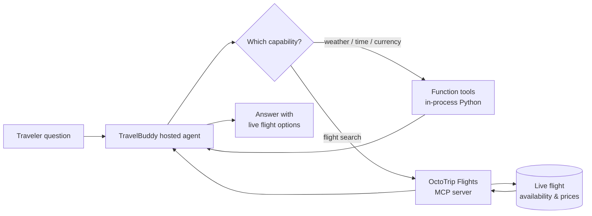

# Step 3 — Plug in an MCP server for live flight search

> **Goal:** wire the **OctoTrip Flights MCP** server into TravelBuddy so it can search real flights from a public, anonymous knowledge source — while keeping the Step 2 function tools.

## What you'll learn

- What the **Model Context Protocol (MCP)** is and why hosted agents can talk to MCP servers natively
- The difference between **function tools** (Step 2, local Python) and **MCP tools** (this step, a remote standardised server) — and why they coexist in the same agent
- How to register a remote MCP server in code with `client.get_mcp_tool(...)` and what `approval_mode` controls
- How the manifest declares the MCP server's configuration through environment variables
- Why adding an MCP tool changes your code and config but **not** your deployment shape (still `resources: []`)

## What's already in the repo

- `travel_assistant/main.py`, `travel_assistant/tools.py`, `agent.yaml`, `agent.manifest.yaml` — carried over from Step 2 (your TravelBuddy agent with the three function tools). Nothing was deleted when you advanced; your Step 2 work is preserved.
- The MCP settings are already listed in `.env.example` (`MCP_SERVER_LABEL`, `MCP_SERVER_URL`); this step starts using them.

In this step you make **delta-only** edits: add the MCP env vars to `.env`, add one line to `main.py` to register the MCP tool, append one sentence to TravelBuddy's instructions, and update the manifest metadata. You do **not** rewrite `main.py`, `tools.py`, or the YAML files from scratch — you add to the files you finished in Step 2.

## Concept (5-min read)

TravelBuddy already has three **function tools** (weather, local time, currency) — small Python functions that run **in-process** inside its container. That pattern is perfect for capabilities you own and can code. But some capabilities are better consumed as a **service**: a large, live data source (say, real-time flight availability) you don't want to re-implement or redeploy every time it changes. That's where MCP comes in.

The **Model Context Protocol (MCP)** is an open standard for connecting AI applications to external tools, data, and prompts. An **MCP server** exposes a set of capabilities (tools, resources, prompts) over a standard protocol; an **MCP client** (here, your hosted agent) connects to that server, discovers what it offers, and calls it when useful. Because the protocol is standardised, the same client can talk to *any* compliant server — GitHub, a database gateway, a docs service — without custom glue for each one.

The key contrast with Step 2:

| | Function tools (Step 2) | MCP tools (this step) |
| --- | --- | --- |
| Where the code runs | In-process, in your container | On a **remote** MCP server |
| Who owns it | You (your Python) | The server operator (here, OctoTrip) |
| How it's registered | Pass the function in `tools=[...]` | `client.get_mcp_tool(name=..., url=...)` |
| Tool schema | Inferred from type hints + docstring | Streamed from the server at connect time |
| Evolves without redeploy | No — you edit and redeploy | Yes — the server can add/update tools |

Crucially, **from the model's point of view they are all just tools.** The same tool-calling loop from Step 2 applies: the model sees the available tools (local *and* remote), decides which to call, the framework runs the call, and the result flows back into the answer. A single hosted agent can connect to many MCP servers at once, and the model picks the right capability per question.

This step points TravelBuddy at the **OctoTrip Flights MCP** server, a public, anonymous endpoint that searches live flights (routes, prices, times). Weather, time, and currency stay as local function tools (they're small and app-specific); flight search becomes an MCP tool because it's a large, live data source that OctoTrip keeps current for you.



`client.get_mcp_tool(...)` is the Agent Framework helper that turns a remote MCP server into a tool the agent can use. You give it a `name` (a stable label that identifies the server in logs and tool-call traces), a `url` (the MCP endpoint), and `approval_mode`. Setting `approval_mode="never_require"` lets the runtime call the server automatically without pausing for human approval — appropriate here because OctoTrip Flights is a read-only, public search source. For servers that mutate state (booking a flight, sending mail), you'd require approval instead.

The upstream `03-mcp` sample connects to the **GitHub** MCP server and passes an `Authorization` header built from a `GITHUB_PAT`. This workshop uses the exact same Agent Framework pattern but points at the **anonymous** OctoTrip Flights endpoint, so no token or header is needed. (The Troubleshooting section shows the authenticated variant if you switch to a server that requires a token.)

Helpful references:

- [What is the Model Context Protocol (MCP)?](https://modelcontextprotocol.io/) — the open standard TravelBuddy speaks to.
- [OctoTrip Flights MCP server](https://mcp.octotrip.app/flights) — the public, anonymous flight-search server used in this step (streamable HTTP; a single `search` tool taking `origin`, `destination`, and `departure_date`).
- [Model Context Protocol tools in Microsoft Foundry Agents](https://learn.microsoft.com/azure/foundry/agents/how-to/tools/model-context-protocol) — how Foundry agents connect to MCP servers and what `approval_mode` controls.
- [Using tools with an agent](https://learn.microsoft.com/agent-framework/agents/tools/function-tools) — the shared tool-calling loop that function tools and MCP tools both flow through.
- [What are hosted agents?](https://learn.microsoft.com/azure/foundry/agents/concepts/hosted-agents) — the hosted boundary your agent (and its MCP connection) runs inside.
- [Upstream `03-mcp` hosted-agent sample](https://github.com/microsoft-foundry/foundry-samples/tree/main/samples/python/hosted-agents/agent-framework/responses/03-mcp) — the sample this step is based on.

## Steps

### 1. Add the MCP env vars to `.env`

Open `.env` and add the MCP settings. They're already listed in `.env.example`; this step starts using them.

```env
# .env
MCP_SERVER_LABEL=octotrip-flights
MCP_SERVER_URL=https://mcp.octotrip.app/flights/mcp
```

- **`MCP_SERVER_LABEL`** is a short, stable identifier for the server. It becomes the tool group name that shows up in logs and tool-call traces, so keep it predictable and avoid spaces.
- **`MCP_SERVER_URL`** is the MCP endpoint the agent connects to.

Keep the Foundry values (`AZURE_AI_PROJECT_ENDPOINT`, `AZURE_AI_MODEL_DEPLOYMENT_NAME`, `WORKSHOP_RESOURCE_PREFIX`) in `.env` too. Don't add any secret for OctoTrip Flights MCP — it's public and anonymous.

### 2. Register the MCP tool in `travel_assistant/main.py`

Your `main.py` is already complete from Step 2 — **don't rewrite it.** There's exactly **one functional addition**: append a `client.get_mcp_tool(...)` entry to the existing `tools=[...]` list. Then add one sentence to the instructions so the model knows when to reach for flight search.

**Keep your Step 2 imports and function tools exactly as they are.** The three function tools are still registered; you're *adding* a fourth, remote tool alongside them:

```python
    tools = [
        get_weather,        # <-- kept from Step 2
        get_local_time,     # <-- kept from Step 2
        convert_currency,   # <-- kept from Step 2
        client.get_mcp_tool(                          # <-- add this entry
            name=os.environ["MCP_SERVER_LABEL"],
            url=os.environ["MCP_SERVER_URL"],
            approval_mode="never_require",
        ),
    ]
```

Then **keep your Step 2 instructions exactly as they are** and append one MCP sentence so the model knows the flight-search capability exists:

```python
        instructions=(
            # ... keep your Step 2 instructions here, unchanged ...
            "Use the OctoTrip Flights MCP server when the traveler asks about "
            "flights, routes, fares, or schedules; pass IATA airport codes and a "
            "departure date (YYYY-MM-DD) — if the traveler doesn't give one, call "
            "get_local_time and use the date part of its iso_time as today's date — "
            "and summarize the options you find."
        ),
        tools=tools,        # <-- the list you just extended above
```

That's the whole code change. `client.get_mcp_tool(...)` reads the label and URL from the environment (the same values you just added to `.env`) and hands the agent a remote tool. Everything else in `main.py` — the `FoundryChatClient` setup, the three function tools, `default_options={"store": False}`, and `ResponsesHostServer(agent).run()` — is unchanged from Step 2. If you get stuck, the finished file is in [`.workshop/solutions/03-mcp/`](.workshop/solutions/03-mcp/).

> **Why `os.environ[...]` and not a hardcoded URL?** Reading the label and URL from the environment keeps them out of source control and lets you point at a different MCP server (or the authenticated variant in Troubleshooting) by editing `.env` — no code change. The hosted runtime gets the same values from the manifest at deploy time.

### 3. Update `travel_assistant/agent.manifest.yaml`

An MCP connection is made **in code** and configured through **environment variables**, so the manifest structure barely changes — same `template`, same `protocols`, and `resources` stays empty (`[]`) because no new Azure resource is needed. This step makes two kinds of edit: **metadata** (update the human-facing `description`, add an `MCP Tools` tag and an MCP entry to `tool_declarations`) and **configuration** (add the two MCP environment variables so the hosted runtime receives them).

Update the `description`:

```yaml
# travel_assistant/agent.manifest.yaml
description: >
  TravelBuddy is an Agent Framework hosted agent with local Python function tools
  for weather, local time, and currency, plus an OctoTrip Flights MCP connection for
  live flight search.
```

Extend `metadata` — add the `MCP Tools` tag and an MCP entry alongside the Step 2 `tool_declarations` (keep the three function-tool entries):

```yaml
metadata:
  tags:
    - Agent Framework
    - AI Agent Hosting
    - Azure AI AgentServer
    - Responses Protocol
    - Travel Assistant
    - Function Tools
    - MCP Tools           # <-- added
  tool_declarations:
    # ... keep the get_weather / get_local_time / convert_currency entries ...
    - name: octotrip-flights         # <-- added: the remote MCP tool group
      description: OctoTrip Flights MCP server for live flight search.
      type: mcp
      url: ${MCP_SERVER_URL}
```

Then add the two MCP variables to the **existing** `template.environment_variables` list (keep the Step 1/Step 2 entries):

```yaml
template:
  # ... name, kind, protocols unchanged ...
  environment_variables:
    # ... AZURE_AI_PROJECT_ENDPOINT, AZURE_AI_MODEL_DEPLOYMENT_NAME, WORKSHOP_RESOURCE_PREFIX ...
    - name: MCP_SERVER_LABEL         # <-- added
      value: ${MCP_SERVER_LABEL}
    - name: MCP_SERVER_URL           # <-- added
      value: ${MCP_SERVER_URL}

resources: []                        # <-- unchanged: no new Azure resource
```

`tool_declarations` is **descriptive metadata** — it documents the agent's capabilities for humans and tooling that browse the manifest. The MCP tools are still connected in code via `client.get_mcp_tool(...)`; the MCP server itself decides which concrete tools it exposes at connect time. `resources` stays `[]` because MCP adds no Azure resource — the connection is an outbound HTTPS call from the running container.

### 4. Add the MCP env vars to `travel_assistant/agent.yaml`

`agent.yaml` is the local hosted-agent runtime definition, so it carries its **own** environment-variable list. Add the same two MCP variables here so the **local** run (`azd ai agent run`) picks them up — the hosted `agent.yaml` and the manifest's `template` share the same environment contract, but each file declares the variables it needs:

```yaml
# travel_assistant/agent.yaml
environment_variables:
  # ... AZURE_AI_PROJECT_ENDPOINT, AZURE_AI_MODEL_DEPLOYMENT_NAME, WORKSHOP_RESOURCE_PREFIX ...
  - name: MCP_SERVER_LABEL           # <-- added
    value: ${MCP_SERVER_LABEL}
  - name: MCP_SERVER_URL             # <-- added
    value: ${MCP_SERVER_URL}
```

Leave the `name`, `kind`, `protocols`, and CPU/memory blocks exactly as they were. No new Azure resource is declared, so you won't need to re-provision — but because `azd ai agent init` **copied** your code and manifest into the project folder in earlier steps, you'll re-run `azd ai agent init` in the next section to refresh that copy before deploying.

## Run and deploy TravelBuddy

**Do you need to re-init? Yes.** In the earlier steps, `azd ai agent init` **copied** your `travel_assistant/` code into the generated `${WORKSHOP_RESOURCE_PREFIX}-travel-buddy/` project folder — that copy is the snapshot azd actually builds and deploys. Your Step 3 edits live in `travel_assistant/` (the `main.py` MCP tool line, the appended instruction, and the manifest/`agent.yaml` changes), so the copied snapshot is now **stale**. Re-run `azd ai agent init` to refresh it before you run or deploy; it re-copies the current `travel_assistant/` code and re-reads the updated `agent.manifest.yaml`.

You do **not** need `azd provision` again — you added no new Azure resources (`resources:` is still `[]`), so the infrastructure from earlier steps is unchanged. The re-init just refreshes the copied code + manifest, and then `azd deploy` ships the new container version.

> Prefer not to re-init? You can instead copy your edited `travel_assistant/main.py` (and the updated YAML) into the code directory inside `${WORKSHOP_RESOURCE_PREFIX}-travel-buddy/` and skip straight to `azd deploy`. Re-init is the reliable path because it also picks up the manifest changes and can't drift out of sync.

1. **Re-init from the repository root.** Load your `.env` into the shell first — the repo `.env` isn't auto-loaded, and the shell needs `WORKSHOP_RESOURCE_PREFIX` to expand `--agent-name` (and to `cd` into the folder later):

   <!-- terminal -->
   ```bash
   # bash / zsh
   set -a; source .env; set +a
   azd ai agent init -m travel_assistant/agent.manifest.yaml \
     --agent-name "${WORKSHOP_RESOURCE_PREFIX}-travel-buddy"
   ```

   <!-- terminal -->
   ```powershell
   # PowerShell
   Get-Content .env | Where-Object { $_ -match '^\s*[^#].*=' } | ForEach-Object {
     $name, $value = $_ -split '=', 2
     Set-Item "Env:$($name.Trim())" $value.Trim()
   }
   azd ai agent init -m travel_assistant/agent.manifest.yaml `
     --agent-name "$($env:WORKSHOP_RESOURCE_PREFIX)-travel-buddy"
   ```

   This refreshes the `${WORKSHOP_RESOURCE_PREFIX}-travel-buddy/` folder with your updated `main.py` and the updated manifest metadata (including the new MCP environment variables).

2. **`cd` into the project folder and add the new MCP values to the azd env.** azd keeps its **own** environment store (`.azure/<env-name>/.env`), separate from the repo `.env`. The Foundry values (`AZURE_AI_PROJECT_ENDPOINT`, `AZURE_AI_MODEL_DEPLOYMENT_NAME`, `WORKSHOP_RESOURCE_PREFIX`) are already in the azd env from earlier steps, so you only need to set the **two new** MCP variables. Keep `.env` loaded in the shell so you can pass the values through:

   <!-- terminal -->
   ```bash
   # bash / zsh — after: set -a; source .env; set +a
   cd "${WORKSHOP_RESOURCE_PREFIX}-travel-buddy"
   azd env set MCP_SERVER_LABEL "$MCP_SERVER_LABEL"
   azd env set MCP_SERVER_URL "$MCP_SERVER_URL"
   ```

   <!-- terminal -->
   ```powershell
   # PowerShell — after loading .env into the shell
   cd "$($env:WORKSHOP_RESOURCE_PREFIX)-travel-buddy"
   azd env set MCP_SERVER_LABEL "$env:MCP_SERVER_LABEL"
   azd env set MCP_SERVER_URL "$env:MCP_SERVER_URL"
   ```

3. **Run TravelBuddy locally** in the hosted Responses runtime:

   <!-- terminal -->
   ```bash
   azd ai agent run
   ```

   `azd` reads `agent.yaml`, substitutes values from your azd environment, and starts the server on `http://localhost:8088` — now with your three function tools **and** the OctoTrip Flights MCP connection loaded. Leave this terminal running.

4. **Invoke the local agent from a second terminal.** The `azd ai agent run` process is still holding the first terminal, so open a **new** one (in the same project folder) and ask a question that forces a flight search:

   <!-- terminal -->
   ```bash
   azd ai agent invoke --local "Find flights from Seattle (SEA) to Tokyo (NRT). List a few options with airline, price, and times."
   ```

   Expected: TravelBuddy calls the OctoTrip Flights MCP server and answers with real flight options — not just generic advice. The exact flights and prices change as the live server updates.

   Prefer a UI? With the local agent still running, open the **Agent Inspector** from the Foundry Toolkit (Command Palette → **Foundry Toolkit: Open Agent Inspector**). It connects to `http://localhost:8088` and shows each streamed MCP tool call and result.

5. **Deploy to Foundry**:

   <!-- terminal -->
   ```bash
   azd deploy
   ```

   This builds the container image from the **refreshed** project-folder snapshot — now including the MCP tool registration and env vars — pushes it to your Azure Container Registry, and rolls out a new hosted agent version. No `azd provision` is needed because the infrastructure is unchanged.

6. **Invoke the deployed agent**:

   <!-- terminal -->
   ```bash
   azd ai agent invoke "Find flights from Seattle (SEA) to Tokyo (NRT)."
   ```

   Prefer a UI? Open the **Hosted Agent Playground** from the Foundry Toolkit (**Developer Tools** → **Build** → **Hosted Agent Playground**), pick your deployed agent and version, and watch the MCP tool calls in the session details.

## Try it

Try prompts that make the tool choice obvious.

- "Find me flights from London (LHR) to New York (JFK)."

Now try a **mixed** prompt that should use both a local function tool and MCP in one conversation:

- "What's the weather in Reykjavik right now, and can you find flights from Reykjavik (KEF) to Copenhagen (CPH)?"

The weather portion should use the Step 2 `get_weather` function tool; the flight portion should use OctoTrip Flights MCP. That's the key lesson: local function tools and remote MCP tools are both just tools from the model's point of view, and it routes each part of the question to the right one.

## Troubleshooting

### MCP server unreachable

Check the URL in `.env`.

```env
# .env
MCP_SERVER_URL=https://mcp.octotrip.app/flights/mcp
```

The OctoTrip Flights MCP is public and anonymous, but it's rate-limited (roughly one request per second). If calls fail intermittently, space out your prompts and retry. If the endpoint is temporarily unavailable, try again later.

### No MCP tools listed

Confirm the two settings are in **both** `.env` and the manifest, and that `main.py` actually appends `client.get_mcp_tool(...)` to the `tools` list passed to `Agent`.

Common mistakes:

- putting `environment_variables` under `resources` instead of `template`;
- using `environmentVariables` instead of `environment_variables`;
- adding `MCP_SERVER_LABEL` / `MCP_SERVER_URL` to `.env` but not to the manifest;
- forgetting to restart the agent (or re-run `azd ai agent init`) after editing `.env` or the manifest.

### The local function tools stopped working

The final `tools` list should contain **four** entries: the three function tools from Step 2 (`get_weather`, `get_local_time`, `convert_currency`) plus the MCP tool from this step. If you replaced the whole list with only the MCP tool, restore the function tools and run again.

### Auth error against the MCP server

OctoTrip Flights MCP is anonymous, so an auth error usually means you changed `MCP_SERVER_URL` to a server that requires a token. For an authenticated MCP server, follow the upstream `03-mcp` auth pattern: read a token from the environment and pass an `Authorization` header to `client.get_mcp_tool(...)`.

```python
# travel_assistant/main.py
token = os.environ["MCP_SERVER_TOKEN"]
mcp_tool = client.get_mcp_tool(
    name=os.environ["MCP_SERVER_LABEL"],
    url=os.environ["MCP_SERVER_URL"],
    headers={"Authorization": f"Bearer {token}"},
    approval_mode="never_require",
)
```

Do not commit tokens to `.env.example`, `agent.manifest.yaml`, or source control. Use your local `.env` or the deployment environment's secret store.

### The agent answers without searching flights

Make the prompt explicit: give an origin, a destination (IATA codes work well), and a departure date, and ask for flight options. MCP gives the model access to live flight search, but the model still chooses whether to call it. Strong prompts make the desired tool use clear while you're testing.

### Deploy didn't pick up my MCP change

`azd ai agent init` **copied** your code into the `${WORKSHOP_RESOURCE_PREFIX}-travel-buddy/` project folder, so edits in `travel_assistant/` don't deploy on their own. Re-run `azd ai agent init` (step 1 above) to refresh that snapshot — or copy your edited files into the folder's code directory — then `azd deploy` again.

## Solution

> If you get stuck: [`.workshop/solutions/03-mcp/`](.workshop/solutions/03-mcp/)

## Upstream sample

> Based on the upstream [`03-mcp`](https://github.com/microsoft-foundry/foundry-samples/tree/main/samples/python/hosted-agents/agent-framework/responses/03-mcp) sample.
