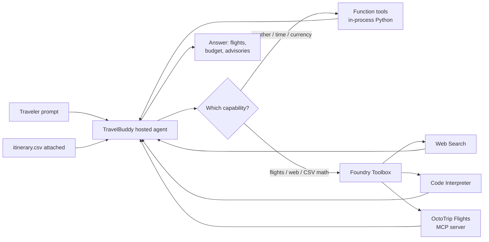

# Step 4 — Move flight search into a Foundry Toolbox (+ Web Search and Code Interpreter)

> **Goal:** package the Step 3 flights MCP into a project-managed **Foundry Toolbox** that also adds **Web Search** and **Code Interpreter**, then consume the whole bundle from one endpoint with `FoundryToolbox` — while keeping the Step 2 function tools.

## What you'll learn

- What a **Foundry Toolbox** is and how it differs from the tool patterns you've used so far
- The three tool surfaces now in play — **in-process function tools** (Step 2), a **directly-wired MCP server** (Step 3), and a **project-managed toolbox** (this step) — and when to reach for each
- What the built-in **Web Search** and **Code Interpreter** tools give the agent
- Why moving the flights MCP *into* the toolbox makes it reusable and centrally managed
- How `FoundryToolbox(credential)` connects to the toolbox through a single `TOOLBOX_ENDPOINT`
- Why the toolbox is created **out-of-band**, so your deployment shape doesn't change (still `resources: []`, no `azd provision`)

## What's already in the repo

- `travel_assistant/main.py`, `travel_assistant/tools.py`, `agent.yaml`, `agent.manifest.yaml` — carried over from Step 3 (your TravelBuddy agent with the three function tools **and** the directly-wired OctoTrip flights MCP). Nothing was deleted when you advanced.
- `travel_assistant/data/itinerary.csv` — a small sample itinerary (mixed currencies on purpose) for Code Interpreter to analyze. It was delivered when you advanced.
- `travel_toolbox/toolbox.yaml` — a starter toolbox definition at the **repo root** (a sibling of `travel_assistant/`, delivered when you advanced). Step 1 walks through it.

In this step you make **delta-only** edits: create the toolbox from `toolbox.yaml`, set **one** new environment variable (`TOOLBOX_ENDPOINT`), swap the direct `client.get_mcp_tool(...)` line in `main.py` for `FoundryToolbox(credential)`, and update `agent.yaml` + the manifest metadata. You keep your carried-over instructions and function tools — you only adjust what the toolbox changes.

## Concept (5-min read)

You've now met two tool patterns. **Function tools** (Step 2) are Python functions that run **in-process** in your container — perfect for small, app-specific logic you own (`get_weather`, `get_local_time`, `convert_currency`). **MCP tools** (Step 3) live behind a protocol boundary on a remote server; you wired the OctoTrip flights server directly in code with `client.get_mcp_tool(...)`, reading its label and URL from `.env`.

A **Foundry Toolbox** is the **managed** option. It's a project-level bundle of tools — Web Search, Code Interpreter, MCP servers, Azure AI Search, and more — that Foundry hosts behind **one endpoint**. You define the bundle once (in `toolbox.yaml`), create it in your project, and any hosted agent can consume it by pointing `FoundryToolbox` at the toolbox's `TOOLBOX_ENDPOINT`. Credentials, connections, and policy live in the Foundry project, not scattered across each agent's code.

Here's the contrast across all three:

| | Function tools (Step 2) | Directly-wired MCP (Step 3) | Foundry Toolbox (this step) |
| --- | --- | --- | --- |
| Where it's defined | Python in your app | `client.get_mcp_tool(...)` in code | `toolbox.yaml`, created in the project |
| Who manages it | You | You (per agent) | The Foundry project |
| Reuse across agents | Copy the code | Re-wire per agent | Share one toolbox endpoint |
| Config lives in | Your source | Each agent's `.env` + manifest | The toolbox (one place) |
| Registered in code as | `tools=[fn, ...]` | `client.get_mcp_tool(...)` | `FoundryToolbox(credential)` |
| Deployment impact | None | None (`resources: []`) | None (`resources: []`, created out-of-band) |

This step migrates the **flights MCP from Step 3 into the toolbox**, and adds two Foundry-managed capabilities alongside it:

- **Web Search** — grounds answers in current travel advisories, disruptions, and events. You don't run or key a search engine; Foundry manages it.
- **Code Interpreter** — a sandboxed Python runtime that can read an uploaded file and return tables, totals, and charts. TravelBuddy uses it to turn `itinerary.csv` into a budget breakdown with currency conversion.

The three function tools (weather, time, currency) **stay in-process** — a toolbox hosts Foundry-managed tools, not your arbitrary Python. So after this step TravelBuddy uses two surfaces at once: local function tools **and** the shared toolbox.



One important detail for Code Interpreter: **uploading a file isn't enough** — the agent input must include the uploaded file reference so the sandbox can mount it. In the Foundry playground you attach the file to the message; from custom code you pass `Content.from_hosted_file(file_id=...)` (see Troubleshooting).

> **Portal alternative.** You don't have to use the CLI. A toolbox can also be created and managed in the [Foundry portal](https://ai.azure.com) under **Toolboxes** (and in the Microsoft Foundry Toolkit for VS Code, which lists each toolbox's **Endpoint URL**). This step uses `azd ai toolbox create --from-file` so the definition stays in source control, but the portal is a fine way to inspect or tweak it.

Helpful references:

- [Create, test, and deploy a toolbox in Foundry](https://learn.microsoft.com/azure/foundry/agents/how-to/tools/toolbox) — the `toolbox.yaml` schema, `azd ai toolbox` commands, and the `TOOLBOX_ENDPOINT` connection pattern.
- [Web Search tool](https://learn.microsoft.com/azure/foundry/agents/how-to/tools/web-search) — what Web Search grounds on and how to enable it.
- [Code Interpreter tool](https://learn.microsoft.com/azure/foundry/agents/how-to/tools/code-interpreter) — the sandboxed Python runtime, file inputs, and file outputs.
- [Model Context Protocol tools in Microsoft Foundry Agents](https://learn.microsoft.com/azure/foundry/agents/how-to/tools/model-context-protocol) — the MCP tool you're moving into the toolbox.
- [What are hosted agents?](https://learn.microsoft.com/azure/foundry/agents/concepts/hosted-agents) — the hosted boundary the toolbox connection runs inside.
- [Upstream `04-foundry-toolbox` hosted-agent sample](https://github.com/microsoft-foundry/foundry-samples/tree/main/samples/python/hosted-agents/agent-framework/responses/04-foundry-toolbox) — the sample this step is based on.

## Steps

### 1. Review the toolbox definition in `travel_toolbox/toolbox.yaml`

A toolbox is described by a single YAML file. Yours was delivered at the repo root when you advanced — open `travel_toolbox/toolbox.yaml` and read it:

```yaml
# travel_toolbox/toolbox.yaml
description: TravelBuddy tools — web search, Code Interpreter, and flight search.
tools:
  - type: web_search
    name: web_search
    require_approval: "never"
  - type: code_interpreter
    name: code_interpreter
    require_approval: "never"
  - type: mcp
    # OctoTrip Flights MCP — public and anonymous, so no connection/auth is needed.
    server_label: octotrip-flights
    server_url: "https://mcp.octotrip.app/flights/mcp"
    require_approval: "never"
```

- **`web_search`** and **`code_interpreter`** are built-in Foundry tool types — you name them and you're done; Foundry hosts them.
- The **`mcp`** entry is the OctoTrip flights server **migrated in from Step 3**. Because it's public and anonymous, you give it a `server_label` and `server_url` and nothing else. (A tool that needs auth would instead reference a `project_connection_id` — a named connection stored in the project.)
- `require_approval: "never"` lets the runtime call each tool automatically without pausing for human approval — appropriate for these read-only, public capabilities.

> **Why does this file live at the repo root, not in `travel_assistant/`?** `azd ai agent init` snapshots the **`travel_assistant/` folder** into the deployable project. The toolbox is created separately (Step 2) and referenced only by endpoint, so its definition must sit **outside** the agent folder — otherwise it would be needlessly copied into the agent image. Keeping `travel_toolbox/` a sibling of `travel_assistant/` keeps the two concerns separate.

### 2. Create the toolbox in your Foundry project

Creating the toolbox is a one-time setup that produces the endpoint your agent connects to. Two things matter for the command to succeed:

- **Load your repo-root `.env`** so `WORKSHOP_RESOURCE_PREFIX` expands into the toolbox name.
- **Run it from inside the `${WORKSHOP_RESOURCE_PREFIX}-travel-buddy/` project folder** that Step 1 generated. `azd ai toolbox create` needs a **current azd environment** — the one Step 1 created at `.azure/<env-name>/` inside that folder. Run it from the repo root and it fails with `failed to read current azd environment: … no project exists` even though the project endpoint resolves. (`azd ai project set` alone does **not** satisfy this — azd still needs an environment in the working directory.)

The `toolbox.yaml` stays at the repo root, so from inside the project folder you reference it as `../travel_toolbox/toolbox.yaml`. Sign in, load `.env`, `cd` into the folder, then create the toolbox:

<!-- terminal -->
```bash
# bash / zsh — run from the repo root
set -a; source .env; set +a
cd "${WORKSHOP_RESOURCE_PREFIX}-travel-buddy"   # the azd project folder from Step 1 (holds the azd env)
azd ai toolbox create "${WORKSHOP_RESOURCE_PREFIX}-travel-toolbox" \
  --from-file ../travel_toolbox/toolbox.yaml
cd ..                                           # back to the repo root
```

<!-- terminal -->
```powershell
# PowerShell — run from the repo root
Get-Content .env | Where-Object { $_ -match '^\s*[^#].*=' } | ForEach-Object {
  $name, $value = $_ -split '=', 2
  Set-Item "Env:$($name.Trim())" $value.Trim()
}
cd "$($env:WORKSHOP_RESOURCE_PREFIX)-travel-buddy"   # the azd project folder from Step 1 (holds the azd env)
azd ai toolbox create "$($env:WORKSHOP_RESOURCE_PREFIX)-travel-toolbox" `
  --from-file ../travel_toolbox/toolbox.yaml
cd ..                                                # back to the repo root
```

The command prints a **versioned MCP endpoint**, shaped like:

```text
https://<account>.services.ai.azure.com/api/projects/<project>/toolboxes/<toolbox-name>/versions/<version>/mcp?api-version=v1
```

Copy that endpoint and record it as the **one new** variable this step introduces. The Foundry values (`AZURE_AI_PROJECT_ENDPOINT`, `AZURE_AI_MODEL_DEPLOYMENT_NAME`, `WORKSHOP_RESOURCE_PREFIX`) are already in `.env` from earlier steps — don't touch them:

```env
# .env — add only this new line (keep the earlier variables as-is)
TOOLBOX_ENDPOINT=https://<account>.services.ai.azure.com/api/projects/<project>/toolboxes/<toolbox-name>/versions/<version>/mcp?api-version=v1
```

> Lost the endpoint later? Retrieve it any time — **from inside the `${WORKSHOP_RESOURCE_PREFIX}-travel-buddy/` folder** (the `azd` commands need its environment) — with `azd ai toolbox show "${WORKSHOP_RESOURCE_PREFIX}-travel-toolbox" --output json`, or read it from the **Toolboxes** view in the Foundry portal / VS Code Toolkit. You no longer need `MCP_SERVER_LABEL` / `MCP_SERVER_URL` in `.env` — the flights server now lives inside the toolbox.

Once the toolbox is deployed, you can also see it in the **Foundry Toolkit** for VS Code: expand your project under **My Resources → Tools** and open the **Toolboxes** tab to view your toolbox along with its **Endpoint URL**.


### 3. Swap the MCP tool for the toolbox in `travel_assistant/main.py`

Your `main.py` is complete from Step 3 — this is a small, surgical delta. The flights capability moves from a **direct** `client.get_mcp_tool(...)` call to the **toolbox**, so you make three edits and keep everything else.

First, add `FoundryToolbox` to the hosting import (you already import `ResponsesHostServer` from the same package):

```python
# travel_assistant/main.py
from agent_framework_foundry_hosting import FoundryToolbox, ResponsesHostServer  # <-- add FoundryToolbox
```

Next, keep one `credential` object so both the chat client and the toolbox share it, and construct the toolbox. `FoundryToolbox(credential)` resolves *which* toolbox to connect to from the environment — it uses `TOOLBOX_ENDPOINT` if set, otherwise it composes the endpoint from `FOUNDRY_PROJECT_ENDPOINT` + `TOOLBOX_NAME` — then authenticates every request with the credential and connects on first use:

```python
    credential = DefaultAzureCredential()

    client = FoundryChatClient(
        project_endpoint=os.environ["AZURE_AI_PROJECT_ENDPOINT"],
        model=os.environ["AZURE_AI_MODEL_DEPLOYMENT_NAME"],
        credential=credential,                # <-- reuse the same credential
    )

    # FoundryToolbox resolves the toolbox endpoint from the environment
    # (TOOLBOX_ENDPOINT, or FOUNDRY_PROJECT_ENDPOINT + TOOLBOX_NAME), authenticates
    # every request with the credential, and transparently forwards the platform
    # per-request call-id to the toolbox. The hosting server enters the agent, which
    # connects the toolbox on first use and closes it at shutdown.
    toolbox = FoundryToolbox(credential)
```

Then **replace** the Step 3 `client.get_mcp_tool(...)` entry in the `tools` list with the toolbox. Keep the three function tools exactly as they are:

```python
    tools = [
        get_weather,        # <-- kept from Step 2
        get_local_time,     # <-- kept from Step 2
        convert_currency,   # <-- kept from Step 2
        toolbox,            # <-- replaces the Step 3 client.get_mcp_tool(...) entry
    ]
```

Finally, update the instructions: **keep your carried-over instructions**, but **remove the Step 3 OctoTrip flights MCP sentence** and replace it with one that describes the toolbox capabilities. The flights capability now comes from the toolbox, not a directly-wired MCP server, so the old sentence no longer applies.

Delete this Step 3 sentence:

```python
            # remove this Step 3 sentence:
            "Use the OctoTrip Flights MCP server when the traveler asks about "
            "flights, routes, fares, or schedules; pass IATA airport codes and a "
            "departure date (YYYY-MM-DD) — if the traveler doesn't give one, call "
            "get_local_time and use the date part of its iso_time as today's date — "
            "and summarize the options you find."
```

and put the toolbox sentence in its place:

```python
        instructions=(
            # ... keep your other earlier instructions here, unchanged ...
            # (the OctoTrip flights MCP sentence above is removed)
            "Use the Foundry Toolbox for flight search (when the traveler gives no "
            "departure date, call get_local_time and use the date part of its "
            "iso_time as today's date), for web search of current "
            "travel advisories and events, and for Code Interpreter to analyze an "
            "uploaded itinerary.csv (budget totals, currency conversion, charts)."
        ),
```

That's the whole code change. Everything else — the `FoundryChatClient` setup, the three function tools, `default_options={"store": False}`, and the synchronous `ResponsesHostServer(agent).run()` — is unchanged from Step 3. If you get stuck, the finished file is in [`.workshop/solutions/04-toolbox/`](.workshop/solutions/04-toolbox/).

> **Why one `credential`?** The toolbox and the chat client both authenticate to Foundry. Sharing a single `DefaultAzureCredential()` avoids two sign-in flows and keeps token caching in one place.

### 4. Update `travel_assistant/agent.yaml`

`agent.yaml` carries its own environment-variable list for the **local** run (`azd ai agent run`). The flights MCP is no longer wired in code, so remove its two variables and add `TOOLBOX_ENDPOINT`:

```yaml
# travel_assistant/agent.yaml
environment_variables:
  # ... AZURE_AI_PROJECT_ENDPOINT, AZURE_AI_MODEL_DEPLOYMENT_NAME, WORKSHOP_RESOURCE_PREFIX ...
  - name: TOOLBOX_ENDPOINT          # <-- added
    value: ${TOOLBOX_ENDPOINT}
  # remove the Step 3 MCP_SERVER_LABEL / MCP_SERVER_URL entries — the flights
  # server now lives inside the toolbox
```

Leave the `name`, `kind`, `protocols`, and CPU/memory blocks exactly as they were.

### 5. Update `travel_assistant/agent.manifest.yaml`

The toolbox is created **out-of-band** and referenced only by endpoint, so the manifest structure barely changes — same `template`, same `protocols`, and `resources` stays empty (`[]`) because **no new Azure resource is declared**. You make two kinds of edit: **metadata** (update the `description`, add a `Toolbox Tools` tag, swap the MCP `tool_declarations` entry for a toolbox one) and **configuration** (swap the MCP environment variables for `TOOLBOX_ENDPOINT`).

Update the `description`:

```yaml
# travel_assistant/agent.manifest.yaml
description: >
  TravelBuddy is an Agent Framework hosted agent with local Python function tools
  for weather, local time, and currency, plus a Foundry Toolbox that bundles web
  search, Code Interpreter, and the OctoTrip flights MCP server behind one
  project-managed endpoint.
```

Add the `Toolbox Tools` tag (keep the rest, including `Travel Assistant` and `MCP Tools` — the toolbox still carries an MCP server) and replace the Step 3 `octotrip-flights` MCP entry with a toolbox entry (keep the three function-tool entries):

```yaml
metadata:
  tags:
    - Agent Framework
    - AI Agent Hosting
    - Azure AI AgentServer
    - Responses Protocol
    - Travel Assistant
    - Function Tools
    - MCP Tools
    - Toolbox Tools          # <-- added
  tool_declarations:
    # ... keep the get_weather / get_local_time / convert_currency entries ...
    - name: travel-toolbox                       # <-- replaces the octotrip-flights mcp entry
      description: >
        Foundry Toolbox bundling web_search, code_interpreter, and the OctoTrip
        flights MCP server, consumed from one project-managed endpoint.
      type: toolbox
      endpoint: ${TOOLBOX_ENDPOINT}
```

Then swap the MCP variables for `TOOLBOX_ENDPOINT` in the **existing** `template.environment_variables` list (keep the Step 1/Step 2 entries):

```yaml
template:
  # ... name, kind, protocols unchanged ...
  environment_variables:
    # ... AZURE_AI_PROJECT_ENDPOINT, AZURE_AI_MODEL_DEPLOYMENT_NAME, WORKSHOP_RESOURCE_PREFIX ...
    - name: TOOLBOX_ENDPOINT         # <-- added
      value: ${TOOLBOX_ENDPOINT}
    # remove the Step 3 MCP_SERVER_LABEL / MCP_SERVER_URL entries

resources: []                        # <-- unchanged: the toolbox is created out-of-band
```

`tool_declarations` is **descriptive metadata** — it documents the agent's capabilities for humans and tooling that browse the manifest. The toolbox is connected in code via `FoundryToolbox(credential)`; the toolbox itself decides which concrete tools it exposes. `resources` stays `[]` because the toolbox is a project-level resource you created separately — the manifest declares no new Azure resource, so there's nothing to provision.

## Run and deploy TravelBuddy

**Do you need to re-init? Yes.** In earlier steps, `azd ai agent init` **copied** your `travel_assistant/` code into the generated `${WORKSHOP_RESOURCE_PREFIX}-travel-buddy/` project folder — that copy is the snapshot azd actually builds and deploys. Your Step 4 edits (the `main.py` toolbox swap and the manifest/`agent.yaml` changes) live in `travel_assistant/`, so the copied snapshot is now **stale**. Re-run `azd ai agent init` to refresh it before you run or deploy.

**Do you need `azd provision`? No.** You added no new Azure resource to the manifest (`resources:` is still `[]`) — the toolbox was created out-of-band in Step 2. The infrastructure from earlier steps is unchanged.

1. **Re-init from the repository root.** Load your `.env` into the shell first — the repo `.env` isn't auto-loaded, and the shell needs `WORKSHOP_RESOURCE_PREFIX` to expand `--agent-name` (and to `cd` into the folder later):

   <!-- terminal -->
   ```bash
   # bash / zsh
   set -a; source .env; set +a
   azd ai agent init -m travel_assistant/agent.manifest.yaml \
     --agent-name "${WORKSHOP_RESOURCE_PREFIX}-travel-buddy"
   ```

   <!-- terminal -->
   ```powershell
   # PowerShell
   Get-Content .env | Where-Object { $_ -match '^\s*[^#].*=' } | ForEach-Object {
     $name, $value = $_ -split '=', 2
     Set-Item "Env:$($name.Trim())" $value.Trim()
   }
   azd ai agent init -m travel_assistant/agent.manifest.yaml `
     --agent-name "$($env:WORKSHOP_RESOURCE_PREFIX)-travel-buddy"
   ```

   This refreshes the `${WORKSHOP_RESOURCE_PREFIX}-travel-buddy/` folder with your updated `main.py` and manifest metadata (including the new `TOOLBOX_ENDPOINT` variable).

2. **`cd` into the project folder and add the new value to the azd env.** azd keeps its **own** environment store (`.azure/<env-name>/.env`), separate from the repo `.env`. The Foundry values are already in the azd env from earlier steps, so you only need to set the **one new** `TOOLBOX_ENDPOINT`. Keep `.env` loaded in the shell so you can pass the value through:

   <!-- terminal -->
   ```bash
   # bash / zsh — after: set -a; source .env; set +a
   cd "${WORKSHOP_RESOURCE_PREFIX}-travel-buddy"
   azd env set TOOLBOX_ENDPOINT "$TOOLBOX_ENDPOINT"
   ```

   <!-- terminal -->
   ```powershell
   # PowerShell — after loading .env into the shell
   cd "$($env:WORKSHOP_RESOURCE_PREFIX)-travel-buddy"
   azd env set TOOLBOX_ENDPOINT "$env:TOOLBOX_ENDPOINT"
   ```

3. **Run TravelBuddy locally** in the hosted Responses runtime:

   <!-- terminal -->
   ```bash
   azd ai agent run
   ```

   `azd` reads `agent.yaml`, substitutes values from your azd environment, and starts the server on `http://localhost:8088` — now with your three function tools **and** the Foundry Toolbox (web search, Code Interpreter, flights) loaded. Leave this terminal running.

4. **Invoke the local agent from a second terminal.** Open a **new** terminal (in the same project folder) and ask a question that uses the toolbox:

   <!-- terminal -->
   ```bash
   azd ai agent invoke --local "Find flights from Seattle (SEA) to Lisbon (LIS), and what current travel advisories should I know about for Lisbon? Use the web."
   ```

   Expected: TravelBuddy calls the flights MCP (through the toolbox) for options and Web Search for advisories. For the itinerary-budget prompt, attach `itinerary.csv` in a UI or pass it as a hosted file from custom code (see Troubleshooting).

   Prefer a UI? With the local agent still running, open the **Agent Inspector** from the Foundry Toolkit (Command Palette → **Foundry Toolkit: Open Agent Inspector**). It connects to `http://localhost:8088` and shows each streamed toolbox call and result — and lets you **attach `itinerary.csv`** to a message for Code Interpreter.

5. **Deploy to Foundry**:

   <!-- terminal -->
   ```bash
   azd deploy
   ```

   This builds the container image from the **refreshed** project-folder snapshot — now consuming the toolbox — pushes it to your Azure Container Registry, and rolls out a new hosted agent version. No `azd provision` is needed because the infrastructure is unchanged.

6. **Invoke the deployed agent**:

   <!-- terminal -->
   ```bash
   azd ai agent invoke "Find flights from Seattle (SEA) to Lisbon (LIS)."
   ```

   Prefer a UI? Open the **Hosted Agent Playground** from the Foundry Toolkit (**Developer Tools** → **Build** → **Hosted Agent Playground**), pick your deployed agent and version, attach `itinerary.csv`, and watch the toolbox calls in the session details.

## Try it

- "Find flights from Seattle (SEA) to Lisbon (LIS)." — routes to the flights MCP inside the toolbox.
- "What current travel advisories or major events should I know about for my trip dates in Lisbon? Use the web." — routes to Web Search.
- "Read the attached itinerary.csv. Build a total-by-category budget breakdown, convert everything to EUR, and show a chart." — routes to Code Interpreter (**attach the file**).
- (combined) "Based on my attached itinerary and any current Lisbon advisories, suggest one change and re-total the budget in EUR."

When you ask a budget prompt, remember to attach the itinerary file reference. Web-only and flight-only prompts don't need the attachment.

## Troubleshooting

### `azd ai toolbox create` fails with "no project exists"

If the create command exits with `ERROR: failed to read current azd environment: … no project exists; to create a new project, run 'azd init'`, you ran it from the **repo root**, which has no `azd` environment. Setting the project with `azd ai project set` isn't enough — `azd ai toolbox` commands still need a current azd environment in the working directory. Use the one Step 1 created inside the agent project folder:

<!-- terminal -->
```bash
set -a; source .env; set +a
cd "${WORKSHOP_RESOURCE_PREFIX}-travel-buddy"
azd ai toolbox create "${WORKSHOP_RESOURCE_PREFIX}-travel-toolbox" \
  --from-file ../travel_toolbox/toolbox.yaml
cd ..
```

If the `${WORKSHOP_RESOURCE_PREFIX}-travel-buddy/` folder doesn't exist yet, run the Step 1 `azd ai agent init` first — that's what creates the azd environment.

### Toolbox endpoint or auth error

Most toolbox failures are a missing or wrong `TOOLBOX_ENDPOINT`, or a stale sign-in. Confirm the value and that you're signed in (run the `show` from **inside** the `${WORKSHOP_RESOURCE_PREFIX}-travel-buddy/` folder so `azd` finds its environment):

<!-- terminal -->
```bash
cd "${WORKSHOP_RESOURCE_PREFIX}-travel-buddy"
azd ai toolbox show "${WORKSHOP_RESOURCE_PREFIX}-travel-toolbox" --output json
cd ..
```

Make sure the endpoint in `.env` (and in the azd env, via `azd env set TOOLBOX_ENDPOINT ...`) matches the versioned URL the toolbox reports. `FoundryToolbox(credential)` authenticates with `DefaultAzureCredential`, so `az login` (or a valid managed identity when deployed) must resolve.

### Web search returns nothing

Some regions or projects don't have Web Search enabled. In the Foundry portal, open your project and check **Settings → Tools**. Make sure Web Search is available for the project, then retry with a prompt that clearly asks for current information.

### Code Interpreter can't see the file

Uploading a file creates a file object, but Code Interpreter only sees it when the agent input includes the file reference. In a UI (Agent Inspector or Hosted Agent Playground), **attach** `itinerary.csv` to the message. From custom code, pass it as a hosted-file content item:

```python
# travel_assistant/main.py
from agent_framework import Content, Message, Role

message = Message(
    role=Role.USER,
    contents=[
        "Read the attached itinerary.csv and total the trip by category in EUR.",
        Content.from_hosted_file(file_id=itinerary_file_id),
    ],
)
result = await agent.run(message)
```

If you only mention the file name in a string, the runtime hasn't attached the file. Use the attachment / `Content.from_hosted_file(...)`.

### Chart not visible

Code Interpreter often returns plots as **file outputs** rather than inline images. Look for file annotations in the response and download the generated file from the container. The Foundry Code Interpreter file sample shows the output-file download pattern with `container_file_citation` annotations: <https://github.com/Azure/azure-sdk-for-python/blob/main/sdk/ai/azure-ai-projects/samples/agents/tools/sample_agent_code_interpreter_with_files.py>.

For the workshop, it's enough if the response names the chart file.

### The flights tool disappeared

Flight search now lives **inside** the toolbox, not in `main.py`. If flights stop working, confirm `travel_toolbox/toolbox.yaml` still has the `mcp` entry with the OctoTrip `server_url`, and that you created the toolbox from that file. If you edited `toolbox.yaml` after creating the toolbox, re-run `azd ai toolbox create` from inside the `${WORKSHOP_RESOURCE_PREFIX}-travel-buddy/` folder (it publishes a new version) and update `TOOLBOX_ENDPOINT`.

### The local function tools stopped working

The final `tools` list should contain **four** entries: the three function tools from Step 2 (`get_weather`, `get_local_time`, `convert_currency`) plus the `toolbox`. If you replaced the whole list with only the toolbox, restore the function tools and run again.

### Deploy didn't pick up my change

`azd ai agent init` **copied** your code into the `${WORKSHOP_RESOURCE_PREFIX}-travel-buddy/` project folder, so edits in `travel_assistant/` don't deploy on their own. Re-run `azd ai agent init` (step 1 above) to refresh that snapshot — or copy your edited files into the folder's code directory — then `azd deploy` again.

## Solution

> If you get stuck: [`.workshop/solutions/04-toolbox/`](.workshop/solutions/04-toolbox/)

## Upstream sample

> Based on the upstream [`04-foundry-toolbox`](https://github.com/microsoft-foundry/foundry-samples/tree/main/samples/python/hosted-agents/agent-framework/responses/04-foundry-toolbox) sample.
