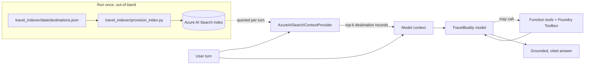

# Step 5 — Ground TravelBuddy in your own data with RAG (Azure AI Search)

> **Goal:** add **retrieval-augmented generation (RAG)** so TravelBuddy answers destination questions from a curated **Azure AI Search** index instead of the model's memory — while keeping the Step 4 function tools and Foundry Toolbox intact.

## What you'll learn

- What **RAG** is, and why grounding beats relying on the model's training data for facts you own
- The difference between a **context provider** (runs *before* the model, injects grounding) and a **tool** (the model *chooses* to call it)
- How `AzureAISearchContextProvider` retrieves the top matching records and adds them to context on every turn
- Why the search index is built **out-of-band** (once, by a script) so your deployment shape doesn't change — still `resources: []`, no `azd provision`
- How to keep the Step 4 tools + toolbox working while layering retrieval on top

## What's already in the repo

- `travel_assistant/main.py`, `travel_assistant/tools.py`, `agent.yaml`, `agent.manifest.yaml`, `requirements.txt` — carried over from Step 4 (TravelBuddy with the three function tools **and** the Foundry Toolbox). Nothing was deleted when you advanced.
- `travel_assistant/data/itinerary.csv` — the Step 4 sample itinerary for Code Interpreter.
- `travel_indexer/` — a **new sibling folder** (delivered when you advanced) that holds everything the index needs, *outside* the agent snapshot:
  - `travel_indexer/data/destinations.json` — a small seed of curated destination records (city, country, summary, highlights). This is the corpus you'll index.
  - `travel_indexer/provision_index.py` — a complete, one-shot script that creates the Search index and uploads the destinations. You run it once, out-of-band. It needs no separate dependencies: `azure-search-documents`, `azure-identity`, and `python-dotenv` are already in the environment you built from `travel_assistant/requirements.txt`.
- `travel_toolbox/toolbox.yaml` — the toolbox definition from Step 4, still a sibling of `travel_assistant/`. Unchanged this step.

**Why the indexer lives in `travel_indexer/`, not in `travel_assistant/`.** `azd ai agent init` snapshots **only** `travel_assistant/` when it packages the deployed agent. The index is built once, offline — the provisioning script and its source JSON are *tooling*, not part of the running agent — so they live in a sibling folder that is never bundled into the agent container. This is the same reason `travel_toolbox/` sits outside the snapshot. At runtime the agent reaches the finished index over the network; it never needs `provision_index.py` or `destinations.json` on disk.

In this step you make **delta-only** edits: provision the index once, set **two** new environment variables (`AZURE_AI_SEARCH_ENDPOINT`, `AZURE_AI_SEARCH_INDEX_NAME`), add an `AzureAISearchContextProvider` to `main.py`'s `context_providers`, append two grounding sentences to the instructions, and update `agent.yaml` + the manifest metadata. You keep your function tools and toolbox — you only add what RAG needs.

## Prerequisites

RAG needs an **Azure AI Search** resource. This is a **participant-provided** Azure resource — it is *not* declared in the manifest and *not* created by `azd provision`. Before you start:

- An Azure AI Search service (Basic tier or higher). Copy its endpoint (e.g. `https://<name>.search.windows.net`).
- Role assignments on that service so `DefaultAzureCredential` works without keys. `provision_index.py` both **creates the index definition** and **uploads documents**, which are two different permissions:
  - **`Search Service Contributor`** — create/delete the index definition.
  - **`Search Index Data Contributor`** — upload the destination documents (and query them locally).

  These two roles are for **you** (your `az login` user) — they let you provision the index and run TravelBuddy locally. The **deployed** agent queries Search under a *different* identity that only exists after you deploy, so you grant it read access (`Search Index Data Reader`, least privilege) in [step 6](#run-and-deploy-travelbuddy), not here.

<!-- terminal -->
```bash
SCOPE="/subscriptions/<sub-id>/resourceGroups/<rg>/providers/Microsoft.Search/searchServices/<search-name>"
USER_ID="$(az ad signed-in-user show --query id -o tsv)"
az role assignment create --assignee "$USER_ID" --role "Search Service Contributor" --scope "$SCOPE"
az role assignment create --assignee "$USER_ID" --role "Search Index Data Contributor" --scope "$SCOPE"
```

<!-- terminal -->
```powershell
# PowerShell
$SCOPE = "/subscriptions/<sub-id>/resourceGroups/<rg>/providers/Microsoft.Search/searchServices/<search-name>"
$USER_ID = az ad signed-in-user show --query id -o tsv
az role assignment create --assignee $USER_ID --role "Search Service Contributor" --scope $SCOPE
az role assignment create --assignee $USER_ID --role "Search Index Data Contributor" --scope $SCOPE
```

## Concept (5-min read)

Large language models are confident but stale: they only know what was in their training data, and they'll happily invent details about a destination they've never seen your notes on. **Retrieval-augmented generation (RAG)** fixes this by splitting the problem into two halves:

1. **Index once (offline).** You take the data you own — here, a JSON file of destination records — and load it into a search index. Each record becomes a searchable document. This is `provision_index.py`, and it runs once, out-of-band, exactly like the toolbox in Step 4.
2. **Retrieve every turn (online).** On each user message, a **context provider** runs a search against that index, pulls back the top matching records, and injects them into the model's context *before* the model responds. The model then answers from *your* text, with citations back to the source records.

The key mental model is **context provider vs. tool**:

- A **tool** (Step 2 functions, Step 4 toolbox) is something the model *decides* to call, mid-turn, when it reasons that it needs to. Retrieval is not guaranteed.
- A **context provider** runs *automatically, before* the model sees the turn. `AzureAISearchContextProvider` always grounds the response — the model can't "forget" to look at your data.

That's why RAG is a provider, not a tool: grounding should be reliable, not optional. TravelBuddy keeps all four Step 4 tools (weather, local time, currency, toolbox) — those still fire when the model needs live actions — and *adds* retrieval as a provider so factual destination answers come from your index.



### Why there's no embedding model here

If you've seen RAG before, you might expect an **embedding model** turning each record into a vector for similarity search. This workshop deliberately does **not** use one, and it's worth understanding why:

- **The corpus is tiny and curated.** Ten short, well-written destination records match reliably on **keyword (full-text) search** alone. `provision_index.py` defines a single searchable `content` field with the `standard.lucene` analyzer, so Azure AI Search ranks results with **BM25** — classic lexical relevance. No vectors, no embedding deployment, no extra cost or infrastructure.
- **`mode="semantic"` here is still keyword search.** The `AzureAISearchContextProvider` accepts `mode="semantic"`, but that name refers to its search *code path*, not to the Azure AI Search **semantic ranker**. Because our index has **no vector field** and we pass **no `semantic_configuration_name`**, the provider auto-detects "no vector fields" and falls back to a plain BM25 query. You get simple, predictable, zero-dependency retrieval — ideal for a first RAG lesson.

**When you'd add an embedding model (and how).** For large, unstructured, or paraphrase-heavy corpora, lexical search misses matches that don't share exact words ("aurora" vs. "northern lights"). Then you add **vector search**:

1. Deploy an embedding model (e.g. `text-embedding-3-small`) in Azure OpenAI / Foundry Models.
2. Add a vector field to the index and either wire up **integrated vectorization** (the index calls the embedding model for you) or pass an `embedding_function` to the provider. The provider **auto-discovers** the vector field and switches to hybrid (keyword + vector) retrieval.
3. Optionally enable the **semantic ranker** by adding a semantic configuration to the index and passing `semantic_configuration_name` — an L2 reranker that reorders the top results for relevance.

None of that is required for TravelBuddy's ten records, so we keep Step 5 focused on the RAG *shape* (index once, retrieve every turn) rather than embedding plumbing. See the vector-search links under **Learn more**.

**Learn more**

- [Retrieval-augmented generation in Azure AI Search](https://learn.microsoft.com/azure/search/retrieval-augmented-generation-overview)
- [Azure AI Search — full-text search & indexes](https://learn.microsoft.com/azure/search/search-what-is-azure-search)
- [Vector search in Azure AI Search](https://learn.microsoft.com/azure/search/vector-search-overview)
- [Integrated vectorization (index calls the embedding model for you)](https://learn.microsoft.com/azure/search/vector-search-integrated-vectorization)
- [Semantic ranking in Azure AI Search](https://learn.microsoft.com/azure/search/semantic-search-overview)
- [Role-based access for Azure AI Search](https://learn.microsoft.com/azure/search/search-security-rbac)
- [Hosted agents in Microsoft Foundry](https://learn.microsoft.com/azure/ai-foundry/agents/)
- [What are hosted agents? — Key concepts (agent identity vs. project managed identity)](https://learn.microsoft.com/azure/foundry/agents/concepts/hosted-agents#key-concepts)
- [Agent identity concepts in Microsoft Foundry](https://learn.microsoft.com/azure/foundry/agents/concepts/agent-identity) — per-agent Entra identities and the runtime OAuth token exchange
- [Hosted agent permissions reference](https://learn.microsoft.com/azure/foundry/agents/concepts/hosted-agent-permissions) — project-MI platform permissions, and data-plane roles for downstream resources (Storage, **Azure AI Search**, Key Vault) on the calling/agent identity
- [Manage hosted agents — retrieve the agent identity for role assignments](https://learn.microsoft.com/azure/foundry/agents/how-to/manage-hosted-agent#retrieve-the-agent-identity-for-role-assignments) — `instance_identity.principal_id` retrieval
- [Connect a Foundry IQ knowledge base to Foundry Agent Service](https://learn.microsoft.com/azure/foundry/agents/how-to/foundry-iq-connect#prerequisites) — the managed RAG path assigns Search roles to the **project managed identity** (unlike the in-code provider, which uses the agent identity)
- [Credential chains in the Azure Identity library for Python (`DefaultAzureCredential`)](https://learn.microsoft.com/azure/developer/python/sdk/authentication/credential-chains) — why in-container code resolves the managed identity
- [Authenticate Azure-hosted Python apps with a system-assigned managed identity](https://learn.microsoft.com/azure/developer/python/sdk/authentication/system-assigned-managed-identity)
- [How managed identities work with Azure VMs (IMDS token endpoint)](https://learn.microsoft.com/entra/identity/managed-identities-azure-resources/how-managed-identities-work-vm)
- [Upstream `11-azure-search-rag` hosted-agent sample](https://github.com/microsoft-foundry/foundry-samples/tree/main/samples/python/hosted-agents/agent-framework/responses/11-azure-search-rag) — the sample this step is based on.

## Steps

### 1. Review the destination corpus

Open `travel_indexer/data/destinations.json`. Each record is one destination:

```json
// travel_indexer/data/destinations.json (excerpt)
[
  {
    "id": "reykjavik",
    "city": "Reykjavik",
    "country": "Iceland",
    "summary": "Compact, walkable capital that is the launch point for the Golden Circle and winter aurora tours.",
    "highlights": ["Northern lights (Sep-Apr)", "Blue Lagoon geothermal spa", "Golden Circle day trips"]
  }
]
```

This is the data you own. Add or edit records freely — anything you index here becomes answerable, and re-running the provisioning script picks up your edits.

The Lisbon record also carries a deliberately synthetic fact — `TravelBuddy's internal concierge desk code for Lisbon is LIS-CANARY-4718`. It's a **canary token**: an invented string that can't exist in the model's training data, so if the agent ever returns it, the answer *must* have come from retrieval. You'll use it under [Try it](#try-it) to prove grounding actually ran.

### 2. Provision the index (out-of-band)

Open `travel_indexer/provision_index.py` and read it — you're expected to understand it, not just run it. It defines the index schema in `build_index()`, flattens each destination into a searchable document, and uploads them. The parts that matter:

- **`content`** is the one **searchable** field. `load_destinations()` flattens each record's city, country, summary, and highlights into a single `content` string, so full-text search matches on all of it.
- **`sourceName` / `sourceLink`** are carried through so the context provider can cite where each answer came from.
- **`RECREATE = True`** deletes and rebuilds the index each run — convenient for the workshop. The script uses `merge_or_upload_documents`, so re-running is idempotent.

Set the two new variables in your `.env` file, then run the script once. The script calls `load_dotenv()`, so it reads `.env` from the repo root automatically — no `export` needed. It reuses the agent's environment — `azure-search-documents`, `azure-identity`, and `python-dotenv` are already installed from `travel_assistant/requirements.txt`, so no extra install is needed (Azure AI Search is out-of-band — this does not touch azd).

Open `.env` at the repo root and fill in the two Step 5 variables:

```dotenv
# Step 5: Azure AI Search endpoint and index for RAG.
AZURE_AI_SEARCH_ENDPOINT=https://<your-search>.search.windows.net
AZURE_AI_SEARCH_INDEX_NAME=<your-prefix>-destinations
```

Two things to get right:

- The endpoint **must** start with `https://` (a plain `http://` or scheme-less value fails with `Bearer token authentication is not permitted for non-TLS protected (non-https) URLs`).
- `.env` does **not** expand `${WORKSHOP_RESOURCE_PREFIX}`, so write the literal index name — use your actual prefix, e.g. `foundry-workshop-destinations`.

Then run the script — with `python`:

<!-- terminal -->
```bash
python travel_indexer/provision_index.py
```

…or with `uv` (uses your `.venv` without activating it):

<!-- terminal -->
```bash
uv run python travel_indexer/provision_index.py
```

You should see `Done. TravelBuddy's destination index is ready.`

> The script loads `.env` with `override=True`, so the value in `.env` wins even if you previously ran `export AZURE_AI_SEARCH_ENDPOINT=...` in this shell — just correct `.env` and rerun the script.

### 3. Add retrieval to `main.py`

Keep everything from Step 4 — the imports, `tools.py` functions, the `FoundryToolbox`, and the `tools` list. Make three changes: add one import, build the search context provider and pass it to the `Agent` via `context_providers`, and append two sentences to the instructions so the model prefers the index for destination facts (the rest of the Step 4 prompt stays verbatim):

```python
# travel_assistant/main.py (delta from Step 4)
from agent_framework.azure import AzureAISearchContextProvider  # NEW

# ... existing imports, credential, client, tools, and toolbox from Step 4 stay ...

# RAG: search the destinations index before each turn and inject the top matches
# into context on every turn.
search_endpoint = os.environ["AZURE_AI_SEARCH_ENDPOINT"]       # NEW
search_index_name = os.environ["AZURE_AI_SEARCH_INDEX_NAME"]   # NEW
context_providers = [                                          # NEW
    AzureAISearchContextProvider(
        source_id="travelbuddy_destinations",
        endpoint=search_endpoint,
        index_name=search_index_name,
        credential=credential,
        mode="semantic",
        top_k=3,
    )
]

agent = Agent(
    client=client,
    name="travel-buddy",
    instructions=(
        # ... all of the Step 4 instruction sentences stay verbatim ...
        "uploaded itinerary.csv (budget totals, currency conversion, charts). "
        "Use the grounded destination context when relevant; if the destinations "  # NEW
        "index does not contain enough detail, say what is missing."                 # NEW
    ),
    tools=tools,                        # unchanged: 3 functions + toolbox
    context_providers=context_providers,  # NEW — RAG grounding on every turn
    default_options={"store": False},
)
```

`context_providers` is the only structural change; the two extra instruction sentences are a prompt tweak. `AzureAISearchContextProvider` runs the search, formats the top 3 records, and prepends them to context every turn — no tool call required. RAG is a required capability here: reading `AZURE_AI_SEARCH_ENDPOINT` and `AZURE_AI_SEARCH_INDEX_NAME` with `os.environ["..."]` (like the project endpoint and model in earlier steps) fails fast with a clear `KeyError` if either is missing, so you never run against a half-configured index.

### 4. Update `agent.yaml`

Add **only** the two new variables. Leave `TOOLBOX_ENDPOINT` and everything from earlier steps in place:

```yaml
# travel_assistant/agent.yaml (delta — add to environment_variables)
  - name: AZURE_AI_SEARCH_ENDPOINT
    value: ${AZURE_AI_SEARCH_ENDPOINT}
  - name: AZURE_AI_SEARCH_INDEX_NAME
    value: ${AZURE_AI_SEARCH_INDEX_NAME}
```

### 5. Update the manifest

The manifest changes are metadata-only. Update the `description` to mention RAG, append the `RAG` capability tag, declare the retrieval surface under `tool_declarations`, and mirror the two new env vars into `template.environment_variables`. `resources` stays `[]` — no new Azure resource is provisioned by azd.

```yaml
# travel_assistant/agent.manifest.yaml (delta)
description: >
  ... existing Step 4 description ..., and RAG grounding over a curated
  destinations index in Azure AI Search.
metadata:
  tags: [Agent Framework, AI Agent Hosting, Azure AI AgentServer, Responses Protocol, Travel Assistant, Function Tools, MCP Tools, Toolbox Tools, RAG]
  tool_declarations:
    # ... the Step 4 declarations (get_weather, get_local_time, convert_currency, travel-toolbox) stay ...
    - name: travelbuddy_destinations
      description: >
        Azure AI Search retrieval over the curated destinations index; injects the
        top-k matching destination records into context before each turn.
      type: azure_ai_search
      endpoint: ${AZURE_AI_SEARCH_ENDPOINT}
template:
  environment_variables:
    # ... existing vars stay ...
    - name: AZURE_AI_SEARCH_ENDPOINT
      value: ${AZURE_AI_SEARCH_ENDPOINT}
    - name: AZURE_AI_SEARCH_INDEX_NAME
      value: ${AZURE_AI_SEARCH_INDEX_NAME}
resources: []
```

## Run and deploy TravelBuddy

**Do you need to re-init? Yes.** In earlier steps, `azd ai agent init` **copied** your `travel_assistant/` code into the generated `${WORKSHOP_RESOURCE_PREFIX}-travel-buddy/` project folder — that copy is the snapshot azd actually builds and deploys. Your Step 5 edits (the `main.py` context-provider addition and the manifest/`agent.yaml` changes) live in `travel_assistant/`, so the copied snapshot is now **stale**. Re-run `azd ai agent init` to refresh it before you run or deploy.

**Do you need `azd provision`? No.** You added no new Azure resource to the manifest (`resources:` is still `[]`) — the Azure AI Search index was created out-of-band by `provision_index.py`. The infrastructure from earlier steps is unchanged.

1. **Re-init from the repository root.** Load your `.env` into the shell first — the repo `.env` isn't auto-loaded, and the shell needs `WORKSHOP_RESOURCE_PREFIX` to expand `--agent-name` (and to `cd` into the folder later):

   <!-- terminal -->
   ```bash
   # bash / zsh
   set -a; source .env; set +a
   azd ai agent init -m travel_assistant/agent.manifest.yaml \
     --agent-name "${WORKSHOP_RESOURCE_PREFIX}-travel-buddy"
   ```

   <!-- terminal -->
   ```powershell
   # PowerShell
   Get-Content .env | Where-Object { $_ -match '^\s*[^#].*=' } | ForEach-Object {
     $name, $value = $_ -split '=', 2
     Set-Item "Env:$($name.Trim())" $value.Trim()
   }
   azd ai agent init -m travel_assistant/agent.manifest.yaml `
     --agent-name "$($env:WORKSHOP_RESOURCE_PREFIX)-travel-buddy"
   ```

   This refreshes the `${WORKSHOP_RESOURCE_PREFIX}-travel-buddy/` folder with your updated `main.py` and manifest metadata (including the new `AZURE_AI_SEARCH_ENDPOINT` and `AZURE_AI_SEARCH_INDEX_NAME` variables).

2. **`cd` into the project folder and add the new values to the azd env.** azd keeps its **own** environment store (`.azure/<env-name>/.env`), separate from the repo `.env`. The Foundry values are already in the azd env from earlier steps, so you only need to set the **two new** Search variables. Keep `.env` loaded in the shell so you can pass the values through:

   <!-- terminal -->
   ```bash
   # bash / zsh — after: set -a; source .env; set +a
   cd "${WORKSHOP_RESOURCE_PREFIX}-travel-buddy"
   azd env set AZURE_AI_SEARCH_ENDPOINT "$AZURE_AI_SEARCH_ENDPOINT"
   azd env set AZURE_AI_SEARCH_INDEX_NAME "$AZURE_AI_SEARCH_INDEX_NAME"
   ```

   <!-- terminal -->
   ```powershell
   # PowerShell — after loading .env into the shell
   cd "$($env:WORKSHOP_RESOURCE_PREFIX)-travel-buddy"
   azd env set AZURE_AI_SEARCH_ENDPOINT "$env:AZURE_AI_SEARCH_ENDPOINT"
   azd env set AZURE_AI_SEARCH_INDEX_NAME "$env:AZURE_AI_SEARCH_INDEX_NAME"
   ```

3. **Run TravelBuddy locally** in the hosted Responses runtime:

   <!-- terminal -->
   ```bash
   azd ai agent run
   ```

   `azd` reads `agent.yaml`, substitutes values from your azd environment, and starts the server on `http://localhost:8088` — now with your Step 4 function tools and toolbox **and** the Azure AI Search context provider grounding every turn. Leave this terminal running.

4. **Invoke the local agent from a second terminal.** Open a **new** terminal (in the same project folder) and ask a question that hits the destinations index:

   <!-- terminal -->
   ```bash
   azd ai agent invoke --local "What does our index say about Reykjavik in winter?"
   ```

   Expected: TravelBuddy answers from your indexed destination record and cites it, rather than relying on the model's general knowledge.

   Prefer a UI? With the local agent still running, open the **Agent Inspector** from the Foundry Toolkit (Command Palette → **Foundry Toolkit: Open Agent Inspector**). It connects to `http://localhost:8088` and shows the retrieved context injected before each response.

5. **Deploy to Foundry**:

   <!-- terminal -->
   ```bash
   azd deploy
   ```

   This builds the container image from the **refreshed** project-folder snapshot — now including the RAG context provider and Search env vars — pushes it to your Azure Container Registry, and rolls out a new hosted agent version. No `azd provision` is needed because the infrastructure is unchanged.

6. **Grant the deployed agent's instance identity read access to the index.** Locally the agent queried Search as *you*. Deployed, its `AzureAISearchContextProvider` calls Search with `DefaultAzureCredential`, which resolves the container's runtime identity — the agent's **instance identity** (a per-agent Microsoft Entra service principal). That principal has no Search role by default, so grant it the least-privilege **`Search Index Data Reader`** — and nothing broader.

   First retrieve the instance identity's principal ID from the **agent** (not a version), then assign the role. `$SCOPE` is the **same Search-service scope from [Prerequisites](#prerequisites)**.

   <!-- terminal -->
   ```bash
   # AGENT_NAME is your deployed agent; AZURE_AI_PROJECT_ENDPOINT is already in your .env from earlier steps.
   AGENT_NAME="${WORKSHOP_RESOURCE_PREFIX}-travel-buddy"

   # 1. Resolve the agent's instance identity principal ID.
   AGENT_IDENTITY="$(az rest --method GET \
     --url "${AZURE_AI_PROJECT_ENDPOINT}/agents/${AGENT_NAME}?api-version=v1" \
     --resource "https://ai.azure.com" \
     --query "instance_identity.principal_id" -o tsv)"

   # 2. Grant it read-only access to the Search service.
   SCOPE="/subscriptions/<sub-id>/resourceGroups/<rg>/providers/Microsoft.Search/searchServices/<search-name>"   # same as Prerequisites
   az role assignment create \
     --assignee-object-id "$AGENT_IDENTITY" \
     --assignee-principal-type ServicePrincipal \
     --role "Search Index Data Reader" \
     --scope "$SCOPE"
   ```

   <!-- terminal -->
   ```powershell
   # PowerShell — AZURE_AI_PROJECT_ENDPOINT is already in your .env from earlier steps.
   $AGENT_NAME = "${env:WORKSHOP_RESOURCE_PREFIX}-travel-buddy"   # your deployed agent's name

   # 1. Resolve the agent's instance identity principal ID.
   $AGENT_IDENTITY = az rest --method GET `
     --url "${env:AZURE_AI_PROJECT_ENDPOINT}/agents/${AGENT_NAME}?api-version=v1" `
     --resource "https://ai.azure.com" `
     --query "instance_identity.principal_id" -o tsv

   # 2. Grant it read-only access to the Search service.
   $SCOPE = "/subscriptions/<sub-id>/resourceGroups/<rg>/providers/Microsoft.Search/searchServices/<search-name>"   # same as Prerequisites
   az role assignment create `
     --assignee-object-id $AGENT_IDENTITY `
     --assignee-principal-type ServicePrincipal `
     --role "Search Index Data Reader" `
     --scope $SCOPE
   ```

   RBAC changes take a minute or two to propagate; retry the Playground afterward.

   > **Do you re-grant this on every redeploy? No.** The instance identity belongs to the **agent**, not to an agent *version*. `azd deploy` just publishes a new version of the same agent, so the identity — and this role assignment — **carry over** untouched (agent identities persist for the life of the agent). You only need to repeat the grant if you **delete and recreate** the agent (a new agent gets a new instance identity) or **publish** it to an agent application, which creates a *distinct* identity that prior role assignments don't transfer to — reassign to its new principal ID then. See [Retrieve the agent identity for role assignments](https://learn.microsoft.com/azure/foundry/agents/how-to/manage-hosted-agent#retrieve-the-agent-identity-for-role-assignments) and [Agent identity concepts](https://learn.microsoft.com/azure/foundry/agents/concepts/agent-identity).
   >
   > **Why the agent identity and not the project managed identity?** The project MI handles *platform* operations (model-inference proxy, ACR image pull, Log Analytics telemetry); your in-container code reaching a downstream resource like Azure AI Search authenticates as the **agent instance identity** — Microsoft's permissions reference notes data-plane roles for Storage/Search/Key Vault go to *"the calling identity or the agent identity"* ([hosted agent permissions](https://learn.microsoft.com/azure/foundry/agents/concepts/hosted-agent-permissions)). Granting per-agent also gives you real least-privilege isolation. (A managed **Foundry IQ** knowledge base is the exception — it retrieves as the project MI; see *Where this goes next*.)

7. **Invoke the deployed agent**:

   <!-- terminal -->
   ```bash
   azd ai agent invoke "What does our index say about Reykjavik in winter?"
   ```

   Prefer a UI? Open the **Hosted Agent Playground** from the Foundry Toolkit (**Developer Tools** → **Build** → **Hosted Agent Playground**), pick your deployed agent and version, and watch the grounded answers in the session details.

## Try it

Each prompt below names **one** destination on purpose — see the note after the list.

- `What does our destinations index say about Reykjavik in winter?` — a single-destination lookup; Reykjavik lands at the top of the retrieval window, so the answer is grounded and cites the record.
- `What is TravelBuddy's internal concierge desk code for Lisbon?` — should return `LIS-CANARY-4718`. This is the **proof that retrieval ran**: the code is a canary token that exists only in your index, so the model can't invent or recall it — if it comes back, the answer was grounded. (Unset `AZURE_AI_SEARCH_ENDPOINT` and ask again to see the agent lose the code once RAG is disabled.)
- `Plan a spring day in Lisbon from our index, then find flights from Seattle (SEA) to Lisbon (LIS).` — grounds on the Lisbon record **and** calls the toolbox flights MCP.
- `Convert the average hotel price of €180/night to USD.` — proves the Step 2 currency tool still works alongside RAG.

> Retrieval injects only the **top 3** matching records each turn (`top_k=3` in the context provider). Keep a grounding prompt focused on **one** destination: a query that names several cities (for example "compare Lisbon *and* Reykjavik") competes for those three slots, so one city can fall outside the window and the agent will honestly say it has no context for it. Raise `top_k` if you want multi-destination comparisons to ground reliably.

> **Note — grounding several destinations, or a new one mid-conversation (four options).** The `top_k=3` window is shared, and in semantic mode the provider builds its search query from **every user + assistant message replayed so far**, not just the latest question. So in a chained session an earlier turn can crowd out a new one: ask about **Lisbon**, then **Reykjavik**, and Reykjavik may not make the top 3 (ask it *first* and it grounds fine). That's a property of hand-built single-query RAG, not a bug — and there is no config knob for it (`agentic_message_history_count` is unused in semantic mode). Four ways to handle it, cheapest first:
>
> 1. **Custom provider + code.** Subclass `AzureAISearchContextProvider` and, in `before_run`, narrow the query to the **current user turn** (or the last couple of user messages) before it searches. The query stops accumulating, so each turn grounds on the destination actually being asked about. Smallest change, no new Azure resources — this is the targeted fix. (Raising `top_k`, from the note above, is the blunt one-line version.)
> 2. **Multi-agent routing needs explicit narrowing.** Splitting into the [Step 7 — Multi-agent](.workshop/docs/steps/07-multi-agent.md) group chat does **not** reliably shrink the query on its own. In Step 7's default manager-led group chat the manager only picks who speaks next — it doesn't hand that specialist a reformulated, single-topic sub-request. User messages are broadcast to every specialist and each specialist's reply is broadcast to the others, so a grounded specialist can still search over earlier destinations and other specialists' output. To make routing actually narrow retrieval, pair it with **option 1** (a per-turn provider on the specialist) or **option 4** (retrieval as a per-destination tool the specialist calls itself).
> 3. **Agentic mode / Foundry IQ.** Switch the *same* provider to `mode="agentic"` against a Foundry IQ knowledge base: an LLM decomposes a multi-destination question into focused sub-queries, retrieves each in parallel, reranks, and merges — purpose-built for exactly this. See [Where this goes next: Foundry IQ & agentic retrieval](#where-this-goes-next-foundry-iq--agentic-retrieval) below.
> 4. **Retrieval as a tool (MCP in front of Search or a vector database).** Instead of always injecting context, expose search as an **MCP tool** the model calls on demand — it formulates its own per-destination query and can call it once per city — over Azure AI Search or a dedicated vector database. Most flexible; you own the extra server, and the model has to choose to call it.

## Troubleshooting

### `403` / `Authorization failed` when provisioning or querying **locally**

Provisioning **creates the index** (needs **`Search Service Contributor`**) and **uploads documents** (needs **`Search Index Data Contributor`**), so your Entra ID needs **both** roles on the Search service; querying alone needs at least **`Search Index Data Reader`**. Assign the missing role (see Prerequisites), confirm you've run `az login`, and retry — RBAC changes can take a minute to propagate.

If the roles are assigned and propagated but you *still* get `403`, the Search service may be rejecting Entra ID auth entirely: confirm it has **RBAC enabled** (Portal → your Search service → **Settings → Keys** → **API Access control** → "Role-based access control" or "Both"). If it's set to **"API keys" only, every Entra ID request returns `403` regardless of role assignments** — and `DefaultAzureCredential` can't use keys.

### `Operation returned an invalid status 'Forbidden'` when the **deployed** agent queries the index

This is the most common Step 5 surprise: everything works locally, then the Playground (or `azd ai agent invoke`) returns `Forbidden`. The cause is **identity**, not code. Locally the agent queries Search as *your* `az login` user (who has the roles from Prerequisites). Deployed, the `AzureAISearchContextProvider` calls Search with `DefaultAzureCredential`, which resolves the agent's **instance identity** — a per-agent service principal that has no Search role by default. Grant that identity **`Search Index Data Reader`** on the Search service — see **step 6 of "Run and deploy TravelBuddy"** above (resolve `instance_identity.principal_id`, then `az role assignment create`). Wait a minute or two for RBAC to propagate, then retry. (In the session logs you'll see a managed-identity token request to `.../msi/token` right before the `Forbidden` — that's the runtime identity that needs the role.) This grant is one-time per agent and survives redeploys. If the grant is in place and propagated but `Forbidden` persists, check that the Search service has **RBAC enabled** (**API Access control** must be "Role-based access control" or "Both", not "API keys" only) — see the local `403` entry above.

### `Set AZURE_AI_SEARCH_ENDPOINT in .env before provisioning`

`travel_indexer/provision_index.py` requires both `AZURE_AI_SEARCH_ENDPOINT` and `AZURE_AI_SEARCH_INDEX_NAME`. Add both to `.env` at the repo root before running the script — the script loads `.env` automatically.

### `Bearer token authentication is not permitted for non-TLS protected (non-https) URLs`

`AZURE_AI_SEARCH_ENDPOINT` is set to an `http://` (or scheme-less) URL. Azure refuses to attach a credential token over plain HTTP. Edit `.env` so the value starts with `https://` and points at the Search host — `https://<your-search>.search.windows.net` — not the Foundry project endpoint. The script loads `.env` with `override=True`, so correcting the value in `.env` and rerunning is enough — it takes precedence over any value you `export`ed earlier in this shell.

### The agent answers from general knowledge, not the index

Check that `context_providers=context_providers` is actually passed to the `Agent`, that you re-ran `travel_indexer/provision_index.py`, and that the appended instruction sentence is present. If retrieval returns nothing relevant, the model is *allowed* to fall back — try a query that clearly matches an indexed city.

### `ModuleNotFoundError: agent_framework_azure_ai_search` (when the agent starts)

That's the **runtime** RAG dependency. Re-run `pip install -r travel_assistant/requirements.txt` — Step 5 adds `agent-framework-azure-ai-search`.

### `ModuleNotFoundError: azure.search.documents` (when provisioning)

`provision_index.py` uses the same dependencies as the agent. Make sure you've installed `travel_assistant/requirements.txt` (which includes `azure-search-documents`) in the environment you're running the script from.

### Deploy didn't pick up my change

`azd ai agent init` **copied** your code into `${WORKSHOP_RESOURCE_PREFIX}-travel-buddy/`, so edits in `travel_assistant/` don't deploy on their own. Re-run `azd ai agent init` to refresh the snapshot, then `azd deploy` again. (Edits in `travel_indexer/` are out-of-band and never deploy — re-run `provision_index.py` instead.)

## Where this goes next: Foundry IQ & agentic retrieval

You just built RAG by hand: one index, one context provider, one query per turn. That pattern scales well for a focused corpus, but production knowledge grounding often needs more — many sources, permission-aware access, and smarter query planning. That's what **Foundry IQ** provides.

**Foundry IQ** is a managed knowledge layer, built on Azure AI Search, that turns enterprise content into a reusable **knowledge base**. Instead of wiring a separate index and retrieval path into every agent, you define a knowledge base once — connecting one or more **knowledge sources** (Azure AI Search indexes, Blob Storage, OneLake, SharePoint, even public web) — and any agent can ground against it.

Its retrieval engine is **agentic retrieval**: rather than a single query, an optional LLM decomposes a complex question into focused sub-queries, runs them in parallel across sources, semantically reranks the results, and synthesizes a unified answer — with document-level security honored via Entra ID and Microsoft Purview when your sources are configured with the appropriate access controls. Microsoft reports roughly **36% higher answer quality** than classic single-query RAG on complex questions.

The bridge from this step is concrete: the *same* `AzureAISearchContextProvider` you added supports `mode="agentic"`. Point it at a Foundry IQ knowledge base and TravelBuddy graduates from one hand-built index to a governed, multi-source knowledge layer — without changing the "a context provider grounds every turn" shape you learned here.

You don't need Foundry IQ for ten destination records, but it's where this pattern leads once your corpus grows. If you want to try it, expand the optional walkthrough below.

> **Identity note — Foundry IQ shifts *which* identity reaches Search.** In this step your in-code `AzureAISearchContextProvider` calls Search as the **agent's own instance identity**, so each agent has its own isolated, least-privilege access. A managed **Foundry IQ** knowledge base works differently: Foundry performs the retrieval for you, and its setup assigns the Search data-plane role (`Search Index Data Reader`) to the **project managed identity** ([Connect a Foundry IQ knowledge base — Prerequisites](https://learn.microsoft.com/azure/foundry/agents/how-to/foundry-iq-connect#prerequisites)). So with Foundry IQ the calling principal becomes the *shared* project MI — every agent in the project grounds through the same identity — and Foundry IQ instead layers **document-level security** on top (query-time ACL/RBAC trimming *per end-user* via Entra ID and Purview when sources carry permission metadata). Net: the hand-built path gives per-agent identity isolation; Foundry IQ trades that for a managed, multi-source layer with per-user result trimming.

<details>
<summary><strong>Optional: switch TravelBuddy to agentic retrieval (Foundry IQ)</strong></summary>

This path is **not required** for the workshop — it consumes more tokens (an LLM plans the queries) and needs one extra resource. It's here so you can see exactly what changes.

#### What you need in addition to Step 5

- **A Search service in a region that supports agentic retrieval**, plus the **`Search Service Contributor`** role to create the knowledge source and knowledge base. If the knowledge base calls an Azure OpenAI model, the Search service's **managed identity** also needs **`Cognitive Services User`** on that model resource.
- **An Azure OpenAI model deployment** for the knowledge base's query-planning LLM (a chat model such as `gpt-4o`). The Foundry project you already deployed has one; what you need here is its **Azure OpenAI resource URL** — `https://<your-resource>.openai.azure.com` — which is **different** from your Foundry *project* endpoint.
- **An index with a semantic configuration.** Agentic retrieval requires the underlying index to define at least one [semantic configuration](https://learn.microsoft.com/azure/search/semantic-how-to-configure). The keyword-only Step 5 index doesn't have one, so before either form below you'd add a `SemanticConfiguration` over the `content` field in `build_index()` and re-run the provisioning script.
- **A knowledge base.** Two options:
  - **Let the provider create one for you** from the `${WORKSHOP_RESOURCE_PREFIX}-destinations` index (once it has the semantic configuration above) — the least additional setup.
  - **Bring your own** knowledge base created ahead of time (see *Create the knowledge base yourself* below), then reference it by name.

#### 1. Add environment variables

```bash
# the Azure OpenAI resource behind your model deployment (NOT the Foundry project endpoint)
export AZURE_OPENAI_RESOURCE_URL="https://<your-resource>.openai.azure.com"
# only if you created a knowledge base yourself (Form B):
export AZURE_AI_SEARCH_KNOWLEDGE_BASE_NAME="travelbuddy-kb"
```

#### 2. Change the provider in `main.py`

Swap the `mode="semantic"` block from Step 3 for an agentic one. Pick **one** of the two forms:

```python
# travel_assistant/main.py — agentic variant of the context provider

# Form A — auto-create the knowledge base from the existing index (simplest)
context_providers.append(
    AzureAISearchContextProvider(
        source_id="travelbuddy_destinations",
        endpoint=search_endpoint,
        index_name=search_index_name,                 # reuse the Step 5 index
        credential=credential,
        mode="agentic",                                # was "semantic"
        azure_openai_resource_url=os.environ["AZURE_OPENAI_RESOURCE_URL"],
        model="gpt-4o",                                # your chat deployment name
        retrieval_reasoning_effort="minimal",          # "low"/"medium" need the preview SDK build
        top_k=3,
    )
)

# Form B — point at a knowledge base you created yourself (no OpenAI URL needed:
# the KB already carries its own query-planning model)
context_providers.append(
    AzureAISearchContextProvider(
        source_id="travelbuddy_destinations",
        endpoint=search_endpoint,
        credential=credential,
        mode="agentic",
        knowledge_base_name=os.environ["AZURE_AI_SEARCH_KNOWLEDGE_BASE_NAME"],
        retrieval_reasoning_effort="minimal",
        top_k=3,
    )
)
```

Everything else — the `Agent(...)` call, `context_providers=context_providers`, your tools and instructions — stays identical. That's the point: **only the provider config changes**; the "a context provider grounds every turn" shape is the same. (To *deploy* this rather than run it locally, add the two new variables to `agent.yaml` and the manifest exactly as you did for the Search endpoint in Steps 4–5.)

> **Preview features.** `retrieval_reasoning_effort` of `"low"` / `"medium"` and answer synthesis (`knowledge_base_output_mode="answer_synthesis"`) require the *preview* build of the Search SDK: `pip install --pre azure-search-documents`. The provider auto-detects the installed build and picks the right API version; on the stable build it uses extractive output with `minimal` effort.

#### Create the knowledge base yourself (Form B only)

If you'd rather not let the provider auto-create one, define a **knowledge source** over your index, then a **knowledge base** that binds it to a query-planning model. Minimal REST bodies (preview API):

```jsonc
// 1) knowledge source over the existing index
// PUT {search-endpoint}/knowledgeSources/travelbuddy-ks?api-version=2026-05-01-preview
{
  "name": "travelbuddy-ks",
  "kind": "searchIndex",
  "searchIndexParameters": { "searchIndexName": "<your WORKSHOP_RESOURCE_PREFIX>-destinations" }
}
```

```jsonc
// 2) knowledge base binding the source to a query-planning model
// PUT {search-endpoint}/knowledgeBases/travelbuddy-kb?api-version=2026-05-01-preview
{
  "name": "travelbuddy-kb",
  "knowledgeSources": [ { "name": "travelbuddy-ks" } ],
  "models": [
    {
      "kind": "azureOpenAI",
      "azureOpenAIParameters": {
        "resourceUri": "https://<your-resource>.openai.azure.com",
        "deploymentId": "gpt-4o",
        "modelName": "gpt-4o"
      }
    }
  ],
  "retrievalReasoningEffort": { "kind": "low" }
}
```

> `deploymentId` is your Azure OpenAI **deployment** name and `modelName` is the **model** behind it — they're often the same, but not always.

You can also create both from the **Azure portal**. See the links under **Learn more** for the full schema, the portal walkthrough, and how document-level security can be enforced (via Entra ID and Purview) when sources carry access-control metadata.

</details>

**Learn more**

- [What is Foundry IQ](https://learn.microsoft.com/azure/foundry/agents/concepts/what-is-foundry-iq)
- [Foundry IQ FAQ](https://learn.microsoft.com/azure/foundry/agents/concepts/foundry-iq-faq)
- [Agentic retrieval overview (Azure AI Search)](https://learn.microsoft.com/azure/search/agentic-retrieval-overview)
- [Create a knowledge base](https://learn.microsoft.com/azure/search/agentic-retrieval-how-to-create-knowledge-base)
- [Create a search index knowledge source](https://learn.microsoft.com/azure/search/agentic-knowledge-source-how-to-search-index)
- [Knowledge sources](https://learn.microsoft.com/azure/search/agentic-knowledge-source-overview)

## Solution

> If you get stuck: [`.workshop/solutions/05-rag/`](.workshop/solutions/05-rag/)

## Upstream sample

> Based on the upstream [`11-azure-search-rag`](https://github.com/microsoft-foundry/foundry-samples/tree/main/samples/python/hosted-agents/agent-framework/responses/11-azure-search-rag) sample.
