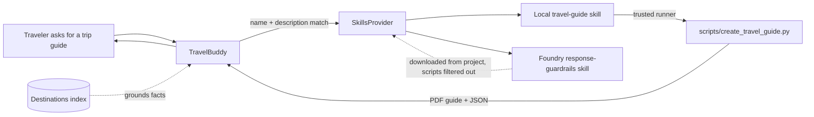

# Step 6 — Package a reusable behaviour as a Skill (local **and** Foundry)

> **Goal:** package repeatable behaviour into named, reusable **Skills** the model loads on demand. You work through it in **two parts**. **Part A** ships a **local** `travel-guide` skill (already in your repo) that renders a colorful, downloadable PDF trip guide grounded in your Step 5 RAG index — you *review* it, wire it into `main.py` and the manifest, then re-init, run, and deploy. **Part B** adds a **Foundry** `response-guardrails` skill uploaded to the project — a reusable behaviour any agent can share — then re-init, run, and deploy again. You keep the Step 5 tools, toolbox, and RAG intact throughout.

## What you'll learn

- What an Agent Framework **Skill** is, and how it bundles a prompt template, an I/O schema, and a deterministic tool script
- How `SkillsProvider` advertises a skill's name + description and loads its full body only when the model decides it's relevant
- The difference between a **local skill** (ships with your agent code) and a **Foundry skill** (uploaded to the project, downloaded at runtime, shareable across agents)
- Why local skills may run a **trusted script runner** while a **script filter** blocks any downloaded Foundry skill from executing code — and why both live behind a **single** provider so their tool names never collide
- Why skills keep instructions lean — repeated behaviour lives in a folder (or in the project), not in an ever-growing system prompt
- That Foundry skills need a **project role** (`Foundry User`) and **public network access**, yet still don't change your deployment shape — still `resources: []`, no `azd provision`

## What's already in the repo

- Everything from Steps 1–5 in `travel_assistant/` — the three function tools, the Foundry Toolbox, and the Step 5 RAG context provider. Nothing was deleted when you advanced.
- `travel_toolbox/toolbox.yaml` — the toolbox definition, still a sibling of `travel_assistant/`.
- `travel_indexer/` — the out-of-band Search indexer from Step 5, a sibling of `travel_assistant/`.
- `travel_assistant/skills/travel-guide/` — the **complete, ready-to-review** local skill: `SKILL.md` and `scripts/create_travel_guide.py`. In Part A you **read** these and wire them in — you don't author them from scratch.
- `foundry_skills/` — a **new sibling folder** (delivered when you advanced), the out-of-band home of the Foundry skill:
  - `foundry_skills/skills/response-guardrails/SKILL.md` — the **source of truth** for the Foundry skill (delivered; its exact wording isn't the point — the *wiring* is).
  - `foundry_skills/provision_skills.py` — a complete, one-shot uploader you run once (and again after editing the Foundry skill's `SKILL.md`).

**Why `foundry_skills/` lives outside `travel_assistant/`.** `azd ai agent init` snapshots **only** `travel_assistant/` when it packages the deployed agent. The Foundry skill is uploaded to the **project** once, offline — the provisioning script and its source `SKILL.md` are *tooling*, not part of the running agent — so they live in a sibling folder that is never bundled into the container, exactly like `travel_indexer/` and `travel_toolbox/`. At runtime the agent downloads the finished skill from the project; it never needs `provision_skills.py` on disk.

**Source-of-truth discipline.** Edit `foundry_skills/skills/response-guardrails/SKILL.md`, then re-run `provision_skills.py`. The agent re-downloads the skill at runtime into a writable temp dir (`<tempdir>/foundry_downloaded_skills/`) — **never edit that copy** (it is a throwaway cache, recreated each startup). Two copies is expected, and mirrors the indexer (source JSON vs. the live index).

## Concept (5-min read)

As an agent grows, the temptation is to keep stuffing rules into the system prompt: "when someone wants a trip guide, render it as a PDF, group nearby activities, prefer retrieved facts…". That bloats the prompt, is hard to reuse, and mixes *what the agent is* with *how it does one specific job*.

A **Skill** extracts that job into a self-contained package the model can discover and load only when the task calls for it. Each skill is a folder with:

- a **`SKILL.md`** — YAML front-matter (`name`, `description`) plus a Markdown body describing the workflow, arguments, and output contract (this is the prompt template),
- an **I/O schema** — the script arguments the skill declares (here: `city`, `days`, `interests`, `tone`, `source_summary`),
- an optional **tool script** — a deterministic helper (`scripts/create_travel_guide.py`) that renders a downloadable PDF guide and returns predictable JSON.

`SkillsProvider` advertises each skill's `name` + `description` to the model — cheaply, without loading the full body. When the model decides a skill is relevant, it loads the body and can run the declared script through a **trusted script runner** you supply. That runner is where you enforce safety (only file-based scripts, no path escapes, a timeout).

> **How skills are loaded (progressive disclosure).** A skill is *not* auto-injected. `SkillsProvider` only puts each skill's `name` + `description` in the system prompt; the model then decides, turn by turn, whether to pull it in:
>
> 1. **Advertise** — names + descriptions are always visible, so the model knows what exists (cheap, a few tokens each).
> 2. **Load** — the model calls `load_skill(<name>)` **only when it judges the skill relevant** to the current request; that's when the full `SKILL.md` body enters context.
> 3. **Read / run** — it then reads any declared resources and, for a local skill, invokes the script through the trusted runner.
>
> The consequence: the model won't load a skill on its own just because you *want* it applied everywhere. An always-on behaviour like `response-guardrails` only loads if the system prompt **explicitly tells the model to use it** (that's why the instructions say "ALWAYS USE the response-guardrails skill for every response"). Even then, loading is the model's decision — treat it as strong guidance, not a hard guarantee. To confirm a skill actually loaded, look for its evidence in the reply: `response-guardrails` ends every response with a `GUARDRAILS-APPLIED` marker. There is no eager/always-load flag on `from_paths` — selective, on-demand loading is the whole point (it keeps the prompt small).

**Skill vs. tool vs. RAG.** These three layers now coexist in TravelBuddy:

- A **tool** (Step 2/4) is a single callable action the model invokes mid-turn.
- **RAG** (Step 5) is a context provider that *always* injects grounding before the model responds.
- A **skill** is a *packaged behaviour* — prompt + schema + (optional) script — the model loads *selectively* when a whole task (like "make me a trip guide") matches. It composes the other layers: the travel-guide skill leans on RAG for facts (the retrieved city context is rendered straight into the PDF) and can call tools.

**Local vs. Foundry.** A **local** skill lives in your repo and deploys with the agent — simple and self-contained; here it's `travel-guide`, which renders the PDF. A **Foundry** skill is uploaded to the project and can be discovered by *other* agents with project access — better for sharing a behaviour across a team. Here it's `response-guardrails`, a domain-agnostic Responsible-AI behaviour the agent applies to **every** response, and that any other agent could reuse unchanged. In this step you build **both** and see them coexist. The Foundry-skill download pattern mirrors the upstream `12-foundry-skills` sample.

**One provider, two folders.** You don't register two `SkillsProvider`s (they'd collide on skill-loading tool names). Instead you download the Foundry skill next to the local one and hand **both folders** to a single `SkillsProvider.from_paths([local, downloaded], script_runner=..., script_filter=...)`. The one runner exists for the local skill's `create_travel_guide.py`; a `script_filter` arms it for **local skills only**, so a downloaded (remote) skill can never run a script — a remote skill body never executes local code.

> **Alternative: serving the Foundry skill through the Toolbox (MCP skills).** Foundry can also expose a skill *through the Toolbox over MCP* instead of the REST download used here. In that model you attach the skill to your toolbox version (`azd ai skill create` + attach) and let the agent discover it via `FoundryToolbox(credential, load_tools=False).as_skills_provider()` — no runtime ZIP download, no local cache, and skill bodies/resources are fetched on demand. See the upstream [`12_foundry_toolbox_mcp_skills`](https://github.com/microsoft/agent-framework/tree/main/python/samples/04-hosting/foundry-hosted-agents/responses/12_foundry_toolbox_mcp_skills) sample. This workshop deliberately keeps the **REST download** pattern because it also teaches a *local* skill with a runnable script (`create_travel_guide.py`), and one `SkillsProvider` over two folders is the clearest way to show local and Foundry skills side by side. If your agent only needs remote, script-free skills, the Toolbox route is simpler.



**Learn more**

- [Skills in Microsoft Agent Framework](https://learn.microsoft.com/agent-framework/user-guide/skills)
- [Agents and context providers overview](https://learn.microsoft.com/agent-framework/user-guide/agents/)
- [Hosted agents in Microsoft Foundry](https://learn.microsoft.com/azure/ai-foundry/agents/)
- [Agent identity concepts in Microsoft Foundry](https://learn.microsoft.com/azure/foundry/agents/concepts/agent-identity) — per-agent Entra identities; the identity the deployed agent uses to download the Foundry skill
- [Manage hosted agents — retrieve the agent identity for role assignments](https://learn.microsoft.com/azure/foundry/agents/how-to/manage-hosted-agent#retrieve-the-agent-identity-for-role-assignments) — `instance_identity.principal_id` retrieval
- [Upstream `07-skills` hosted-agent sample](https://github.com/microsoft-foundry/foundry-samples/tree/main/samples/python/hosted-agents/agent-framework/responses/07-skills) — the local Skill this step is based on
- [Upstream `12-foundry-skills` hosted-agent sample](https://github.com/microsoft-foundry/foundry-samples/tree/main/samples/python/hosted-agents/agent-framework/responses/12-foundry-skills) — the Foundry Skill this step is based on
- [Upstream `12_foundry_toolbox_mcp_skills` sample](https://github.com/microsoft/agent-framework/tree/main/python/samples/04-hosting/foundry-hosted-agents/responses/12_foundry_toolbox_mcp_skills) — the alternative: serving a Foundry skill through the Toolbox over MCP (`as_skills_provider()`), no runtime download

---

## Part A — Ship the local travel-guide Skill

The local skill is already in your repo. In this part you **review** it, wire it into `main.py` and the manifest, then re-init, run, and deploy — a full end-to-end loop **before** you touch the Foundry skill.

### A1. Review the delivered local skill

The skill lives at `travel_assistant/skills/travel-guide/` — two files, both complete:

```text
travel_assistant/
└── skills/
    └── travel-guide/
        ├── SKILL.md
        └── scripts/
            └── create_travel_guide.py
```

Open **`SKILL.md`** and read it. Its front-matter is what the model sees first — the `name` and `description` decide *whether* the skill gets loaded; the body is the prompt template (workflow, argument contract, output shape). The parts that matter for wiring are the front-matter and the argument list:

```markdown
<!-- travel_assistant/skills/travel-guide/SKILL.md (excerpt) -->
---
name: travel-guide
description: Creates a colorful, downloadable PDF travel guide that bundles a day-by-day itinerary, local highlights, and practical tips for a destination, grounded in the destinations index. Use when the traveler wants a shareable trip guide, a day-by-day plan, or a printable trip outline.
---
# ... workflow ...
# args: city (required), days (1-7, default 3), interests, tone,
#       source_summary (retrieved destination facts, for RAG grounding)
# output: JSON with city, days, interests, pages, path, grounded, message
```

Open **`scripts/create_travel_guide.py`** and skim it. You don't need to change it — just understand what it does:

- It's **pure standard library** (it hand-writes a multi-page PDF: cover, grounded notes, day-by-day itinerary, tips) — no third-party dependencies.
- It's **adapted from the upstream `07-skills` travel-guide sample** (MIT, Copyright (c) 2025 Microsoft Corporation — keep the license header intact).
- The *model* decides when to call it; the script just renders the guide and prints predictable JSON.
- The one workshop-specific addition is **`--source-summary`**: when the model passes the facts it retrieved from the destinations index, they are rendered into a dedicated "From your destinations index" page — so the right **city context** grounds the PDF.

Smoke-test it directly to see the PDF and the JSON contract before wiring it into the agent — with `uv` (uses your `.venv` without activating it):

<!-- terminal -->
```bash
uv run python travel_assistant/skills/travel-guide/scripts/create_travel_guide.py \
  --city Lisbon \
  --days 4 \
  --interests food,viewpoints,history,neighborhoods \
  --tone "first-time visitors who like walking" \
  --source-summary "The index highlights Alfama, Belém, miradouros, seafood, and day trips to Sintra."
```

…or with plain `python` if you activated the venv:

<!-- terminal -->
```bash
python travel_assistant/skills/travel-guide/scripts/create_travel_guide.py \
  --city Lisbon \
  --days 4 \
  --interests food,viewpoints,history,neighborhoods \
  --tone "first-time visitors who like walking" \
  --source-summary "The index highlights Alfama, Belém, miradouros, seafood, and day trips to Sintra."
```

You should get JSON with the city, day count, interests, page count, PDF `path`, and `grounded: true` — and a PDF written to the output directory. Because the PDF lands on the host filesystem (ephemeral in a deployed container), treat it as a local/demo artifact.

### A2. Add a trusted script runner and a local provider to `main.py`

The runner is the bridge between the model's skill call and your **local** script. It validates that the script is file-based and inside the skill folder, forwards the positional CLI arguments the model supplies, runs the script with a timeout, and returns stdout. `SkillsProvider` advertises each file script as taking a JSON array of string arguments, so the runner receives `args` as a `list[str]` and passes them straight through. Add the imports (`subprocess`, `sys`, `Path`, `Any`, and `FileSkill`, `FileSkillScript`, `Skill`, `SkillScript`, `SkillsProvider` from `agent_framework`) and the runner:

```python
# travel_assistant/main.py (delta from Step 5)
import subprocess    # NEW
import sys           # NEW
from pathlib import Path  # NEW
from typing import Any    # NEW

from agent_framework import (  # NEW (Agent already imported)
    FileSkill,
    FileSkillScript,
    Skill,
    SkillScript,
    SkillsProvider,
)


def run_local_skill_script(
    skill: Skill, script: SkillScript, args: dict[str, Any] | list[str] | None = None
) -> str:
    """Run a trusted file-based skill script with positional CLI arguments."""
    if not isinstance(skill, FileSkill) or not isinstance(script, FileSkillScript):
        return "Error: only file-based skill scripts can be run by this runner."

    skill_path = Path(skill.path).resolve()
    script_path = Path(script.full_path).resolve()
    if skill_path != script_path and skill_path not in script_path.parents:
        return f"Error: script '{script.name}' resolves outside the skill directory."

    command = [sys.executable, str(script_path)]
    if isinstance(args, list):
        for item in args:
            if not isinstance(item, str):
                return (
                    f"Error: script '{script.name}' only accepts string CLI arguments, "
                    f"but received a {type(item).__name__}."
                )
        command.extend(args)
    elif args is not None:
        return (
            f"Error: script '{script.name}' expects positional CLI arguments as a list "
            f"of strings, but received {type(args).__name__}."
        )

    try:
        completed = subprocess.run(
            command, cwd=skill_path, capture_output=True, check=False, text=True, timeout=60
        )
    except subprocess.TimeoutExpired:
        return f"Error: script '{script.name}' timed out after 60 seconds."

    if completed.returncode != 0:
        details = completed.stderr.strip() or completed.stdout.strip() or "no error output was produced."
        return f"Error: script '{script.name}' failed with exit code {completed.returncode}: {details}"
    return completed.stdout.strip() or f"Script '{script.name}' completed successfully."
```

Every skill tool (`load_skill`, `read_skill_resource`, `run_skill_script`) is registered to **require approval** by default. The documented opt-out, `ToolApprovalMiddleware`, needs an `AgentSession` — which the hosted `ResponsesHostServer` never provides — so an unattended run would stall on an approval request and the skill would never load. Because this skill is authored in your own repo (and, in Part B, the runner is armed for local skills only), you can trust it: subclass `SkillsProvider` to register its tools without the gate. Then hand the **local** skills folder to that provider and append it to the **existing** `context_providers` list (the Step 5 RAG provider stays). For now it's **local-only** — you add the Foundry-skill folder in Part B:

```python
# travel_assistant/main.py (delta from Step 5)
LOCAL_SKILLS_DIR = Path(__file__).parent / "skills"


class TrustedSkillsProvider(SkillsProvider):
    """A SkillsProvider that runs its skill tools without an approval gate.

    The hosted ResponsesHostServer runs the agent without an AgentSession, so
    ToolApprovalMiddleware can't be used to auto-approve. Our skills are authored
    in this repo, so we trust them and register their tools as ``never_require``.
    """

    def _create_tools(self, skills):
        tools = super()._create_tools(skills)
        for tool in tools:
            tool.approval_mode = "never_require"
        return tools


# ... credential, client, tools (functions + toolbox), and the Step 5
#     AzureAISearchContextProvider all stay exactly as they were ...
context_providers.append(
    TrustedSkillsProvider.from_paths([LOCAL_SKILLS_DIR], script_runner=run_local_skill_script)
)  # NEW — RAG provider from Step 5 stays

agent = Agent(
    client=client,
    name="travel-buddy",
    instructions=(
        # ... all of the Step 5 instruction sentences stay verbatim, ending with:
        "index does not contain enough detail, say what is missing. "
        "When the traveler wants a downloadable trip guide or a day-by-day plan, "   # NEW
        "use the travel-guide skill to render a grounded PDF guide before answering."  # NEW
    ),
    tools=tools,                        # unchanged: 3 functions + toolbox
    context_providers=context_providers,  # now RAG + Skills
    default_options={"store": False},
)
```

> **Why `TrustedSkillsProvider`?** The approval gate exists so a human vets every skill tool call before it runs — a sensible default, since `run_skill_script` executes code on the host. You can bypass it here for one reason only: **you** authored and reviewed this skill in your own repo, and the `script_filter` (Part B) arms the runner for these local skills alone, so nothing downloaded at runtime can execute local code. That makes auto-approval a deliberate, bounded trust decision rather than a blanket "off switch." Note the gate is per-provider, so in Part B this also auto-approves `load_skill`/`read_skill_resource` for the downloaded Foundry skill — acceptable only because that skill is uploaded from reviewed in-repo source and, thanks to `script_filter`, still can't run any script.
>
> **Why this isn't a production pattern.** Disabling approval trades safety for convenience so the workshop's hosted agent can run unattended. In production, keep the gate and put a real reviewer behind it: run the agent in a client flow that supplies an `AgentSession` and surface each `run_skill_script` request for human (or policy-based) approval, so an untrusted or newly added skill can't run code silently. Treat `never_require` as a workshop shortcut for skills you fully control — not the default for skills whose provenance you can't vouch for.
>
> **This may change.** The approval-by-default behaviour and the `_create_tools` override are tied to the current agent-framework version. Approval-by-default landed as a breaking change and could be revisited, and overriding an internal method means a future release could rename it and silently bring the gate back (the agent would then stall). The upstream Foundry skills sample this step is based on can also change and may adopt its own approach. If skills stop loading after an upgrade, re-check this override against the installed agent-framework and the current upstream sample, and prefer any first-class opt-out the library adds.

The two `# NEW` lines are the only prompt change — they point the model at the local `travel-guide` skill. Every Step 5 instruction sentence before them stays verbatim (there's no separate `INSTRUCTIONS` constant; the prompt lives inline in the `instructions=( ... )` string, exactly as it did in Step 5).

### A3. Declare the local skill in the manifest

Add the local skill to the manifest metadata: a `travel-guide` entry under `tool_declarations` and a `Skills` tag. `resources` stays `[]`, and the local skill needs **no** new environment variable, so `agent.yaml` is unchanged in Part A.

```yaml
# travel_assistant/agent.manifest.yaml (delta)
metadata:
  tags: [Agent Framework, AI Agent Hosting, Azure AI AgentServer, Responses Protocol, Travel Assistant, Function Tools, MCP Tools, Toolbox Tools, RAG, Skills]
  tool_declarations:
    # ... the Step 5 declarations stay ...
    - name: travel-guide
      description: >
        Local Skill that renders a grounded, downloadable PDF travel guide (with a
        day-by-day itinerary) via scripts/create_travel_guide.py.
      type: skill
resources: []
```

### A4. Re-init, run locally, and deploy

`azd ai agent init` **copies** your `travel_assistant/` code into the generated `${WORKSHOP_RESOURCE_PREFIX}-travel-buddy/` project folder — that copy is the snapshot azd builds and deploys. Your Part A edits live in `travel_assistant/`, so **re-init** to refresh the snapshot. You **don't** need `azd provision` — you added no Azure resource (`resources:` is still `[]`).

1. **Re-init from the repository root.** Load your `.env` into the shell first so `WORKSHOP_RESOURCE_PREFIX` expands:

   <!-- terminal -->
   ```bash
   # bash / zsh
   set -a; source .env; set +a
   azd ai agent init -m travel_assistant/agent.manifest.yaml \
     --agent-name "${WORKSHOP_RESOURCE_PREFIX}-travel-buddy"
   ```

   <!-- terminal -->
   ```powershell
   # PowerShell
   Get-Content .env | Where-Object { $_ -match '^\s*[^#].*=' } | ForEach-Object {
     $name, $value = $_ -split '=', 2
     Set-Item "Env:$($name.Trim())" $value.Trim().Trim('"').Trim("'")
   }
   azd ai agent init -m travel_assistant/agent.manifest.yaml `
     --agent-name "$($env:WORKSHOP_RESOURCE_PREFIX)-travel-buddy"
   ```

2. **Run TravelBuddy locally** and invoke the local skill from a second terminal:

   <!-- terminal -->
   ```bash
   # terminal 1 — from the project folder:
   cd "${WORKSHOP_RESOURCE_PREFIX}-travel-buddy"
   azd ai agent run
   ```

   <!-- terminal -->
   ```bash
   # terminal 2 — ask for a trip guide:
   azd ai agent invoke --local "Make me a 4-day Lisbon travel guide as a PDF using our destinations index."
   ```

   Expected: the agent grounds on RAG, runs `create_travel_guide.py`, and replies with the PDF file `path`. Prefer a UI? With the local agent still running, open the **Agent Inspector** from the Foundry Toolkit (Command Palette → **Foundry Toolkit: Open Agent Inspector**).

3. **Deploy to Foundry** and invoke the deployed agent:

   <!-- terminal -->
   ```bash
   azd deploy
   azd ai agent invoke "Make me a 3-day Reykjavik travel guide for winter as a PDF."
   ```

   `azd deploy` builds the container image from the **refreshed** snapshot, pushes it, and rolls out a new hosted agent version. The local skill deploys **inside** the container, so nothing else is needed — no role grant, no `azd provision`.

   Prefer a UI? Open the **Hosted Agent Playground** from the Foundry Toolkit (**Developer Tools** → **Build** → **Hosted Agent Playground**), pick your deployed agent and version, and ask for a guide — the generated PDF shows up under **Session Details → Files**.

   

---

## Part B — Share the Foundry response-guardrails Skill

Part A shipped a skill that lives in your repo. Part B uploads a skill to the **Foundry project** so it can be shared across agents, and teaches your agent to **download** it at startup. The pattern — not the skill's wording — is the point.

**Before you start Part B: two project requirements.** Part A needed neither — set these up now, right before you use them.

- **Public network access.** The Foundry Skills API doesn't support private networking, so you can't create, manage, or download skills from a Foundry resource that has public network access disabled ([Skills — Limitations](https://learn.microsoft.com/azure/foundry/agents/how-to/tools/skills#limitations)). **If your Foundry project can't allow public network access, skip Part B** — the local `travel-guide` skill from Part A still works and deploys, and nothing later in the workshop depends on the Foundry skill.
- **Role — `Foundry User`** (formerly *Azure AI User*) on the Foundry project. This is the baseline role for *using* a Foundry project, so if you created it (or were added to it) and have run the agent through Steps 1-5, **you very likely already have it**. The **same** role covers *both* your upload here *and* the deployed agent's runtime download. It is **not** the same as `Azure AI Project Contributor`, and **not** an ARM `Contributor`/`Owner` role — the Skills data-plane API is gated by `Foundry User` (role ID `53ca6127-db72-4b80-b1b0-d745d6d5456d`). Verify, and assign only if it's missing:

<!-- terminal -->
```bash
# bash / zsh — you very likely already have Foundry User; check first, assign only if missing.
# PROJECT_SCOPE is your Foundry project's ARM resource ID (you can also scope to the account).
PROJECT_SCOPE="/subscriptions/<sub-id>/resourceGroups/<rg>/providers/Microsoft.CognitiveServices/accounts/<foundry-account>/projects/<project-name>"
USER_ID="$(az ad signed-in-user show --query id -o tsv)"
# Check: if this lists 'Foundry User' (or an Owner/Contributor superset), you're set — skip the next line.
az role assignment list --assignee "$USER_ID" --scope "$PROJECT_SCOPE" --query "[].roleDefinitionName" -o tsv
# Only if it's missing, assign it:
az role assignment create --assignee "$USER_ID" --role "Foundry User" --scope "$PROJECT_SCOPE"
# If the display name doesn't resolve, use the role ID:
# --role 53ca6127-db72-4b80-b1b0-d745d6d5456d
```

<!-- terminal -->
```powershell
# PowerShell — you very likely already have Foundry User; check first, assign only if missing.
$PROJECT_SCOPE = "/subscriptions/<sub-id>/resourceGroups/<rg>/providers/Microsoft.CognitiveServices/accounts/<foundry-account>/projects/<project-name>"
$USER_ID = az ad signed-in-user show --query id -o tsv
# Check: if this lists 'Foundry User' (or an Owner/Contributor superset), you're set — skip the next line.
az role assignment list --assignee $USER_ID --scope $PROJECT_SCOPE --query "[].roleDefinitionName" -o tsv
# Only if it's missing, assign it:
az role assignment create --assignee $USER_ID --role "Foundry User" --scope $PROJECT_SCOPE
# If the display name doesn't resolve, use the role ID:
# --role 53ca6127-db72-4b80-b1b0-d745d6d5456d
```

The genuinely *new* role assignment comes later, at the end of Part B (step **B4**): granting the **deployed agent's instance identity** the same `Foundry User` role.

### B1. Review the Foundry skill and upload it

The Foundry skill's source of truth is delivered at `foundry_skills/skills/response-guardrails/SKILL.md`. Open it if you like — it's a small, domain-agnostic **Responsible-AI** behaviour (be helpful within safe bounds, add caveats, point to official sources for high-stakes specifics) that ends **every** response with a `GUARDRAILS-APPLIED` marker — your **proof** the Foundry skill loaded at runtime (the local skill never emits it). The content is deliberately simple — what matters in this part is the upload/download plumbing.

```text
foundry_skills/
├── provision_skills.py          # delivered — uploads each skills/*/SKILL.md to the project
└── skills/
    └── response-guardrails/
        └── SKILL.md              # delivered source of truth (edit if you want, then re-upload)
```

`foundry_skills/provision_skills.py` is **delivered and complete**. It zips each `skills/*/SKILL.md` folder and uploads it via `project.beta.skills.create_from_files(...)` (the preview Skills API, reached with `allow_preview=True`). It is **safe to re-run**: each run uploads a **new version** of the skill (existing versions are left intact) — so running it again after editing `SKILL.md` simply refreshes the project copy.

Run it once (and again whenever you edit the Foundry skill's `SKILL.md`) — with `uv`:

<!-- terminal -->
```bash
uv run python foundry_skills/provision_skills.py
```

…or with plain `python` if you activated the venv:

<!-- terminal -->
```bash
python foundry_skills/provision_skills.py
```

It prints the uploaded skill's version and `skill_id`, then confirms the project lists it. This needs the **`Foundry User`** role and **public network access** covered at the start of Part B above.

Prefer a UI? Open the Foundry Toolkit and select your project under **My Resources → Tools → Skills** — the uploaded `response-guardrails` skill appears there with its version and description.


### B2. Add the download and extend the provider in `main.py`

The download client needs `azure-ai-projects`. It already ships in `travel_assistant/requirements.txt` (delivered in Step 0) — **confirm it's listed**:

```text
# travel_assistant/requirements.txt
azure-ai-projects
```

If it's missing, add that line and reinstall with `uv pip install -r travel_assistant/requirements.txt` (or `pip install -r ...` with the venv activated).

At startup the agent downloads each skill named in `FOUNDRY_SKILL_NAMES` into a **writable temp directory** (`<tempdir>/foundry_downloaded_skills/<name>/`). The deployed container's app directory is **read-only**, so the download can't sit next to `main.py`; the OS temp dir is writable both locally and in the hosted container. Add these imports and helpers to `main.py` (this mirrors the two download methods in the upstream `12-foundry-skills` sample):

```python
# travel_assistant/main.py (delta — extends Part A)
import asyncio
import io
import shutil
import tempfile
import zipfile

from azure.ai.projects.aio import AIProjectClient
from azure.identity.aio import DefaultAzureCredential as AsyncDefaultAzureCredential

# The deployed container's app directory is read-only, so download into the OS
# temp dir (writable both locally and in the hosted container).
FOUNDRY_DOWNLOADED_SKILLS_DIR = Path(tempfile.gettempdir()) / "foundry_downloaded_skills"
SKILL_DOWNLOAD_TIMEOUT_SECONDS = 60.0


def _foundry_skill_names() -> list[str]:
    """Parse FOUNDRY_SKILL_NAMES, treating an unresolved ${VAR}/{{VAR}} as empty."""
    raw = os.environ.get("FOUNDRY_SKILL_NAMES", "").strip()
    if (raw.startswith("${") and raw.endswith("}")) or (raw.startswith("{{") and raw.endswith("}}")):
        raw = ""
    parsed = [name.strip().strip('"').strip("'") for name in raw.split(",")]
    return [name for name in parsed if name]


def _safe_extract_zip(zf: zipfile.ZipFile, dest_dir: Path) -> None:
    """Unpack a skill archive, rejecting entries that escape dest_dir (zip-slip guard)."""
    dest_root = dest_dir.resolve()
    for member in zf.infolist():
        target = (dest_root / member.filename).resolve()
        if dest_root != target and dest_root not in target.parents:
            raise RuntimeError(f"Refusing unsafe zip entry '{member.filename}'.")
    zf.extractall(dest_dir)


async def _download_foundry_skills(endpoint: str, names: list[str]) -> None:
    """Download each named Foundry skill into the temp foundry_downloaded_skills/<name>/ cache."""
    if FOUNDRY_DOWNLOADED_SKILLS_DIR.exists():
        shutil.rmtree(FOUNDRY_DOWNLOADED_SKILLS_DIR)
    FOUNDRY_DOWNLOADED_SKILLS_DIR.mkdir(parents=True)
    async with (
        AsyncDefaultAzureCredential() as credential,
        AIProjectClient(endpoint=endpoint, credential=credential, allow_preview=True) as project,
    ):
        for name in names:
            stream = await project.beta.skills.download(name)
            data = b"".join([chunk async for chunk in stream])
            skill_dir = FOUNDRY_DOWNLOADED_SKILLS_DIR / name
            skill_dir.mkdir()
            with zipfile.ZipFile(io.BytesIO(data)) as zf:
                _safe_extract_zip(zf, skill_dir)
            if not (skill_dir / "SKILL.md").is_file():
                raise RuntimeError(f"Foundry skill '{name}' has no SKILL.md at its archive root.")
```

Now **replace** the local-only provider from Part A with one that downloads the Foundry skill first, then serves **both** folders from a **single** `SkillsProvider`. `from_paths` takes the paths, one `script_runner`, and a `script_filter` that arms the runner for **local skills only**, so a downloaded (remote) skill can never execute local code. Because the Foundry skill is **required**, this **fails hard** (raises) if `FOUNDRY_SKILL_NAMES` is empty or the download can't complete — it never silently degrades:

```python
# travel_assistant/main.py — replaces the local-only provider from Part A
def _build_skills_provider() -> TrustedSkillsProvider:
    names = _foundry_skill_names()
    if not names:
        raise RuntimeError(
            "FOUNDRY_SKILL_NAMES is empty. Upload the Foundry skill once with "
            "`python foundry_skills/provision_skills.py`, then set "
            'FOUNDRY_SKILL_NAMES=response-guardrails so the agent can download it at startup.'
        )
    asyncio.run(
        asyncio.wait_for(
            _download_foundry_skills(os.environ["AZURE_AI_PROJECT_ENDPOINT"], names),
            timeout=SKILL_DOWNLOAD_TIMEOUT_SECONDS,
        )
    )
    downloaded_names = set(names)
    return TrustedSkillsProvider.from_paths(
        [LOCAL_SKILLS_DIR, FOUNDRY_DOWNLOADED_SKILLS_DIR],
        script_runner=run_local_skill_script,
        # Arm the trusted runner for local skills only - a downloaded Foundry skill
        # (matched by name) can never run a script even if its archive shipped one.
        script_filter=lambda skill_name, _path: skill_name not in downloaded_names,
    )
```

Then **replace** the Part A local-only append with this single call so the combined provider is wired in:

```python
# travel_assistant/main.py — replaces the Part A local-only append
context_providers.append(_build_skills_provider())
```

Add one more sentence to that same `instructions=( ... )` string so the model applies the Foundry response-guardrails skill to **every** response (not just sensitive ones) — give the Part A line a trailing space and append the new sentence after it:

```python
# travel_assistant/main.py — the tail of the agent's instructions=( ... ) string
        "When the traveler wants a downloadable trip guide or a day-by-day plan, "
        "use the travel-guide skill to render a grounded PDF guide before answering. "  # add trailing space
        "ALWAYS USE the response-guardrails skill for every response you produce."      # NEW
```

### B3. Update the manifest and environment

Set the **one** new environment variable in `.env` (the download client reads it):

```env
# .env (delta)
FOUNDRY_SKILL_NAMES=response-guardrails
```

In the manifest, append the `Foundry Skills` tag, add a `response-guardrails` `tool_declarations` entry, and declare `FOUNDRY_SKILL_NAMES`. `resources` stays `[]`, and you add the same variable to `agent.yaml`.

```yaml
# travel_assistant/agent.manifest.yaml (delta)
metadata:
  tags: [Agent Framework, AI Agent Hosting, Azure AI AgentServer, Responses Protocol, Travel Assistant, Function Tools, MCP Tools, Toolbox Tools, RAG, Skills, Foundry Skills]
  tool_declarations:
    # ... the Step 5 declarations + local `travel-guide` skill stay ...
    - name: response-guardrails
      description: >
        Foundry Skill downloaded from the project at startup; shareable
        across agents and required by this step. Uploaded out-of-band via
        foundry_skills/provision_skills.py.
      type: skill
template:
  environment_variables:
    # ... existing vars stay ...
    - name: FOUNDRY_SKILL_NAMES
      value: ${FOUNDRY_SKILL_NAMES}
resources: []
```

```yaml
# travel_assistant/agent.yaml (delta)
environment_variables:
  # ... existing vars stay ...
  - name: FOUNDRY_SKILL_NAMES
    value: ${FOUNDRY_SKILL_NAMES}
```

### B4. Re-init, run locally, deploy, and grant the instance identity

Re-init again to snapshot your Part B edits, and add the new variable to the azd env. You already uploaded the Foundry skill in B1 and confirmed `azure-ai-projects` in `requirements.txt` in B2 — no need to re-upload or reinstall here (if a local run reports `azure-ai-projects` missing, see Troubleshooting). Go straight to the re-init:

1. **Re-init from the repository root** (same as Part A — it refreshes the snapshot with your new `main.py` and the `FOUNDRY_SKILL_NAMES` variable):

   <!-- terminal -->
   ```bash
   # bash / zsh
   set -a; source .env; set +a
   azd ai agent init -m travel_assistant/agent.manifest.yaml \
     --agent-name "${WORKSHOP_RESOURCE_PREFIX}-travel-buddy"
   ```

   <!-- terminal -->
   ```powershell
   # PowerShell
   Get-Content .env | Where-Object { $_ -match '^\s*[^#].*=' } | ForEach-Object {
     $name, $value = $_ -split '=', 2
     Set-Item "Env:$($name.Trim())" $value.Trim().Trim('"').Trim("'")
   }
   azd ai agent init -m travel_assistant/agent.manifest.yaml `
     --agent-name "$($env:WORKSHOP_RESOURCE_PREFIX)-travel-buddy"
   ```

2. **`cd` into the project folder and add the new value to the azd env.** azd keeps its **own** environment store (`.azure/<env-name>/.env`), separate from the repo `.env`. You only need the **one new** variable:

   <!-- terminal -->
   ```bash
   # bash / zsh — after: set -a; source .env; set +a
   cd "${WORKSHOP_RESOURCE_PREFIX}-travel-buddy"
   azd env set FOUNDRY_SKILL_NAMES "$FOUNDRY_SKILL_NAMES"
   ```

   <!-- terminal -->
   ```powershell
   # PowerShell — after loading .env into the shell
   cd "$($env:WORKSHOP_RESOURCE_PREFIX)-travel-buddy"
   azd env set FOUNDRY_SKILL_NAMES "$env:FOUNDRY_SKILL_NAMES"
   ```

3. **Run TravelBuddy locally** and invoke the Foundry skill from a second terminal:

   <!-- terminal -->
   ```bash
   # terminal 1:
   azd ai agent run
   ```

   <!-- terminal -->
   ```bash
   # terminal 2 — any prompt works; a sensitive one makes the guardrails obvious:
   azd ai agent invoke --local "Is it safe to travel to Porto right now, and what vaccinations do I need?"
   ```

   On startup your `main.py` downloads the Foundry skill as *you* (you have `Foundry User` from the start of Part B). Expected: the response ends with `GUARDRAILS-APPLIED` — the Foundry skill now applies to **every** response, so the marker appears whatever you ask.

4. **Deploy to Foundry**:

   <!-- terminal -->
   ```bash
   azd deploy
   ```

   This builds the container image from the **refreshed** snapshot — now including your Part B `main.py` and `FOUNDRY_SKILL_NAMES` — and rolls out a new hosted agent version. Still no `azd provision` (infrastructure is unchanged).

5. **Grant the deployed agent's instance identity `Foundry User` on the project.** Locally the agent downloaded the Foundry skill as *you*. Deployed, your `main.py` calls the Skills API with `DefaultAzureCredential`, which resolves the container's runtime identity — the agent's **instance identity** (a per-agent Microsoft Entra service principal). That principal has **no** skills access by default, so the download would fail with `Forbidden`. Grant it the **same** `Foundry User` role you hold.

   First retrieve the instance identity's principal ID from the **agent** (not a version), then assign the role. `$PROJECT_SCOPE` is the **same Foundry project scope you verified at the start of Part B**.

   <!-- terminal -->
   ```bash
   # AGENT_NAME is your deployed agent; AZURE_AI_PROJECT_ENDPOINT is already in your .env.
   AGENT_NAME="${WORKSHOP_RESOURCE_PREFIX}-travel-buddy"

   # 1. Resolve the agent's instance identity principal ID.
   AGENT_IDENTITY="$(az rest --method GET \
     --url "${AZURE_AI_PROJECT_ENDPOINT}/agents/${AGENT_NAME}?api-version=v1" \
     --resource "https://ai.azure.com" \
     --query "instance_identity.principal_id" -o tsv)"

   # 2. Grant it Foundry User on the Foundry project (same scope you verified at the start of Part B).
   PROJECT_SCOPE="/subscriptions/<sub-id>/resourceGroups/<rg>/providers/Microsoft.CognitiveServices/accounts/<foundry-account>/projects/<project-name>"
   az role assignment create \
     --assignee-object-id "$AGENT_IDENTITY" \
     --assignee-principal-type ServicePrincipal \
     --role "Foundry User" \
     --scope "$PROJECT_SCOPE"
   ```

   <!-- terminal -->
   ```powershell
   # PowerShell — AZURE_AI_PROJECT_ENDPOINT is already in your .env.
   $AGENT_NAME = "${env:WORKSHOP_RESOURCE_PREFIX}-travel-buddy"

   # 1. Resolve the agent's instance identity principal ID.
   $AGENT_IDENTITY = az rest --method GET `
     --url "${env:AZURE_AI_PROJECT_ENDPOINT}/agents/${AGENT_NAME}?api-version=v1" `
     --resource "https://ai.azure.com" `
     --query "instance_identity.principal_id" -o tsv

   # 2. Grant it Foundry User on the Foundry project (same scope you verified at the start of Part B).
   $PROJECT_SCOPE = "/subscriptions/<sub-id>/resourceGroups/<rg>/providers/Microsoft.CognitiveServices/accounts/<foundry-account>/projects/<project-name>"
   az role assignment create `
     --assignee-object-id $AGENT_IDENTITY `
     --assignee-principal-type ServicePrincipal `
     --role "Foundry User" `
     --scope $PROJECT_SCOPE
   ```

   RBAC changes take a minute or two to propagate; retry afterward.

   > **Do you re-grant this on every redeploy? No.** The instance identity belongs to the **agent**, not to an agent *version*. `azd deploy` publishes a new version of the same agent, so the identity — and this role assignment — **carry over**. You only re-grant if you **delete and recreate** the agent (a new agent gets a new instance identity) or **publish** it to an agent application (a distinct identity). See [Retrieve the agent identity for role assignments](https://learn.microsoft.com/azure/foundry/agents/how-to/manage-hosted-agent#retrieve-the-agent-identity-for-role-assignments).

6. **Invoke the deployed agent**:

   <!-- terminal -->
   ```bash
   azd ai agent invoke "Is it safe to travel to Porto right now, and what vaccinations do I need?"
   ```

   Prefer a UI? Open the **Hosted Agent Playground** from the Foundry Toolkit (**Developer Tools** → **Build** → **Hosted Agent Playground**), pick your deployed agent and version.

## Try it

- `Make me a 4-day Lisbon travel guide using our destinations index.` — should load the **local** `travel-guide` skill, ground on RAG, and render a PDF (the reply shares the file `path`), then end with `GUARDRAILS-APPLIED`.
- `Same idea but a 3-day Reykjavik guide for winter.` — grounds in RAG, then renders the PDF with the local skill (again ending with `GUARDRAILS-APPLIED`).
- `Is it safe to travel to Porto right now, and what vaccinations do I need?` — a sensitive question where the **Foundry** `response-guardrails` skill matters most; expect caveats, a pointer to an official source, and the `GUARDRAILS-APPLIED` marker.
- `Can I bring my prescription medication through customs into Portugal?` — another high-stakes question; again expect a pointer to an official source and `GUARDRAILS-APPLIED`.
- `What's the weather in Lisbon and convert €180 to USD?` — needs no travel-guide skill (proves the Step 2/5 layers still work independently), yet still ends with `GUARDRAILS-APPLIED` because the Foundry skill applies to every response.

> The `GUARDRAILS-APPLIED` marker in the Foundry skill's `SKILL.md` is your proof the **Foundry** skill loaded — the agent is instructed to apply it to **every** response, so you should see it on all of them (the local travel-guide skill never emits the marker on its own).

## Troubleshooting

### Skill not invoked

The agent picks the **local** `travel-guide` skill by `name` + `description`, so make both specific — confirm `travel_assistant/skills/travel-guide/SKILL.md` exists and that the provider was appended to `context_providers`. The **Foundry** `response-guardrails` skill isn't picked by topic: the agent's `instructions` tell it to apply the skill to **every** response, so if `GUARDRAILS-APPLIED` is missing, check that the skill downloaded (see the download troubleshooting below) and that the always-apply sentence is in the agent's `instructions` string.

### Script path or argument error

The runner rejects scripts that resolve outside the skill folder — the skill must say `scripts/create_travel_guide.py` and the file must live under `travel_assistant/skills/travel-guide/scripts/`. `city` is required, and `days` must be an integer (it is clamped to 1–7). Run the script directly to isolate schema issues. (A `script_filter` arms the runner for **local** skills only; a downloaded Foundry skill can never run a script, and the guardrails skill is prompt-only anyway.)

### `provision_skills.py` fails with `403` / `Forbidden`

Your Entra ID needs **`Foundry User`** (formerly *Azure AI User*) on the Foundry **project** — **not** `Azure AI Project Contributor` and **not** an ARM `Contributor`/`Owner` role. Assign it (see the start of Part B), run `az login` again, wait a minute or two for RBAC to propagate, and re-run. If the role is assigned and propagated but it still fails, confirm the Foundry account allows **public network access** — the Skills API does not support private networking.

### The **deployed** agent fails on startup with `Forbidden` / `403` downloading the Foundry skill

This is the most common Part B surprise: everything works locally, then the deployed agent errors. The cause is **identity**, not code. Locally the agent downloads the skill as *your* `az login` user (who has `Foundry User` from the start of Part B). Deployed, your `main.py` startup code calls the Skills API with `DefaultAzureCredential`, which resolves the agent's **instance identity** — a per-agent service principal with no skills access by default. Grant that identity **`Foundry User`** on the project — see **step 5 of Part B** above (resolve `instance_identity.principal_id`, then `az role assignment create`). Wait a minute or two for RBAC to propagate, then retry. This grant is one-time per agent and survives redeploys.

### `Timed out` or "could not be downloaded" on startup

The startup download is **fail-hard** because the Foundry skill is required — it raises instead of degrading. Work the checklist: (1) upload it (`python foundry_skills/provision_skills.py`), (2) grant `Foundry User` to the right identity, (3) ensure **public network access**. Also confirm `AZURE_AI_PROJECT_ENDPOINT` and `FOUNDRY_SKILL_NAMES` are set in both `.env` and the azd env.

### `ModuleNotFoundError: azure.ai.projects`

The Foundry-skill download client needs `azure-ai-projects`. Re-run `uv pip install -r travel_assistant/requirements.txt` (or `pip install -r ...` with the venv activated) — it ships in `requirements.txt` from Step 0. `provision_skills.py` uses the same dependency.

### I edited `foundry_downloaded_skills/` and my change vanished

That folder is a **runtime cache** in the OS temp dir — `main.py` deletes and re-downloads it every startup. (In the deployed container the app directory is read-only, which is why the download targets the writable temp dir.) Edit the source of truth at `foundry_skills/skills/response-guardrails/SKILL.md` and re-run `provision_skills.py`.

### Deploy didn't pick up my change

`azd ai agent init` **copied** your code into `${WORKSHOP_RESOURCE_PREFIX}-travel-buddy/`, so edits in `travel_assistant/` don't deploy on their own. Re-run `azd ai agent init` to refresh the snapshot, then `azd deploy` again. (Edits in `foundry_skills/` are out-of-band and never deploy — re-run `provision_skills.py` instead.)

## Solution

- [`.workshop/solutions/06-skills/`](.workshop/solutions/06-skills/) — the local skill **and** the required Foundry skill, with `foundry_skills/` as a sibling of `travel_assistant/`.

## Upstream sample

> This step combines the upstream [`07-skills`](https://github.com/microsoft-foundry/foundry-samples/tree/main/samples/python/hosted-agents/agent-framework/responses/07-skills) sample (local Skill) and [`12-foundry-skills`](https://github.com/microsoft-foundry/foundry-samples/tree/main/samples/python/hosted-agents/agent-framework/responses/12-foundry-skills) sample (Foundry Skill).
