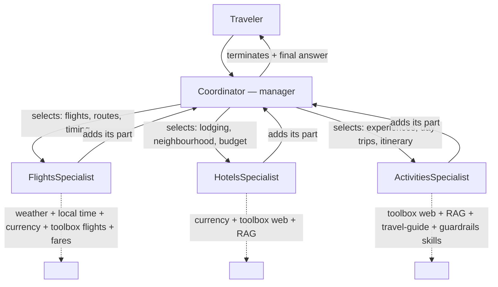

# Step 7 — Multi-agent: a group chat of specialists

> **Goal:** split TravelBuddy into a **Coordinator** (the group chat *manager*) plus **Flights / Hotels / Activities** specialists. Each round the Coordinator picks which specialist speaks next, then synthesizes one final answer — while the Coordinator and its specialists each reuse a slice of the Step 6 tools, toolbox, RAG, and skills.

> **Tip — give this step a capable model.** Step 7 is the most demanding step for the model: the manager and three specialists share one conversation, and every round replays the accumulated history plus each specialist's tool-grounded response, so the context grows fast. A small `-mini` deployment (for example `gpt-4o-mini`) often picks the wrong speaker, terminates too early, or loops. If routing misbehaves, point `AZURE_AI_MODEL_DEPLOYMENT_NAME` at a full-size model — for example a `gpt-5.4` deployment rather than `gpt-5.4-mini` — and re-run. It's a deployment-name change only; no code changes.

## What you'll learn

- The Agent Framework's native multi-agent primitives — `SequentialBuilder`, `ConcurrentBuilder`, `HandoffBuilder`, and `GroupChatBuilder`
- When a **manager-led group chat** fits: a coordinator LLM chooses the next expert each round and decides when the plan is done
- How to give each agent a narrow capability slice from the carried stack (tools, toolbox, RAG, skills)
- How `workflow.as_agent()` exposes the whole graph as one hosted agent, so deployment is unchanged (`resources: []`, no `azd provision`)

## What's already in the repo

- Everything from Steps 1–6 in `travel_assistant/` — the three function tools, the Foundry Toolbox, the Step 5 RAG provider, and the Step 6 itinerary skill. Nothing was deleted when you advanced.
- `travel_toolbox/toolbox.yaml` — the toolbox definition, still a sibling of `travel_assistant/`.
- `travel_assistant/agents/{flights,hotels,activities}/` — the per-specialist config slices (`agent.yaml` + `agent.manifest.yaml`), delivered complete when you advanced. You **read** these; you don't edit them.
- `travel_assistant/coordinator.py` — a starter scaffold with `TODO`s that you fill in below.

In this step you make **delta-only** edits: read the per-specialist config slices under `agents/`, build the group chat in `coordinator.py`, and point `main.py` at the Coordinator. There are **no** new environment variables and no manifest env changes — only a `Multi-Agent` tag and a `group_chat` metadata block.

## Concept (5-min read)

A single-agent assistant is the simplest shape: one instruction set, one tool list, one history, one model deciding every step. That's great while TravelBuddy's job is narrow. As it grows, the prompt starts carrying too many responsibilities — flight trade-offs, hotel constraints, destination grounding, itinerary generation, web lookups, and user-facing coordination all at once.

A **multi-agent runtime** keeps one conversation but splits responsibilities into focused agents. A **manager** agent — our **Coordinator** — reads the traveler's request and, each round, decides which specialist should speak next. A specialist uses only the capabilities it needs, adds its part to the shared conversation, and returns control to the manager. When the plan is complete, the manager stops the chat and writes the final answer.

**Group chat vs. the other shapes.** The Agent Framework gives you several orchestration builders:

- `SequentialBuilder` passes work through agents in a fixed order.
- `ConcurrentBuilder` fans the same task out to several agents and aggregates the results.
- `HandoffBuilder` lets the *active* agent transfer control to another participant — a peer-to-peer, human-in-the-loop shape.
- `GroupChatBuilder` is the **manager-led** shape we use here: a central orchestrator sits between the participants and, every round, selects the next speaker (or ends the chat). All routing decisions flow through one place.

Group chat wins when you want a single brain deciding *who's next* from the whole conversation, and a clean, predictable completion each turn. Because the manager explicitly decides to **terminate**, each hosted turn finishes cleanly and the **next** question just continues the same conversation — which makes group chat a natural fit for a hosted, multi-turn agent. A **workflow** (Step 8) wins when the process is known ahead of time: gather → specialists → approve → finalize. This step is manager-led collaboration; Step 8 re-expresses the same trip-planning scenario as a durable, observable pipeline.

The important design choice isn't the number of agents — it's the **boundary** around each one. Each specialist gets a short purpose statement (its `description`, which the manager reads when choosing a speaker), a narrow capability slice, and a clear rule about staying in its lane. Those slices come straight from the carried stack:



**One hosted agent, or many? (in-process vs. A2A).** Notice all four agents live in the *same* process and share one `FoundryChatClient`; `workflow.as_agent()` then wraps the whole graph as a **single** hosted agent — so deployment is unchanged (`resources: []`, no `azd provision`). The manager's speaker selections and the participant runs are in-memory calls: fast, simple, and easy to trace. The alternative is to deploy each specialist as its **own** hosted agent and have the Coordinator reach them remotely over the **A2A (Agent-to-Agent) protocol** (or expose one deployed agent as a function tool of another). Remote agents can be scaled, versioned, owned, and reused independently — even across teams, languages, or vendors — but every round now pays a network hop plus auth and serialization cost, and you operate N deployments instead of one. Rule of thumb: keep chatty, tightly-coupled specialists **in-process** (what we do here); reach for **A2A** only when a specialist genuinely needs to be independently deployed or reused. The two compose — a hosted agent like this one can itself be a node in a larger A2A mesh.

**Learn more**

- [Group chat orchestration in Microsoft Agent Framework](https://learn.microsoft.com/agent-framework/user-guide/agent-orchestration/group-chat)
- [Agent orchestration overview](https://learn.microsoft.com/agent-framework/user-guide/agent-orchestration/)
- [Using workflows as agents](https://learn.microsoft.com/agent-framework/user-guide/workflows/workflows-as-agents)
- [Agent-to-Agent (A2A) protocol in Microsoft Agent Framework](https://learn.microsoft.com/agent-framework/journey/agent-to-agent)
- [Connect to an A2A agent endpoint from Foundry Agent Service](https://learn.microsoft.com/azure/foundry/agents/how-to/tools/agent-to-agent)
- [Agent Framework orchestrations gallery](https://github.com/microsoft/agent-framework/tree/main/python/samples/03-workflows/orchestrations) — the `group_chat_*.py` samples this step follows (a `GroupChatBuilder` graph exposed through `workflow.as_agent()`).

## Steps

### 1. Read the specialist config slices

The per-specialist config slices are **already in the repo** — one folder per specialist under `travel_assistant/agents/`, delivered complete when you advanced. Each folder holds an `agent.yaml` (the role, `description`, and `instructions`) and an `agent.manifest.yaml` (the capability slice: `tools`, `rag`, `skills`). You don't edit them here — **open and read them**, because in the next section you translate each one into the code that builds that specialist.

```text
travel_assistant/agents/
├── flights/     { agent.yaml, agent.manifest.yaml }   # weather + local time + currency + toolbox flights (fares)
├── hotels/      { agent.yaml, agent.manifest.yaml }   # currency + toolbox web + destinations RAG
└── activities/  { agent.yaml, agent.manifest.yaml }   # toolbox web + destinations RAG + travel-guide/guardrails skills
```

Reading them, notice the intended boundary of each specialist:

- **Flights** — the three function tools (`get_weather`, `get_local_time`, `convert_currency`) plus the toolbox (its flight search); it always reports concrete fares. No RAG, no skills.
- **Hotels** — `convert_currency`, the toolbox (its web search for live rates and availability signals), and the destinations index (RAG).
- **Activities** — the toolbox (web search), the destinations index (RAG), **and** the two skills that shape the final deliverable: the LOCAL `travel-guide` skill (renders the shareable PDF trip guide) and the Foundry `response-guardrails` skill. In this group chat the skills ride on the **Activities specialist**, not the Coordinator/manager (see the callout below).

Three small slices make each specialist's intended boundary explicit and easy to review — they're the architecture spec a teammate reads before touching the graph.

> **The Foundry skill is optional here.** The **Activities** specialist owns the two skills that shape the final answer — the LOCAL `travel-guide` skill (renders the shareable PDF trip guide) and the Foundry `response-guardrails` skill carried from Step 6 — and the checked-in **solution is the Foundry-enabled reference**: its `coordinator.py`, `ACTIVITIES_INSTRUCTIONS`, and `.env.example` all wire the guardrails skill in and treat it as required. If you built it in Step 6, keep it: serve both skills from your skills provider and keep the "always apply `response-guardrails`" line in `ACTIVITIES_INSTRUCTIONS`. If you **skipped** the Foundry skill (for example your Foundry project can't allow public network access — see Step 6), leave `FOUNDRY_SKILL_NAMES` unset, drop the `response-guardrails` line from `ACTIVITIES_INSTRUCTIONS`, and serve only the local `travel-guide` skill — carry your Step 6 *local-only* skills provider rather than the solution's Foundry-enabled `_build_skills_provider`. The local `travel-guide` skill still renders the PDF and nothing else in this step depends on the Foundry skill. In practice, if you couldn't build the Foundry skill in Step 6 you already made your skills provider treat it as optional there — just carry that same local-only provider forward; there's nothing extra to redo here.

> **Why the skills ride on Activities, not the Coordinator.** A skills provider is a **context provider that registers its skill *tools*** on whichever agent holds it. But the Coordinator here is the group chat **manager**: `GroupChatBuilder` invokes it each round for a *structured* routing decision (which specialist speaks next, or terminate with the final answer). You *could* attach tools or a skills provider to it — the framework doesn't strip them — but a skill it carried wouldn't reliably fire, because the manager's turn produces that routing decision, not the free, tool-driven answer that renders the PDF and runs the guardrail. The skills therefore live on the **Activities specialist** — a normal participant that runs its tools and skills freely. The trade-off: only Activities' output is guarded, not the manager's final synthesis, and the manager has to *route* the deliverable through Activities rather than being *structurally* forced to. That's a real limitation of a manager-plus-specialists chat, and it's exactly what **Step 8** fixes — its workflow adds a dedicated `finalize` node that owns the deliverable and guards the actual final answer.

> **These slices are documentation, not runtime config.** Nothing loads `agent.yaml`/`agent.manifest.yaml` at run time. In the next section `coordinator.py` builds each specialist directly in Python: the `instructions:` become string constants and the tool/RAG/skill slices become hand-written `tools=[...]` and `context_providers=[...]` arguments. The slices are the reviewable **contract**; `coordinator.py` is the executable **source of truth**. That means they can drift, so when a specialist behaves unexpectedly, inspect `coordinator.py` first — then realign the slice so the two agree.

### 2. Build the group chat in `coordinator.py`

The Coordinator is the group chat **manager** — the single brain that decides which specialist speaks each round and writes the final answer. `coordinator.py` ships as a starter scaffold with `TODO`s — you fill in the instruction constants and the per-specialist capability slices, while the `GroupChatBuilder` graph below comes pre-wired. `GroupChatBuilder` registers the participants, wires the manager between them, and — every round — asks the manager (via a structured response) who should speak next or whether to stop. It lives in `agent_framework.orchestrations` — a separate `agent-framework-orchestrations` package, already added to `requirements.txt` for this step. Each specialist is a normal `Agent` — the same constructor from Steps 4–6 — with a sliced `tools` list and, where relevant, sliced `context_providers` (RAG for Hotels and Activities, plus the skills provider for Activities). This is where the `agents/*/agent.yaml` slices become executable: their `instructions:` turn into the string constants below, their `description:` into each specialist's `description=` (the manager reads it when choosing a speaker), and their tool/RAG/skill lists into the hand-written `tools=[...]`/`context_providers=[...]` arguments.

**How the manager picks a speaker.** `GroupChatBuilder` builds the selection prompt for you: each round it shows the manager the conversation plus the list of participant **names and `description`s**, and asks it to return a structured decision — the next speaker, or *terminate* with a final message. So the specialist `description=` fields do the routing work here (keep them crisp), and `COORDINATOR_INSTRUCTIONS` sets the manager's *policy*: gather order, when to finish, and how to write the final answer. You don't hand-write any speaker-selection tools — the builder handles that.

**Now open `travel_assistant/coordinator.py` and fill in its `TODO`s using the slices you just read.** The scaffold constructs the `Coordinator` and imports the essentials; as you carry your Step 5 RAG and Step 6 skills providers over, add any imports they need (for example `Path`, your skills-provider type). You supply:

- the three **specialist** instruction constants (`FLIGHTS_`, `HOTELS_`, `ACTIVITIES_INSTRUCTIONS`) — copy each specialist's `instructions:` block from its `agents/<name>/agent.yaml`;
- the **`COORDINATOR_INSTRUCTIONS`** constant — there's no Coordinator slice, so you write this one. It's the manager's brief; make it cover:
  - **Role:** you are TravelBuddy's Coordinator, the manager of a group chat between the three specialists — read the conversation, pick who speaks next, or terminate with the final answer.
  - **Routing rules,** one line per specialist, matching each slice's `description`: Flights → timing, airports, routes, layovers, weather risk, fares; Hotels → lodging areas, budgets, amenities, neighbourhood trade-offs; Activities → experiences, day trips, destination guidance, day-by-day itineraries, PDF guide.
  - **Full-trip behaviour:** for a complete plan, gather flight and hotel details first, then choose the **Activities** specialist **last** — it owns the `travel-guide` (PDF) and `response-guardrails` skills, so it folds the plan into the itinerary, produces the final deliverable, and runs the guardrail check. When you terminate, include Activities' guarded guide and its PDF link **verbatim** in your final answer — don't rewrite or drop them.
  - **Managing the chat:** pick the one specialist who owns the next missing piece, and let each finish before choosing the next. Terminate once the request is fully answered. If a required detail is missing and blocks progress, terminate and ask the traveler that one question directly, rather than looping a specialist. You never call tools yourself — only the specialists do.
- the carried `search` RAG provider (from Step 5) for Hotels and Activities, and the `skills` provider (from Step 6) for the **Activities** specialist — it owns the `travel-guide` + `response-guardrails` skills (attach it to the specialist, not the manager, whose turn is only a routing decision — see the callout above);
- the three specialist `Agent(...)`s — translate each `agents/<name>/agent.manifest.yaml` slice into `tools=[...]` and `context_providers=[...]` (function tools + toolbox → `tools`; `rag` → `search`), and set each one's `description=` from its `agent.yaml`. The Activities manifest also carries the two `skills`; attach the `skills` provider alongside its `search` provider (`context_providers=[search, skills]`). The Coordinator/manager itself takes **no tools and no context providers**.

The `GroupChatBuilder` graph and its `return workflow.as_agent()` are **already wired in the scaffold** — it references `flights`, `hotels`, and `activities`, so once you define those three specialists the Coordinator is complete.

Carry `default_options={"store": False}` over to every participant, exactly as in Steps 1–6 — the hosting layer manages history, so none of the agents should persist their responses server-side.

The pre-wired builder is what makes this a manager-led chat rather than a fixed pipeline:

- `orchestrator_agent=coordinator` makes the Coordinator the manager that selects the next speaker each round.
- `participants=[flights, hotels, activities]` are the specialists the manager can pick from.
- `max_rounds=40` caps the number of orchestrator rounds. The round counter is checkpoint-restored, so this cap is **cumulative across the whole conversation**, not per turn — a normal turn terminates well before it, and `40` leaves ample headroom for a multi-turn planning session while still stopping a manager that never terminates. (A very long conversation could eventually exhaust it; if a late follow-up returns a bare "max rounds reached" result, start a fresh conversation or raise the cap.)
- `workflow.as_agent()` wraps the multi-agent runtime so the rest of the app treats it like a single hosted agent.

**Why group chat is a clean fit for a hosted, multi-turn agent.** Each round the manager either selects a speaker or **terminates** — and when it terminates, the workflow simply *completes* (goes idle) and yields the final answer. It never parks waiting for a special reply. So when the traveler asks a **follow-up** in the same conversation, the hosting layer just restores the conversation and runs the manager again against the new message — the chat continues naturally. (This is the key difference from a peer-to-peer handoff, which pauses for human-in-the-loop input after each turn and needs extra care to resume cleanly when hosted.)

Because the toolbox is one bundle (web search + Code Interpreter + OctoTrip flights), Flights, Hotels, and Activities each receive the whole toolbox; the tighter boundary — flight search for Flights, web search for Hotels and Activities — is enforced by each specialist's instructions.

### 3. Point `main.py` at the Coordinator

`main.py` collapses to constructing the Coordinator and hosting it through the same adapter as before. Edit your existing `travel_assistant/main.py` in place:

- **Import** `build_travel_coordinator` from `coordinator` (instead of your Step 6 agent builder).
- In `main()`, **build the agent** with `agent = build_travel_coordinator()` — the group chat, exposed as one agent — and host it with `ResponsesHostServer(agent).run()`, exactly as before.

Everything else in `main.py` is unchanged. If you moved the `run_local_skill_script` runner and the skill-download helpers into `coordinator.py`, delete their now-unused copies from `main.py`.

### 4. Update the manifest

Metadata-only: append the `Multi-Agent` tag to your existing `tags` (if you kept the Foundry skill you'll also already have `Foundry Skills` from Step 6), update the `description`, and add a `group_chat` block naming the manager + specialists. No new `template.environment_variables`; `resources` stays `[]`.

```yaml
# travel_assistant/agent.manifest.yaml (delta)
metadata:
  tags: [Agent Framework, AI Agent Hosting, Azure AI AgentServer, Responses Protocol, Travel Assistant, Function Tools, MCP Tools, Toolbox Tools, RAG, Skills, Multi-Agent]
  group_chat:
    manager: Coordinator
    specialists: [FlightsSpecialist, HotelsSpecialist, ActivitiesSpecialist]
```

## Run and deploy TravelBuddy

`azd ai agent init` **copies** your `travel_assistant/` code into the generated `${WORKSHOP_RESOURCE_PREFIX}-travel-buddy/` project folder — that copy is the snapshot azd builds and deploys. You changed code in `travel_assistant/`, so **re-init** to refresh the snapshot. There are **no** new variables to `azd env set` (reuse the azd environment from earlier steps) and you do **not** run `azd provision` — you added no Azure resource (`resources:` is still `[]`, and no new project role is required).

1. **Re-init from the repository root.** Load your `.env` into the shell first so `WORKSHOP_RESOURCE_PREFIX` expands:

   <!-- terminal -->
   ```bash
   # bash / zsh
   set -a; source .env; set +a
   azd ai agent init -m travel_assistant/agent.manifest.yaml \
     --agent-name "${WORKSHOP_RESOURCE_PREFIX}-travel-buddy"
   ```

   <!-- terminal -->
   ```powershell
   # PowerShell
   Get-Content .env | Where-Object { $_ -match '^\s*[^#].*=' } | ForEach-Object {
     $name, $value = $_ -split '=', 2
     Set-Item "Env:$($name.Trim())" $value.Trim().Trim('"').Trim("'")
   }
   azd ai agent init -m travel_assistant/agent.manifest.yaml `
     --agent-name "$($env:WORKSHOP_RESOURCE_PREFIX)-travel-buddy"
   ```

2. **Run TravelBuddy locally** and invoke the Coordinator from a second terminal:

   <!-- terminal -->
   ```bash
   # terminal 1 — from the project folder:
   cd "${WORKSHOP_RESOURCE_PREFIX}-travel-buddy"
   azd ai agent run
   ```

   <!-- terminal -->
   ```bash
   # terminal 2 — ask for a full trip plan:
   azd ai agent invoke --local "Help me plan a 5-day Tokyo trip: flights from Lisbon, a hotel near Shibuya under €200/night, and a day-trip suggestion."
   ```

   A good trace shows the Coordinator consulting more than one specialist — depending on log level you may see the manager's speaker selections, specialist names in the messages, or per-specialist tool calls. Prefer a UI? With the local agent still running, open the **Agent Inspector** from the Foundry Toolkit (Command Palette → **Foundry Toolkit: Open Agent Inspector**).

3. **Deploy to Foundry** and invoke the deployed agent:

   <!-- terminal -->
   ```bash
   azd deploy
   azd ai agent invoke "Help me plan a 5-day Tokyo trip: flights from Lisbon, a hotel near Shibuya under €200/night, and a day-trip suggestion."
   ```

   `azd deploy` builds the container image from the **refreshed** snapshot, pushes it, and rolls out a new hosted agent version. The whole group chat deploys **inside** the single container, so nothing else is needed — no role grant, no `azd provision`.

## Try it

- `Help me plan a 5-day Tokyo trip: flights from Lisbon, a hotel near Shibuya under €200/night, and a day-trip suggestion.` → expect the manager to consult all three specialists.
- `Just the hotel — Reykjavik next weekend, must have a view.` → expect the manager to pick Hotels directly.
- `I already booked flights to Rome. Build a relaxed food-and-history itinerary with one day trip.` → expect Activities, not Flights.
- `Can you keep the whole Lisbon weekend under 600 EUR including hotel and activities?` → expect Hotels and Activities, with currency math.

Then ask a **follow-up** in the same conversation (for example, after the Tokyo plan: `Swap the Shibuya hotel for something near Shinjuku instead.`). Because the manager terminates cleanly each turn, the follow-up just continues the conversation — no error.

## Troubleshooting

### A follow-up question fails (`Unexpected content type while awaiting request info responses`)

If you've built multi-agent agents with **`HandoffBuilder`** before, you may have hit this: the **first** question works, but asking a **second** question in the same hosted conversation fails with a `response.failed` event:

```json
"error": {
  "code": "server_error",
  "message": "Unexpected content type while awaiting request info responses."
}
```

That's a **handoff** symptom, and it's exactly why this step uses **group chat** instead. `HandoffBuilder` runs human-in-the-loop by default: after each turn it *parks* the workflow in `IDLE_WITH_PENDING_REQUESTS`, expecting the next input as a `function_result` correlated to that request — but the hosted `ResponsesHostServer` delivers the follow-up as plain **text**, which the parked workflow can't consume. `GroupChatBuilder` never parks: the manager explicitly **terminates** each turn, the workflow goes `IDLE`, and the hosting layer replays history for the next question. So with the group chat you built here, follow-ups just work.

If you're adapting an older handoff-based Step 7 and see this error, the fix is to move to the group chat shape in this step (or, if you must keep the handoff, terminate each turn instead of parking). For background on the parked-request protocol, see the Agent Framework [handoff orchestration docs](https://learn.microsoft.com/agent-framework/user-guide/agent-orchestration/handoff).

### Coordinator picks the wrong specialist

The manager chooses the next speaker from each participant's **`description`** plus `COORDINATOR_INSTRUCTIONS`. Make each specialist `description` unambiguous and each name descriptive, and keep the routing rules in the Coordinator's brief crisp. If the manager consistently picks wrong or terminates too early, strengthen those rules. A weak model can also be the cause: on this multi-agent step the shared context grows quickly, and `-mini` deployments often mis-route — if your prompts already look right, try a full-size model deployment (see the model tip at the top of this step).

### Tool not available to a specialist

Each specialist gets only the capabilities you pass it in `coordinator.py` (and documents them in its `agents/*/agent.manifest.yaml` slice). Add the tool to the specialist that needs it and restart the server so the graph is rebuilt.

### Specialist answers outside its lane

Tighten that specialist's boundary text — e.g. Flights should explicitly say it does not choose hotels or activities. A narrow prompt is often more effective than more routing logic.

### Imports fail after adding `coordinator.py`

Keep import names aligned with the files you created in Steps 5–6. `coordinator.py` reuses `tools.py`, the `AzureAISearchContextProvider` wiring from Step 5, and the `run_local_skill_script` runner from Step 6 — if you renamed any of those, update the imports.

### Deploy didn't pick up my change

`azd ai agent init` **copied** your code into `${WORKSHOP_RESOURCE_PREFIX}-travel-buddy/`. Re-run `azd ai agent init` to refresh the snapshot, then `azd deploy` again.

## Solution

> If you get stuck: [`.workshop/solutions/07-multi-agent/`](.workshop/solutions/07-multi-agent/)

## Upstream sample

> The Foundry hosted-agents `responses/` gallery has no dedicated group chat sample, so this step follows the Agent Framework [group chat orchestration](https://learn.microsoft.com/agent-framework/user-guide/agent-orchestration/group-chat) docs and the canonical group chat samples in the Agent Framework repo: [`group_chat_agent_manager.py`](https://github.com/microsoft/agent-framework/blob/main/python/samples/03-workflows/orchestrations/group_chat_agent_manager.py) — which, like this step, uses an LLM manager (`orchestrator_agent`) to select the next speaker — plus [`group_chat_simple_selector.py`](https://github.com/microsoft/agent-framework/blob/main/python/samples/03-workflows/orchestrations/group_chat_simple_selector.py) ([full orchestrations gallery](https://github.com/microsoft/agent-framework/tree/main/python/samples/03-workflows/orchestrations)). Step 8 re-expresses the same scenario using the workflow pattern from [`05-workflows`](https://github.com/microsoft-foundry/foundry-samples/tree/main/samples/python/hosted-agents/agent-framework/responses/05-workflows).
