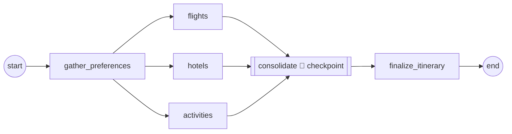

# Step 8 — Durable orchestration with workflows

> 🧪 **Experimental** — this step has not been fully tested yet. Treat it as a preview and expect rough edges.

> **Goal:** re-express Step 7's trip planning as an Agent Framework **workflow** — a fixed graph that is observable, restart-safe via checkpoints, and can pause for human approval — while reusing the exact same specialists.

## What you'll learn

- The workflow graph model: **executors**, **edges**, **supersteps**, and fan-out / fan-in
- How **checkpoints** make a long-running plan restart-safe (`FileCheckpointStorage`)
- How to expose a whole workflow as one hosted agent with `workflow.as_agent()` — so deployment is unchanged
- How a **human approval gate** works with `ctx.request_info()` + `@response_handler`, and how it surfaces when the workflow is hosted

## What's already in the repo

- Everything from Steps 1–7 in `travel_assistant/` — the specialists, tools, toolbox, RAG, and skill.
- `travel_assistant/coordinator.py` — the Step 7 group chat. In this step you extract the specialist constructors into reusable factories so the workflow builds the **same** agents.
- `travel_toolbox/toolbox.yaml` — unchanged.

This step adds a `workflow.py`, refactors `coordinator.py` to expose factories, repoints `main.py`, and adds a `Workflows` tag. There are **no** new environment variables and no new Azure resources.

## Concept (5-min read)

Step 7 was **runtime collaboration**: the Coordinator decided, turn by turn, which specialist should answer next. That's the right shape when the path is user-driven and unknown in advance.

A **workflow** is the opposite trade-off. You choose it when the process has a **known shape**, must survive restarts, or needs an explicit review before a costly action. Trip planning fits perfectly: gather preferences → ask each specialist → consolidate a draft → (optionally) get approval → finalize. The graph makes that process repeatable and inspectable, at the cost of the conversational flexibility the group chat gave you.

**The graph model.** A workflow is built from **executors** (nodes) connected by **edges**. Executors can be `AgentExecutor` (an agent wrapped as a node) or your own `Executor` subclasses with `@handler` methods. The engine runs in **supersteps**: every executor ready at the start of a superstep runs, their messages are delivered, and the next superstep begins. Fanning three edges out of one node runs those branches **concurrently**; fanning several edges into one node lets it aggregate.

**Checkpoints.** When a `checkpoint_storage` is supplied, the engine writes a checkpoint at the end of each superstep, capturing executor state, pending messages, and pending requests. If the process dies, or the user says "replan with a lower budget," you can resume from a checkpoint instead of redoing completed work. Your executors persist their own local state by overriding `on_checkpoint_save` / `on_checkpoint_restore`.

**Human-in-the-loop.** An executor calls `ctx.request_info(request_data=..., response_type=...)` to pause and ask an outside party a question; a `@response_handler` method resumes the graph when the answer arrives. Locally you drive this with a streaming loop that feeds `responses=` back into `workflow.run(...)`. When the workflow is **hosted as an agent**, the same request is surfaced to the caller as a **function call** — so the pattern still works over the Responses protocol, it just arrives as a tool call rather than a plain prompt.

**Hosting.** `workflow.as_agent()` wraps the whole graph as a single agent, validated so its start executor accepts the input, with a session managing conversation state. That means hosting and deployment are identical to every earlier step: one agent, `ResponsesHostServer`, `resources: []`. As in Step 7, all the executors run **in-process** inside that one hosted agent — the same in-process vs. remote-A2A trade-off applies if you ever need a step owned or scaled independently.



The doubled `consolidate` node is where the checkpoint is written — the safe resume point. The dashed approval gate (below) slots between `consolidate` and `finalize` when you enable it.

**Learn more**

- [Agent Framework workflows overview](https://learn.microsoft.com/agent-framework/workflows/)
- [Checkpoints](https://learn.microsoft.com/agent-framework/workflows/checkpoints)
- [Human-in-the-loop](https://learn.microsoft.com/agent-framework/workflows/human-in-the-loop)
- [Agent executor & context modes](https://learn.microsoft.com/agent-framework/workflows/advanced/agent-executor)

## Steps

### 1. Extract the specialist factories

Step 7 built the specialists inline inside `build_travel_coordinator()`. Extract that construction into factories and a shared client helper, then delete `build_travel_coordinator()`: Step 8 replaces the Step 7 group chat with the durable **workflow**, which builds the **same** agents from these factories. The factories are now the single source of truth the workflow reads.

As in Step 7, the `agents/*/agent.yaml` slices remain **documentation** — nothing loads them at runtime. The workflow imports these Python factories, so `coordinator.py` stays the single executable source of truth for what each specialist is and may touch.

```python
# travel_assistant/coordinator.py (delta)
def make_client(credential=None) -> FoundryChatClient:
    return FoundryChatClient(
        project_endpoint=os.environ["AZURE_AI_PROJECT_ENDPOINT"],
        model=os.environ["AZURE_AI_MODEL_DEPLOYMENT_NAME"],
        credential=credential or DefaultAzureCredential(),
    )


def create_flights_agent(client, credential=None) -> Agent:
    credential = credential or DefaultAzureCredential()
    toolbox = FoundryToolbox(credential)
    return Agent(
        client=client, name="FlightsSpecialist",
        instructions=FLIGHTS_INSTRUCTIONS,
        tools=[get_weather, get_local_time, convert_currency, toolbox], default_options={"store": False},
    )

# create_hotels_agent (currency + toolbox web + RAG) and
# create_activities_agent (toolbox web + RAG) follow the same pattern.
```

The point is a **single source of truth**: the workflow builds every specialist from these factories.

### 2. Create `travel_assistant/workflow.py`

The workflow has three custom executors plus agent nodes. `GatherPreferences` fans the request out to all three specialists; `Consolidate` aggregates their answers, checkpoints the draft, then sends the finalize prompt; `finalize_itinerary` is an `AgentExecutor` that writes the plan and owns the final deliverable, using the `travel-guide` skill to render the shareable PDF and the `response-guardrails` skill to check the answer. This is the payoff over Step 7: there the group chat Coordinator was the manager: every round it returned a structured routing decision rather than a free, tool-driven answer, so a deliverable-shaping skill didn't belong on it — the skills had to ride on the Activities leaf and only guarded that leaf's output. A dedicated `finalize` node owns the deliverable outright and guards the actual final answer.

```python
# travel_assistant/workflow.py
from agent_framework import (
    Agent, AgentExecutor, AgentExecutorRequest, AgentExecutorResponse,
    Executor, FileCheckpointStorage, Message, WorkflowBuilder, WorkflowContext,
    handler, response_handler,
)

from coordinator import (
    _build_skills_provider,
    create_activities_agent, create_flights_agent, create_hotels_agent, make_client,
)


class GatherPreferences(Executor):
    def __init__(self) -> None:
        super().__init__(id="gather_preferences")

    @handler
    async def gather(self, request: str, ctx: WorkflowContext[AgentExecutorRequest]) -> None:
        base = f"The user is planning a trip.\n\nUser request:\n{request}"
        for target_id, focus in {
            "flights": "Recommend flight approach, timing, and trade-offs.",
            "hotels": "Recommend neighbourhoods, hotel style, and budget split.",
            "activities": "Recommend a balanced day-by-day activity plan.",
        }.items():
            await ctx.send_message(
                AgentExecutorRequest(
                    messages=[Message(role="user", contents=[f"{base}\n\nFocus: {focus}"])],
                    should_respond=True,
                ),
                target_id=target_id,
            )
```

`Consolidate` waits until all three specialist responses have arrived (it's invoked once per incoming edge), builds the draft, and persists node-local state for safe resume:

```python
# travel_assistant/workflow.py
class Consolidate(Executor):
    def __init__(self, approval_target: str | None = None) -> None:
        super().__init__(id="consolidate")
        self._approval_target = approval_target
        self._draft: DraftPlan | None = None

    @handler
    async def collect(self, response: AgentExecutorResponse, ctx: WorkflowContext[AgentExecutorRequest]) -> None:
        draft = ctx.get_state("draft_plan", DraftPlan(session_id=ctx.get_state("session_id", "local-user")))
        setattr(draft, response.executor_id, response.agent_response.text)  # flights/hotels/activities
        ctx.set_state("draft_plan", draft)
        self._draft = draft
        if not (draft.flights and draft.hotels and draft.activities):
            return  # still waiting for the other branches
        consolidated = f"## Flights\n{draft.flights}\n\n## Hotels\n{draft.hotels}\n\n## Activities\n{draft.activities}\n"
        await ctx.send_message(
            AgentExecutorRequest(
                messages=[Message(role="user", contents=[_finalize_prompt(consolidated)])],
                should_respond=True,
            ),
            target_id="finalize_itinerary",
        )

    async def on_checkpoint_save(self) -> dict[str, Any]:
        return {"draft": self._draft.__dict__ if self._draft else None}

    async def on_checkpoint_restore(self, state: dict[str, Any]) -> None:
        data = state.get("draft")
        self._draft = DraftPlan(**data) if data else None
```

Build the graph, enable checkpointing, and expose it as an agent. `context_mode="last_agent"` keeps each specialist focused on its own slice instead of the whole transcript. `FileCheckpointStorage` deserializes checkpoints with a restricted unpickler, so the `DraftPlan` and `ApprovalRequest` dataclasses we persist must be allow-listed by their `"module:qualname"` — otherwise a resume raises on restore:

```python
# travel_assistant/workflow.py
def build_workflow(require_approval: bool = False):
    client = make_client()
    flights = AgentExecutor(create_flights_agent(client), id="flights", context_mode="last_agent")
    hotels = AgentExecutor(create_hotels_agent(client), id="hotels", context_mode="last_agent")
    activities = AgentExecutor(create_activities_agent(client), id="activities", context_mode="last_agent")
    finalize = AgentExecutor(
        Agent(
            client=client, name="finalize_itinerary", instructions=FINALIZE_INSTRUCTIONS,
            context_providers=[_build_skills_provider()],  # travel-guide PDF + response-guardrails
            default_options={"store": False},
        ),
        id="finalize_itinerary", context_mode="last_agent",
    )
    gather, consolidate = GatherPreferences(), Consolidate()

    return (
        WorkflowBuilder(
            name="travel_planning_workflow",
            start_executor=gather,
            checkpoint_storage=FileCheckpointStorage(
                ".workshop-state/workflow-checkpoints",
                allowed_checkpoint_types=["workflow:DraftPlan", "workflow:ApprovalRequest"],
            ),
            output_executors=[finalize],
        )
        .add_edge(gather, flights)
        .add_edge(gather, hotels)
        .add_edge(gather, activities)
        .add_edge(flights, consolidate)
        .add_edge(hotels, consolidate)
        .add_edge(activities, consolidate)
        .add_edge(consolidate, finalize)
        .build()
    )


def build_workflow_agent(require_approval: bool = False) -> Agent:
    return build_workflow(require_approval=require_approval).as_agent()
```

Do **not** copy the specialist prompts into `workflow.py` — import the factories so Steps 7 and 8 stay aligned.

> **Skipped the Foundry skill?** The finalize step inherits the Step 7 rule: if you left `FOUNDRY_SKILL_NAMES` unset, carry your local-only skills provider here instead of the solution's `_build_skills_provider`, and drop the `response-guardrails` line from `FINALIZE_INSTRUCTIONS`. The local `travel-guide` skill still renders the PDF.

### 3. Point `main.py` at the workflow

`main.py` hosts the workflow-as-agent through the same server as every other step:

```python
# travel_assistant/main.py
from agent_framework_foundry_hosting import ResponsesHostServer

from workflow import build_workflow_agent


def main() -> None:
    agent = build_workflow_agent(require_approval=False)
    ResponsesHostServer(agent).run()


if __name__ == "__main__":
    main()
```

### 4. Update the manifest

Metadata-only: append the `Workflows` tag, update the `description`, and add a `workflow` block describing the graph. No new `template.environment_variables`; `resources` stays `[]`.

```yaml
# travel_assistant/agent.manifest.yaml (delta)
metadata:
  tags: [Agent Framework, AI Agent Hosting, Azure AI AgentServer, Responses Protocol, Travel Assistant, Function Tools, MCP Tools, Toolbox Tools, RAG, Skills, Multi-Agent, Workflows]
  workflow:
    start: gather_preferences
    executors: [gather_preferences, flights, hotels, activities, consolidate, finalize_itinerary]
    checkpointing: FileCheckpointStorage
    human_in_the_loop: optional (approval_gate via request_info)
```

### 5. (Optional) Add a human approval gate

To pause for review before the itinerary is written, insert an `ApprovalGate` executor between `consolidate` and `finalize`. It uses `ctx.request_info()` to pause and a `@response_handler` to resume:

```python
# travel_assistant/workflow.py
class ApprovalGate(Executor):
    def __init__(self) -> None:
        super().__init__(id="approval_gate")

    @handler
    async def request_approval(self, request: ApprovalRequest, ctx: WorkflowContext[str]) -> None:
        await ctx.request_info(request_data=request, response_type=str)

    @response_handler
    async def on_approval(self, original_request: ApprovalRequest, feedback: str, ctx: WorkflowContext[AgentExecutorRequest]) -> None:
        approved = feedback.strip().lower() in {"approve", "approved", "looks good", "finalise"}
        prompt = _finalize_prompt(original_request.draft, "" if approved else feedback)
        await ctx.send_message(
            AgentExecutorRequest(messages=[Message(role="user", contents=[prompt])], should_respond=True),
            target_id="finalize_itinerary",
        )
```

The provided solution wires this in when you call `build_workflow(require_approval=True)`. Locally you drive it with a streaming loop:

```python
# travel_assistant/workflow.py
stream = workflow.run(prompt, stream=True)
while True:
    pending = {}
    async for event in stream:
        if event.type == "request_info":
            pending[event.request_id] = event.data
        elif event.type == "output":
            print(event.data)
    if not pending:
        break
    responses = {rid: input("Approve or request changes: ") for rid in pending}
    stream = workflow.run(stream=True, responses=responses)
```

When hosted, that `request_info` is surfaced to the caller as a **function call** instead — so keep `require_approval=False` for the default hosted run and use the local loop for an interactive approval demo.

## Run and deploy TravelBuddy

`azd ai agent init` **copies** your `travel_assistant/` code into the generated `${WORKSHOP_RESOURCE_PREFIX}-travel-buddy/` project folder — that copy is the snapshot azd builds and deploys. You changed code in `travel_assistant/`, so **re-init** to refresh the snapshot. There are **no** new variables to `azd env set` (reuse the azd environment from earlier steps) and you do **not** run `azd provision` — you added no Azure resource (`resources:` is still `[]`).

1. **Re-init from the repository root.** Load your `.env` into the shell first so `WORKSHOP_RESOURCE_PREFIX` expands:

   <!-- terminal -->
   ```bash
   # bash / zsh
   set -a; source .env; set +a
   azd ai agent init -m travel_assistant/agent.manifest.yaml \
     --agent-name "${WORKSHOP_RESOURCE_PREFIX}-travel-buddy"
   ```

   <!-- terminal -->
   ```powershell
   # PowerShell
   Get-Content .env | Where-Object { $_ -match '^\s*[^#].*=' } | ForEach-Object {
     $name, $value = $_ -split '=', 2
     Set-Item "Env:$($name.Trim())" $value.Trim().Trim('"').Trim("'")
   }
   azd ai agent init -m travel_assistant/agent.manifest.yaml `
     --agent-name "$($env:WORKSHOP_RESOURCE_PREFIX)-travel-buddy"
   ```

2. **Run TravelBuddy locally** and invoke the workflow from a second terminal:

   <!-- terminal -->
   ```bash
   # terminal 1 — from the project folder:
   cd "${WORKSHOP_RESOURCE_PREFIX}-travel-buddy"
   azd ai agent run
   ```

   <!-- terminal -->
   ```bash
   # terminal 2 — ask for a full trip plan:
   azd ai agent invoke --local "Plan a 5-day Tokyo trip for two with a budget of €3000."
   ```

   A good trace shows `gather_preferences`, then `flights` / `hotels` / `activities` running together, then `consolidate`, then `finalize_itinerary`. Checkpoints appear under `.workshop-state/workflow-checkpoints/`.

3. **Deploy to Foundry** and invoke the deployed agent:

   <!-- terminal -->
   ```bash
   azd deploy
   azd ai agent invoke "Plan a 5-day Tokyo trip for two with a budget of €3000."
   ```

   `azd deploy` builds the container image from the **refreshed** snapshot, pushes it, and rolls out a new hosted agent version. The whole workflow deploys **inside** the single container, so nothing else is needed — no role grant, no `azd provision`.

## Try it

- `Plan a 5-day Tokyo trip for two with a budget of €3000.` → all three specialists contribute before the itinerary is finalized.
- `Reykjavik for a long weekend, mid-range hotel, one day trip.` → same graph, different inputs.
- Inspect the newest checkpoint:

<!-- terminal -->
```bash
python -c "from pathlib import Path; print('\n'.join(str(p) for p in Path('.workshop-state/workflow-checkpoints').glob('*')))"
```

Notice a checkpoint records workflow state, executor progress, and the resume point. Don't edit checkpoint files by hand.

## Troubleshooting

### Workflow doesn't checkpoint

Pass `checkpoint_storage=` to `WorkflowBuilder(...)`. `FileCheckpointStorage` requires an explicit path — there is no default directory. It also deserializes with a restricted unpickler: pass any application-defined types you persist via `allowed_checkpoint_types=["module:qualname", ...]` (here `workflow:DraftPlan` and `workflow:ApprovalRequest`) or a resume raises `Type '…' is not allowed`. For a distributed deployment, swap in `CosmosCheckpointStorage` from `agent-framework-azure-cosmos`.

### Re-runs always start from scratch

List checkpoints from the storage and resume by id — there is no `get_latest`:

```python
# travel_assistant/workflow.py
checkpoints = await storage.list_checkpoints(workflow_name=workflow.name)
if checkpoints:
    stream = workflow.run(checkpoint_id=checkpoints[-1].checkpoint_id, stream=True)
```

### Specialists run sequentially instead of together

Fan out **from the same parent** — three edges out of `gather_preferences`. If you chain `gather → flights → hotels → activities`, each waits for the previous one.

### Final itinerary appears before approval

Confirm `finalize_itinerary` has an incoming edge only from `approval_gate` (when approval is enabled), not also from `consolidate`.

### Approval never pauses when hosted

Hosted workflow-agents surface `request_info` as a **function call**, not a prompt. For an interactive approval demo, run the local streaming loop with `responses=`; keep `require_approval=False` for the default `azd ai agent invoke` path.

### Deploy didn't pick up my change

`azd ai agent init` **copied** your code into `${WORKSHOP_RESOURCE_PREFIX}-travel-buddy/`. Re-run `azd ai agent init`, then `azd deploy` again.

## Solution

> If you get stuck: [`.workshop/solutions/08-workflow/`](.workshop/solutions/08-workflow/)

## Upstream sample

> Adapted from the upstream [`05-workflows`](https://github.com/microsoft-foundry/foundry-samples/tree/main/samples/python/hosted-agents/agent-framework/responses/05-workflows) sample, which hosts a writer → legal → formatter workflow with `WorkflowBuilder(...).build().as_agent()`.
