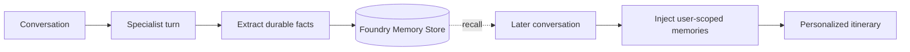

# Step 9 — Durable per-user memory

> 🧪 **Experimental** — this step has not been fully tested yet. Treat it as a preview and expect rough edges.

> **Goal:** give TravelBuddy a persistent, per-user memory backed by a Foundry **Memory Store**, so it recalls stable traveler preferences across separate conversations — while keeping the whole Step 8 workflow intact.

## What you'll learn

- What a Foundry **Memory Store** is, and how it differs from chat history and from RAG
- How `FoundryMemoryProvider` extracts durable facts and injects relevant memories into agent context
- How memory is **scoped per user** with the `{{$userId}}` hosting placeholder
- How to add memory as one more `context_provider` without touching the workflow graph

## What's already in the repo

- Everything from Steps 1–8 in `travel_assistant/` — the durable workflow, specialists, tools, toolbox, RAG, and skill.
- `travel_assistant/coordinator.py` — the Step 8 specialist factories (`make_client`, `create_flights_agent`, `create_hotels_agent`, `create_activities_agent`). This step adds memory there so every specialist gains it from one place.
- `travel_toolbox/toolbox.yaml` — unchanged.

This step adds `provision_memory_store.py`, a small delta on `coordinator.py`, two new environment variables, and a `Memory` tag. `main.py` and `workflow.py` are **unchanged**, and there are **no** new Azure resources in the manifest.

## Concept (5-min read)

A conversation already has **in-conversation context** — the messages still in the current chat history. That is enough for follow-up questions, but it is not durable: when the conversation ends or history is trimmed, it is gone. **Memory** is the durable layer. TravelBuddy writes stable facts about *you* — home airport, cabin class, budget band, dietary needs, favourite destinations — into a Foundry **Memory Store**, and on a later conversation the memory provider retrieves the relevant ones and injects them into the model context before the agent answers.

**Memory is not RAG.** RAG (Step 5) retrieves knowledge about the *world* — destination documents shared by everyone. Memory retrieves personal facts about the *current user*. In this workshop the destination index says what TravelBuddy knows about *places*; the memory store says what TravelBuddy knows about *you*.

**How it works.** `FoundryMemoryProvider` is a `context_provider`, exactly like `AzureAISearchContextProvider` (RAG) and `SkillsProvider` (skills). On each turn it does two things: it **retrieves** memories relevant to the request and adds them to context, and it **extracts** new durable facts from the exchange and writes them to the store. The extraction/consolidation is handled server-side by the memory store using the chat and embedding models you configure when you provision it — that is why an **embedding model deployment** is a prerequisite.

**Scope is the key design detail.** Memories are partitioned by a scope string. Store under one scope and read under another and recall silently fails. For a hosted agent the correct scope is the special placeholder `scope="{{$userId}}"`, which the hosting runtime replaces with the authenticated caller's user id — so every traveler automatically gets their own isolated memories. (In a purely local script you would instead pass a stable id you control.)

**Where memory attaches.** We add the provider inside the Step 8 specialist factories, so the workflow's `flights` / `hotels` / `activities` executors all become memory-aware. The `finalize_itinerary` step is deliberately left out: the specialists already fold each traveler's recalled preferences into the draft, so finalize only has to render and guardrail the consolidated answer — it needs the skills, not per-user recall. The graph, checkpoints, hosting, and `workflow.as_agent()` are untouched — memory rides along as context.



**Learn more**

- [What is memory in Foundry Agents](https://learn.microsoft.com/azure/foundry/agents/concepts/what-is-memory)
- [Use memory with agents](https://learn.microsoft.com/azure/foundry/agents/how-to/memory-usage)
- [Quickstart: memory for a hosted agent](https://learn.microsoft.com/azure/foundry/agents/quickstarts/quickstart-memory-hosted-agent)
- [Agent Framework — get started with memory](https://learn.microsoft.com/agent-framework/get-started/memory)

## Steps

### 1. Provision the memory store (out of band)

A memory store is a Foundry primitive, not an Azure resource you declare in the manifest — so you create it once with a helper script, the same way you provisioned the Search index in Step 5. Create `travel_assistant/provision_memory_store.py`. It reads your `.env`, creates the store named by `MEMORY_STORE_NAME` if it does not already exist, and is safe to re-run.

```python
# travel_assistant/provision_memory_store.py
from azure.ai.projects.aio import AIProjectClient
from azure.ai.projects.models import MemoryStoreDefaultDefinition, MemoryStoreDefaultOptions
from azure.core.exceptions import ResourceNotFoundError
from azure.identity.aio import DefaultAzureCredential

async def main() -> None:
    endpoint = required_env("AZURE_AI_PROJECT_ENDPOINT")
    memory_store_name = required_env("MEMORY_STORE_NAME")
    chat_model = required_env("AZURE_AI_MODEL_DEPLOYMENT_NAME")
    embedding_model = required_env("AZURE_AI_EMBEDDING_MODEL_DEPLOYMENT_NAME")

    async with (
        DefaultAzureCredential() as credential,
        AIProjectClient(endpoint=endpoint, credential=credential, allow_preview=True) as project,
    ):
        try:
            existing = await project.beta.memory_stores.get(name=memory_store_name)
            print(f"Memory store '{existing.name}' already exists; leaving as-is.")
            return
        except ResourceNotFoundError:
            pass
        definition = MemoryStoreDefaultDefinition(
            chat_model=chat_model,
            embedding_model=embedding_model,
            options=MemoryStoreDefaultOptions(
                chat_summary_enabled=False,
                user_profile_enabled=True,
                user_profile_details="Capture durable travel preferences; avoid sensitive data.",
            ),
        )
        await project.beta.memory_stores.create(name=memory_store_name, definition=definition,
            description="Memory store for TravelBuddy")
```

The store needs two model deployments: your existing **chat** model and an **embedding** model (used to index memories for semantic recall). `user_profile_enabled=True` turns on durable per-user facts; `chat_summary_enabled=False` keeps the demo focused on preferences. The `memory_stores` API is preview, so the client is created with `allow_preview=True`.

Run it from the solution's `travel_assistant/` directory, after loading `.env`:

<!-- terminal -->
```bash
python provision_memory_store.py
```

First run creates and verifies the store; re-runs report it already exists.

### 2. Add memory to the specialist factories

Two small changes let every specialist share one memory provider. First, `make_client` opts into the preview API so the underlying project client can reach `beta.memory_stores`:

```python
# travel_assistant/coordinator.py (delta)
from agent_framework.foundry import FoundryChatClient, FoundryMemoryProvider  # add FoundryMemoryProvider

def make_client(credential=None) -> FoundryChatClient:
    return FoundryChatClient(
        project_endpoint=os.environ["AZURE_AI_PROJECT_ENDPOINT"],
        model=os.environ["AZURE_AI_MODEL_DEPLOYMENT_NAME"],
        credential=credential or DefaultAzureCredential(),
        allow_preview=True,  # NEW: needed for client.project_client -> beta.memory_stores
    )
```

Then add a builder that reuses the chat client's `project_client`, and append it to each specialist's `context_providers`:

```python
# travel_assistant/coordinator.py (delta)
def _build_memory_provider(client: FoundryChatClient) -> FoundryMemoryProvider:
    memory_store_name = os.environ["MEMORY_STORE_NAME"]
    return FoundryMemoryProvider(
        project_client=client.project_client,
        memory_store_name=memory_store_name,
        scope="{{$userId}}",  # hosting replaces this with the caller's user id
        update_delay=0,        # write memories immediately (default is 300s / 5 min)
    )
```

`update_delay` is the debounce before the store extracts and persists new facts. It **defaults to 300 seconds (5 minutes)**, which batches writes to reduce cost in production. For the workshop we set `update_delay=0` so a fact you state in one turn is recallable on the next; leave the default (or raise it) in a real deployment.

Each factory builds the provider from its `client` and appends it — keeping every carried-over tool, toolbox, and RAG:

```python
# travel_assistant/coordinator.py (delta)
def create_hotels_agent(client, credential=None) -> Agent:
    credential = credential or DefaultAzureCredential()
    toolbox = FoundryToolbox(credential)
    search = _build_search_provider(credential)
    memory = _build_memory_provider(client)                       # NEW
    return Agent(
        client=client, name="HotelsSpecialist", instructions=HOTELS_INSTRUCTIONS,
        tools=[convert_currency, toolbox],
        context_providers=[search, memory],  # + memory
        default_options={"store": False},
    )
```

`create_flights_agent` gains `context_providers=[memory]` (its first provider); `create_activities_agent` becomes `[search, memory]`. Reading `MEMORY_STORE_NAME` with `os.environ["..."]` makes memory a required capability — a missing value fails fast with a clear `KeyError` instead of silently starting without recall.

Reusing `client.project_client` (instead of constructing a second `AIProjectClient`) keeps a single authentication context, and putting memory in the factories means the runtime Coordinator (Step 7) and the hosted workflow (Step 8) both pick it up from one source of truth. `main.py` and `workflow.py` need **no** changes.

### 3. Declare the new configuration

Add the two new variables so local tooling and the hosted container both receive them. In `agent.yaml`, append to `environment_variables`:

```yaml
# travel_assistant/agent.yaml (delta)
  - name: AZURE_AI_EMBEDDING_MODEL_DEPLOYMENT_NAME
    value: ${AZURE_AI_EMBEDDING_MODEL_DEPLOYMENT_NAME}
  - name: MEMORY_STORE_NAME
    value: ${MEMORY_STORE_NAME}
```

In `agent.manifest.yaml`, append the `Memory` tag, add a memory `tool_declaration`, and mirror the two variables under `template.environment_variables`. `resources` stays `[]`:

```yaml
# travel_assistant/agent.manifest.yaml (delta)
metadata:
  tags: [Agent Framework, AI Agent Hosting, Azure AI AgentServer, Responses Protocol, Travel Assistant, Function Tools, MCP Tools, Toolbox Tools, RAG, Skills, Multi-Agent, Workflows, Memory]
  tool_declarations:
    - name: travelbuddy_memory
      description: Durable, per-user memory backed by a Foundry Memory Store, scoped via {{$userId}}.
      type: memory
      memory_store_name: ${MEMORY_STORE_NAME}
template:
  environment_variables:
    - name: AZURE_AI_EMBEDDING_MODEL_DEPLOYMENT_NAME
      value: ${AZURE_AI_EMBEDDING_MODEL_DEPLOYMENT_NAME}
    - name: MEMORY_STORE_NAME
      value: ${MEMORY_STORE_NAME}
```

Add both variables to `.env` as well — `MEMORY_STORE_NAME` (keep it prefixed with `WORKSHOP_RESOURCE_PREFIX` so cleanup can find it) and `AZURE_AI_EMBEDDING_MODEL_DEPLOYMENT_NAME` (the name of your embedding deployment in Foundry).

## Run and deploy TravelBuddy

You changed code in `travel_assistant/`, so you must **re-init** to refresh the snapshot in `${WORKSHOP_RESOURCE_PREFIX}-travel-buddy/`. There are two new variables to set in the azd environment, and you do **not** run `azd provision` (the memory store was created out of band in step 1).

Load your `.env` into the shell first:

<!-- terminal -->
```bash
set -a; source .env; set +a
```

<!-- terminal -->
```powershell
Get-Content .env | Where-Object { $_ -match '=' -and $_ -notmatch '^\s*#' } | ForEach-Object {
    $name, $value = $_ -split '=', 2
    Set-Item -Path "Env:$($name.Trim())" -Value $value.Trim().Trim('"')
}
```

Register the two new variables with azd (once):

<!-- terminal -->
```bash
azd env set MEMORY_STORE_NAME "$MEMORY_STORE_NAME"
azd env set AZURE_AI_EMBEDDING_MODEL_DEPLOYMENT_NAME "$AZURE_AI_EMBEDDING_MODEL_DEPLOYMENT_NAME"
```

Make sure the store exists before you run (safe to re-run):

<!-- terminal -->
```bash
python travel_assistant/provision_memory_store.py
```

### Run locally

<!-- terminal -->
```bash
azd ai agent init
azd ai agent run
azd ai agent invoke --local --message "I always fly out of SEA and prefer window seats on a mid-range budget."
```

### Deploy

<!-- terminal -->
```bash
azd ai agent init
azd deploy
azd ai agent invoke --message "Plan a 4-day trip to Rome for me."
```

## Try it

Prove memory survives across conversations. First, teach TravelBuddy a durable preference:

<!-- terminal -->
```bash
azd ai agent invoke --message "Remember I'm vegetarian, I prefer trains over flights, and my home base is Lisbon."
```

Then, in a **new** invocation, ask for a plan and watch it apply what it remembers:

<!-- terminal -->
```bash
azd ai agent invoke --message "Plan a long weekend in northern Spain."
```

Expect rail-first routing from Lisbon and vegetarian-friendly food suggestions. Ask `What do you remember about me?` and it should list the stored facts. Because the solution sets `update_delay=0`, writes land right away; if you removed that override the default 5-minute debounce applies and recall would lag behind the first call.

## Troubleshooting

### Memories are never recalled

Recall is partitioned by scope. When hosted, the scope resolves from the authenticated caller, so invoke as the **same** signed-in identity both times. If you fork the code into a local script, use a single stable id — never a random UUID, timestamp, or session id, since each unique scope is an isolated partition.

### `MemoryStoreNotFound` / store missing at runtime

Re-run the provisioner and confirm `.env` uses the exact `MEMORY_STORE_NAME` it printed:

<!-- terminal -->
```bash
python travel_assistant/provision_memory_store.py
```

Watch for an unresolved placeholder like `{{MEMORY_STORE_NAME}}` in `.env` — it is passed straight through to the memory store and fails at runtime, so make sure the variable resolves to the real store name.

### Provisioning fails with an embedding model error

A memory store needs both a chat model and an embedding model deployment. Confirm `AZURE_AI_EMBEDDING_MODEL_DEPLOYMENT_NAME` names a real embedding deployment in your Foundry project, then re-run the provisioner.

### It remembers within one conversation but not across them

That is chat history, not memory. Keep `default_options={"store": False}`, use separate invocations, and verify the same `MEMORY_STORE_NAME` and caller identity across both.

### Memory stores too much or too little

Tune `user_profile_details` in `provision_memory_store.py` — keep it to travel preferences and exclude credentials, payment details, and precise location. Re-run the provisioner after editing (delete the store first if you need the new guidance to take effect).

### Cleanup didn't remove the store

`.workshop/scripts/cleanup.py --apply` only deletes the store when `MEMORY_STORE_NAME` starts with `WORKSHOP_RESOURCE_PREFIX`. Confirm the names line up:

```dotenv
# .env
WORKSHOP_RESOURCE_PREFIX=foundry-workshop
MEMORY_STORE_NAME=foundry-workshop-travelbuddy-memory
```

If cleanup lists it as skipped, the name has no prefix match — delete it manually in Foundry.

### Deploy didn't pick up my change

`azd ai agent init` **copied** your code into `${WORKSHOP_RESOURCE_PREFIX}-travel-buddy/`. Re-run `azd ai agent init`, then `azd deploy` again.

## Solution

> If you get stuck: [`.workshop/solutions/09-memory/`](.workshop/solutions/09-memory/)

## Upstream sample

> Adapted from the upstream [`13-foundry-memory`](https://github.com/microsoft-foundry/foundry-samples/tree/main/samples/python/hosted-agents/agent-framework/responses/13-foundry-memory) sample, which attaches a `FoundryMemoryProvider` (scoped by `{{$userId}}`) to a hosted agent and provisions the store with `provision_memory_store.py`.
